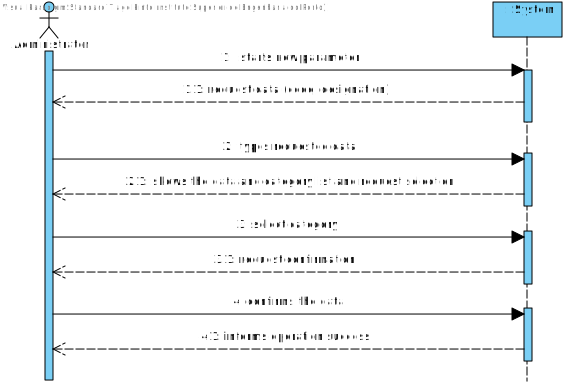
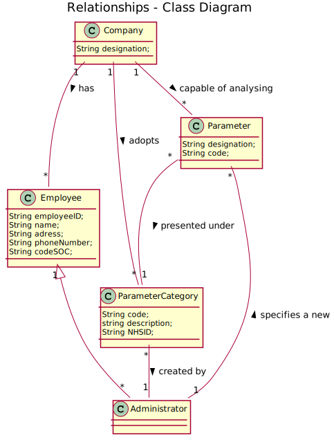
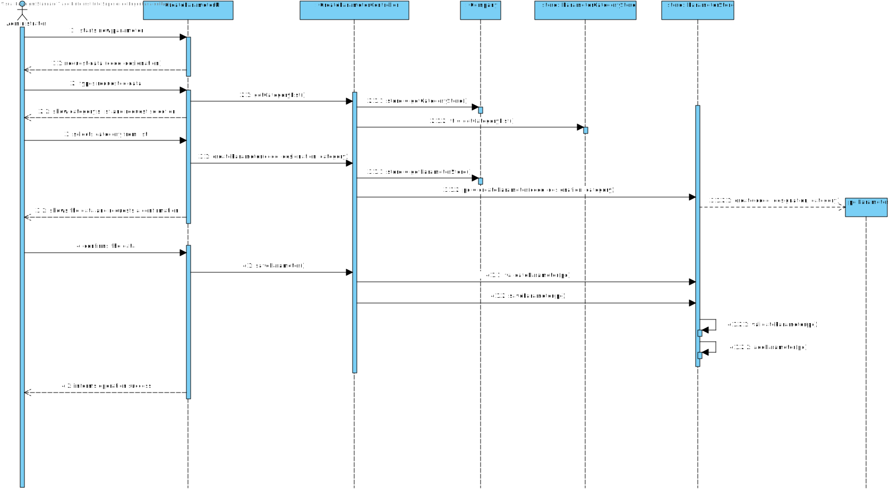
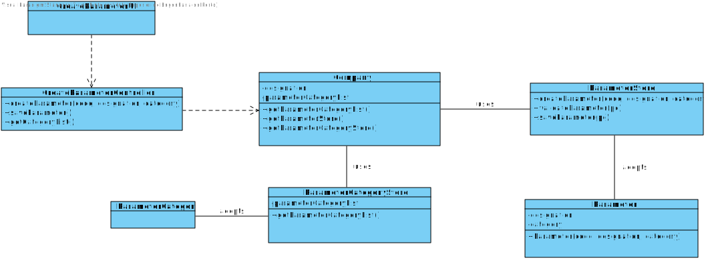

# US 10 - Specify a new parameter and categorize it

## 1. Requirements Engineering

### 1.1. User Story Description

As an administrator, I want to specify a new parameter and categorize it.

### 1.2. Customer Specifications and Clarifications

**_From the Specifications Document_**

"Despite being out of scope, the system should be developed having in mind the need to easily support other kinds of tests (e.g., urine). Regardless, such tests rely on measuring one or more parameters that can be grouped/organized by categories."

**_From the client clarifications_**

-	**Question:** How does the assignment of a parameter category works? Does he have to select the category or he have the option to create in the moment?

	- 	**Answer:** There exists a user story to specify a new parameter category. Therefore, the administrator should select one category when creating a parameter.

-	**Question:** What is the data that characterize a parameter? Should we follow the same data as the parameter category, for example, would each parameter have its own code, description and NHS identifier?

	- 	**Answer:** Each parameter is associated with one category. Each parameter has a Code, a Short Name and a Description.
The Code are five alphanumeric characters. The Short Name is a String with no more than 8 characters. The Description is a String with no more than 20 characters.

### 1.3. Acceptance Criteria

- **AC1:** Parameter's designation cannot be empty.
- **AC2:** The parameter must have always a category.

### 1.4. Found out Dependencies

There is a dependency to "US11 Specify a new parameter category" since when the administrator is creating a new parameter, he needs to categorize it. This means, it's essential that the category already exists.

### 1.5 Input and Output Data

- **Input Data:**
	- Typed data:
		- Parameter's designation;
	- Selected data:
		- Category;
- **Output Data:**
	- (In)Success of the operation;

### 1.6. System Sequence Diagram (SSD)

### 1.7 Other Relevant Remarks

This US will be used whenever there is a need to create a new parameter (e.g, new test type).

## 2. OO Analysis

### 2.1. Relevant Domain Model Excerpt 

### 2.2. Other Remarks

## 3. Design - User Story Realization 

### 3.1. Rationale

**The rationale grounds on the SSD interactions and the identified input/output data.**

| Interaction ID | Question: Which class is responsible for... | Answer  | Justification (with patterns)  |
|:-------------  |:--------------------- |:------------|:---------------------------- |
| Step 1: Starts new parameter | ... instantiating a new Parameter?| Company | Creator: R1/2 |
| Step 2: Request Data | n/a							 | n/a            | n/a                             |
| Step 3: Types requested data |	... saving the input data? | Parameter | IE: The object created in step 1 has its own data.                              |
| Step 4: Show the data and requests a confirmation | ... validating the data locally? | Parameter | IE: knows its own data |
| Step 4: Show the data and requests a confirmation | ... validating the data globally? | Company | IE: knows all the Parameter objects |
| Step 5: Confirms the data |	... saving the created parameter? | Company | IE: adopts/records all the Parameter objects |
| Step 6: Informs operation success | ... informing operation success? | createdParameterUI | IE: responsible for user interaction |                              |              

### Systematization ##

According to the taken rationale, the conceptual classes promoted to software classes are: 

 * Parameter
 * Company

Other software classes (i.e. Pure Fabrication) identified:

 * createdParameterUI  
 * createdParameterController

## 3.2. Sequence Diagram (SD)

## 3.3. Class Diagram (CD)

# 4. Tests 

**Test 1:** 

    @Test
    public void testSetCode_PC() {
        System.out.println("setCode");
        String code = "54321";
        ParameterCategory pc = new ParameterCategory("12345", "this is a description", "12345");
        Parameter instance = new Parameter(code,"ddddd",pc);
        instance.setCode_P(code);
        assertEquals(instance.getCode_P(), "54321");
    }

**Test 2:**

    @Test
    public void testSetCategory_P() {
        System.out.println("setCategory_P");
        ParameterCategory category =  new ParameterCategory("1234","this is a parameter cateogry","1234");
        Parameter instance = new Parameter("3333","this is a parameter",category);
        instance.setCategory_P(category);
        assertEquals(instance.getCategory_P(),category);

    }

**Test 3:** 

    @Test(expected = IllegalArgumentException.class)
    public void testCheckCodeRules1() {
         ParameterCategory category =  new ParameterCategory("1234","this is a parameter cateogry","1234");
        Parameter instance = new Parameter("123", "this is a description", category);
    }

**Test 4:** 

    @Test(expected = IllegalArgumentException.class)
    public void testCheckCodeRules5() {
         ParameterCategory category =  new ParameterCategory("1234","this is a parameter cateogry","1234");
        Parameter instance = new Parameter("     ", "this is a description", category);
    }

**Test 5:** 

    @Test(expected = IllegalArgumentException.class)
    public void testCheckDescriptionRules5() {
        ParameterCategory pc = new ParameterCategory("1234","this is a parameter cateogry","1234");
        Parameter instance = new Parameter("1111", " ",  pc);
    }

# 5. Construction (Implementation)

**Parameters**

	public class Parameter {
    
    private String code;
    private String description;
    private ParameterCategory category;
    
    /**
     *
     * @param description The description of the added parameter
     * @param category The category the parameter fits in 
     */
    public Parameter(String code, String description, ParameterCategory category) {
        checkCodeRules(code);
        checkDescriptionRules(description);
       this.code = code;
        this.description = description;
        this.category = category;
    }
    
    /**
     * 
     * @param code Code must have 4 to 8 chars
     */
    private void checkCodeRules(String code) {
        if (StringUtils.isBlank(code))
            throw new IllegalArgumentException("Code cannot be blank.");
        if ( (code.length() < 4) || (code.length() > 8))
            throw new IllegalArgumentException("Code must have 4 to 8 chars.");
    }
    
    /**
     * 
     * @param description Description must have 1 to 40 chars
     */
    private void checkDescriptionRules(String description){
        
        if ( (description.length() < 1) || (description.length() > 40))
            throw new IllegalArgumentException("Description must have 1 to 40 chars.");
        if (StringUtils.isBlank(description))
            throw new IllegalArgumentException("Code cannot be blank.");
    }
    
   
    /**
     * 
     * @param description New description for this parameter 
     */
    public void setDescription_P(String description){
        checkDescriptionRules(description);
        this.description=description;
    }

    /**
     * return this parameter's code 
    */
    public String getCode_P() {
        return code;
    }

    /**
     * New code to this parameter 
     * @param code 
     */
    public void setCode_P(String code) {
        this.code = code;
    }

    
    /**
     * @return This parameter's category 
     */
    public ParameterCategory getCategory_P() {
        return category;
    }

    /**
     * @param category New category for this parameter  
     */
    public void setCategory_P(ParameterCategory category) {
        this.category = category;
    }
    
    
    /**
     * 
     * @return This parameter category's description
     */
    public String getDescription_P(){
        return this.description;
    }
   
    
    /**
     * 
     * @return This parameter category's attributes information
     */
    @Override
    public String toString(){
        return "Parameter \n" + "Code: " + this.code + "   Description: " + this.description +
                "  Category id: " + this.category.getCodePC();
    }
    
    
**ParameterController**

	public class CreateParameterCategoryController {
    private Company company;
    private ParameterCategory pc;
    private ParameterCategoryStore store;
    private ParameterStore store2;

    /**
     * Creates a controller getting the Company information from App
     */
    public CreateParameterCategoryController() {
        this(App.getInstance().getCompany());
        this.store2 = this.company.getParameterStore();
    }
    
    /**
     * Creates a controller from the Company, having it as a parameter 
     * @param company The company responsible for knowing the categories 
     */
    public CreateParameterCategoryController(Company company) {
        this.company = company;
        this.pc = null;
    }
    
    /**
     * Creates a parameter category based on information given by the UI
     * @param code Code used to identify a category collected by the UI
     * @param description The description of the added category collected by the UI
     * @param nhsId NHS id number for this category collected by the UI
     * @return True if the new parameter category was added successfully to the company's database
     */
    public boolean createParameterCategory(String code, String description, String nhsId) {
        this.store = this.company.getParameterCategoryStore();    
        this.pc = this.store.createParameterCategory(code, description, nhsId);
        return this.store.validateParameterCategory(pc);
    }
    
    /**
     * Tells the parameter category store to save a parameter category
     * @return Validation if the parameter category does not already exists in the company
     */
    public boolean saveParameterCategory() {
        return this.store.saveParameterCategory(pc);
    }
    
    /**
     * Gets the list of categories known by the Company
     * @return All registered test types
     */
    public List<ParameterCategory> showAllParameterCategories(){
        return new ArrayList<>(this.store.getParameterCategories());
    }
    
    /**
     * Gets the list of parameters know by the Company
     * @return list of registered parameters 
     */
    public List<Parameter> parameterList(){
        this.store2 = this.company.getParameterStore();
        return new ArrayList<>(this.store2.getParameters());
    }
    
    /**
     * Adds a new parameter to the category
     * @param p Parameter to be added
     */
    public void fillParameterList(Parameter p){
            this.pc.addPCParameter(p);
    }

**ParameterStore**

	public class ParameterStore {
    
    
    //User Story 10: Create new Parameter
    /**
     *  List of Parameters available for the tests
     */
    private final List<Parameter> parameterList;
   
    
    /**
     * Parameter Store constructor 
     * @param list 
     */
    public ParameterStore(List<Parameter> list ){
        this.parameterList = list;
    }
    
    /**
     * @param code Code used to identify a parameter 
     * @param description Description of the parameter created 
     * @param category Category that the parameter fits in 
     * @return A new parameter 
     */
    public Parameter createParameter( String code, String description, ParameterCategory category){
        return new Parameter(code,description,category);
    }
    
    /**
     * @param p The parameter to be validated
     * @return Validation if the parameter does not already exists 
     */
    public boolean validateParameter(Parameter p){
        if (p == null)
            return false;
        return ! this.parameterList.contains(p);
    }
    
    /**
     * @param p The parameter to be added to the list of parameters
     * @return true if the new parameter was added successfully
     */
    public boolean saveParameter(Parameter p){
        if (!validateParameter(p))
            return false;
        return this.parameterList.add(p);
    }
    
    /**
     * Returns the list of parameters
     * @return the list of parameters
     */
    public List<Parameter> getParameters(){
        return this.parameterList;
    }

# 6. Integration and Demo 

* Added Parameter class
* Added coverage and mutation tests for Parameter class
* Added ParameterController class
* Added coverage and mutation tests for ParameterController class
* Added ParameterStore class
* Added coverage and mutation tests for ParameterStore class
* Added ParameterUI
* A new option on the Administrator menu options was added: Create Parameter

# 7. Observations

