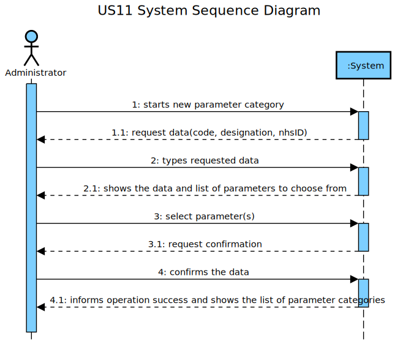
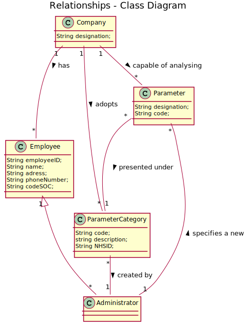
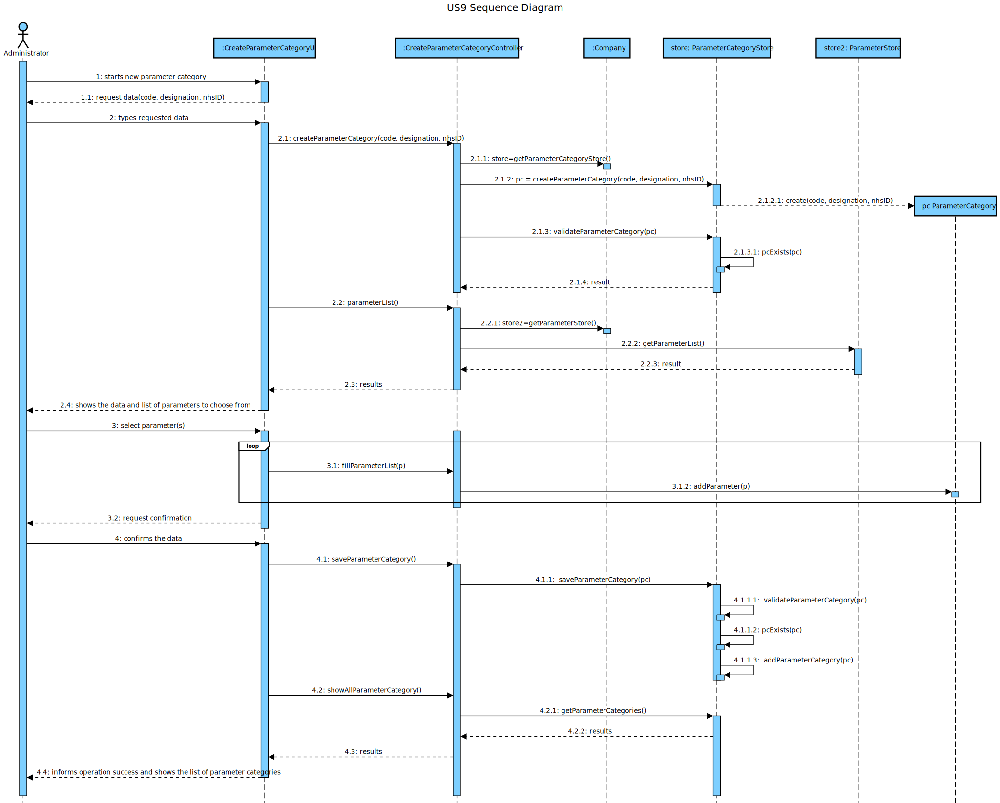
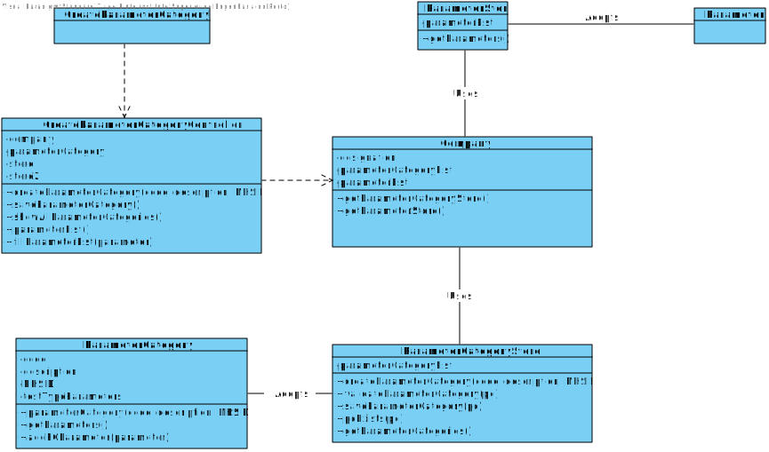

# US 11 - Specify a new parameter category

## 1. Requirements Engineering

*In this section, it is suggested to capture the requirement description and specifications as provided by the client as well as any further clarification on it. It is also suggested to capture the requirements acceptance criteria and existing dependencies to other requirements. At last, identfy the involved input and output data and depicted an Actor-System interaction in order to fulfill the requirement.*

### 1.1. User Story Description

As an administrator, I want to specify a new parameter category.

### 1.2. Customer Specifications and Clarifications 

*Insert here any related specification and/or clarification provided by the client together with **your interpretation**. When possible, provide a link to such specifications/clarifications.*

**_From the Specifications Document_**

“Blood tests are frequently characterized by measuring several parameters which for presentation/reporting purposes are organized by categories. For example, parameters such as the number of Red Blood Cells (RBC), White Blood Cells (RBC) and Platelets (PLT) are usually presented under the blood count (Hemogram) category. Regardless, such tests rely on measuring one or more parameters that can be grouped/organized by categories.”

**_From the client clarifications_**

-	**Question:** What are the data that characterize a parameter category?

	- 	**Answer:** Simply consider a code, a description and an NHS identifier

### 1.3. Acceptance Criteria

- AC1: Code must be unique having 4 to 8 chars
- AC2: Description cannot be empty and has, at maximum, 40 chars
- AC3: NHS identifier is not mandatory

### 1.4. Found out Dependencies

No dependencies were found.

### 1.5 Input and Output Data

- Input Data
	- Typed data: code, description and NHS identified
	- Selected data: parameters
- Output Data
	- (In)Success of the operation

### 1.6. System Sequence Diagram (SSD)

### 1.7 Other Relevant Remarks

This US will be used every time that one parameter doesn't have an appropriated category.

## 2. OO Analysis

### 2.1. Relevant Domain Model Excerpt

### 2.2. Other Remarks

## 3. Design - User Story Realization 

### 3.1. Rationale

**The rationale grounds on the SSD interactions and the identified input/output data.**

| Interaction ID | Question: Which class is responsible for... | Answer  | Justification (with patterns)  |
|:-------------  |:--------------------- |:------------|:---------------------------- |
| Step 1  		 |	... interacting with the actor? | CreateParameterCategoryUI   |  Pure Fabrication: there is no reason to assign this responsibility to any existing class in the Domain Model.           |
| 			  		 |	... coordinating the US? | CreateParameterCategoryController | Controller                             |
| 			  		 |	... instantiating a new ParameterCategory? | ParameterCategoryStore | Indirection: Creates ParameterCategory for the Company that adopts them.   |
| 			  		 |	... instantiating a new ParameterCategoryStore? | Company | IE: Knows all the ParameterCategory objects, in the DM Company adopts ParameterCategory |
| 			  		 | ... knowing the user using the system?  | UserSession  | IE: Knows the registered user and their roles.  |
| 			  		 |							 | Company  | IE: knows/has its own Employees|
| 			  		 |							 | Employee  | IE: knows its own data (e.g. email) |
| Step 1.1  		 |							 |             |                              |
| Step 2  		 |	...saving the inputted data? | ParameterCategory| IE: object created in step 1 has its own data.  |
| Step 2.1  		 |	...knowing the parameters to show? | ParameterStore | IE: adopts/records all the Parameter objects |
| 			  		 |	... instantiating a new ParameterStore? | Company | IE: Knows all the Parameter objects, in the DM Company is capable of analyzing Parameter |
| Step 3  		 |	... saving the selected category? | ParameterCategory| IE: object created in step 1 has a method to add parameters to its list  |
| Step 3.1  		 |							 |             |                              |              
| Step 4  		 |	... validating all data (local validation)? | ParameterCategory | IE: owns its data.| 
| 			  		 |	... validating all data (global validation)? | ParameterCategoryStore | IE: knows all the ParameterCategory objects| 
| 			  		 |	... saving the created ParameterCategory? | ParameterCategoryStore | IE: adopts/records all the ParameterCategory objects | 
| Step 4.1  		 |	... informing operation success?| CreateParameterCategoryUI  | IE: is responsible for user interactions.  | 
|                                        |	...knowing the parameter category to show? | ParameterCategoryStore | IE: adopts/records all the ParameterCategory objects |

### Systematization ##

According to the taken rationale, the conceptual classes promoted to software classes are: 

 * Company
 * Category

Other software classes (i.e. Pure Fabrication) identified: 

 * createdParameterCategoryUI
 * createdParameterCategoryController
 * ParameterCategoryStore

## 3.2. Sequence Diagram (SD)

## 3.3. Class Diagram (CD)

*In this section, it is suggested to present an UML static view representing the main domain related software classes that are involved in fulfilling the requirement as well as and their relations, attributes and methods.*

# 4. Tests 
*In this section, it is suggested to systematize how the tests were designed to allow a correct measurement of requirements fulfilling.* 

**_DO NOT COPY ALL DEVELOPED TESTS HERE_**

**Test 1:** Check that it is not possible to create an instance of the Parameter Category with less than 4 chars code

	@Test(expected = IllegalArgumentException.class)
    	public void testCheckCodeRules1() {
        	ParameterCategory instance = new ParameterCategory("123", "this is a description", "12345");
    	}

**Test 2:** Check that it is not possible to create an instance of the Parameter Category with more than 40 chars description
	
	@Test(expected = IllegalArgumentException.class)
    	public void testCheckDescriptionRules4() {
        	ParameterCategory instance = new ParameterCategory("123456", "12345123451234512345123451234512345123459999", "12345"); 
    	}

**Test 3:** Check that it is not possible to create an instance of the Parameter Category with empty chars nhsid

	@Test(expected = IllegalArgumentException.class)
    	public void testCheckNHSRules5() {
        	ParameterCategory instance = new ParameterCategory("12345", "this is a description", "    ");
    	}

**Test 4:** Check that it is not possible to set an instance of the Parameter Category with 0 chars code

    	@Test(expected = IllegalArgumentException.class)
    	public void testSetCode1() {
        	ParameterCategory instance = new ParameterCategory("123456", "aaaaaaaaaaaaaaaa", "12345");
        	instance.setCodePC("");
    	}

**Test 5:** Check the mutation test for an instance of ParameterCategory class with 4 chars code.

	@Test
    	public void testCheckCodeRules3() {
        	try{
            		ParameterCategory instance = new ParameterCategory("1234", "this is a description", "12345");
        	}
        	catch(IllegalArgumentException e){
            		fail("IllegalArgumentException");
        	}
    	}

**Test 6:** Check the mutation test for an instance of ParameterCategory class with 40 chars description.

	@Test
    	public void testCheckDescriptionRules2() {
        	try{
            		ParameterCategory instance = new ParameterCategory("123456", "1234512345123451234512345123451234512345", "12345");
        	}
        	catch(IllegalArgumentException e){
            		fail("IllegalArgumentException");
        	}
    	}

**Test 7:** Check that it is not possible to add a parameter to the category

	@Test
    	public void testAddTestTypeParameter(){
        	ParameterCategory instance = new ParameterCategory("1234", "description", "12345");
        	ParameterCategory other = new ParameterCategory("4321", "description", "43210");
        
        	Parameter p1 = new Parameter( "description", instance);
        	Parameter p2 = new Parameter( "description", other);
        
        	instance.addPCParameter(p1);
        	instance.addPCParameter(p2);
        	Parameter pp = instance.getParameters().get(1);
        
        	assertEquals(p2, pp);
    	}

# 5. Construction (Implementation)

*In this section, it is suggested to provide, if necessary, some evidence that the construction/implementation is in accordance with the previously carried out design. Furthermore, it is recommeded to mention/describe the existence of other relevant (e.g. configuration) files and highlight relevant commits.*

**ParameterCategory**

	public class ParameterCategory {
    	private String code;
    	private String description;
    	private String nhsId;
    	private final List<Parameter> PCParameters = new ArrayList<>();
    
    	public ParameterCategory(String code, String description, String nhsId) {
        	checkCodeRulesPC(code);
        	checkDescriptionRulesPC(description);
        	checkNHSRulesPC(nhsId);
       		 this.code = code;
        	this.description = description;
        	this.nhsId = nhsId;
   		}
    
    	private void checkCodeRulesPC(String code) {
        	if ( (code.length() < 4) || (code.length() > 8))
            		throw new IllegalArgumentException("Code must have 4 to 8 chars.");
        	if (StringUtils.isBlank(code))
            		throw new IllegalArgumentException("Code cannot be blank.");
    	}
    
    	private void checkDescriptionRulesPC(String description){
        	if ( (description.length() < 1) || (description.length() > 40))
            		throw new IllegalArgumentException("Description must have 1 to 40 chars.");
        	if (StringUtils.isBlank(description))
            		throw new IllegalArgumentException("Description cannot be blank.");
    	}
    
    	private void checkNHSRulesPC(String nhs) {
        	if ( (nhs.length() < 4) || (nhs.length() > 8))
            		throw new IllegalArgumentException("NHS id must have 4 to 8 chars.");
        	if (StringUtils.isBlank(nhs))
            		throw new IllegalArgumentException("NHS id cannot be blank.");
    	}
    
    	public void setCodePC(String code){
        	checkCodeRulesPC(code);
        	this.code=code;
    	}

    	public void setDescriptionPC(String description){
        	checkDescriptionRulesPC(description);
        	this.description=description;
    	}

   		public void setNHSPC(String nhs){
		    checkNHSRulesPC(nhs);
       		this.nhsId=nhs;
    	}
    
    	public String getCodePC(){
        	return this.code;
    	}

    	public String getDescriptionPC(){
        	return this.description;
    	}

    	public String getNHSPC(){
        	return this.nhsId;
    	}

	    public List<Parameter> getParameters(){
       		return this.PCParameters;
    	}

    	public void addPCParameter(Parameter p){
        	this.PCParameters.add(p);
    	}
    
    	@Override
    	public String toString(){
        	return String.format("Parameter Category #%s\n"
                           		+ "%s\n"
                           		+ "NHS id:%s", this.code, this.description, this.nhsId);
    	}
    
	}

**ParameterCategoryStore**

    public class ParameterCategoryStore {   
        private final List<ParameterCategory> parameterCategoryList;
    
        public ParameterCategoryStore(List<ParameterCategory> list){
            this.parameterCategoryList= list;
        }
    
        public ParameterCategory createParameterCategory(String code, String description, String nhsId) {
            return new ParameterCategory(code, description, nhsId);
        }
    
        public boolean validateParameterCategory(ParameterCategory pc) {
            if (pc == null)
                return false;
            return pcExists(this.parameterCategoryList, pc);
        }
    
        public boolean saveParameterCategory(ParameterCategory pc) {
            if (!validateParameterCategory(pc))
                return false;
            return this.parameterCategoryList.add(pc);
        }
    
        public boolean pcExists(List<ParameterCategory> list, ParameterCategory pc){
            for(ParameterCategory p : list){
                if(p.getCodePC().compareTo(pc.getCodePC())==0)
                    return false;
            }
            return true;
        }
    
        public List<ParameterCategory> getParameterCategories(){
            return this.parameterCategoryList;
        }
    }

**ParameterCategoryController**

    public class CreateParameterCategoryController {
        private Company company;
        private ParameterCategory pc;
        private ParameterCategoryStore store;
        private ParameterStore store2;

        public CreateParameterCategoryController() {
            this(App.getInstance().getCompany());
            this.store2 = this.company.getParameterStore();
        }

        public CreateParameterCategoryController(Company company) {
            this.company = company;
            this.pc = null;
        }
    
        public boolean createParameterCategory(String code, String description, String nhsId) {
            this.store = this.company.getParameterCategoryStore();    
            this.pc = this.store.createParameterCategory(code, description, nhsId);
            return this.store.validateParameterCategory(pc);
        }
    
        public boolean saveParameterCategory() {
            return this.store.saveParameterCategory(pc);
        }
    
        public List<ParameterCategory> showAllParameterCategories(){
            return new ArrayList<>(this.store.getParameterCategories());
        }

        public List<Parameter> parameterList(){
            this.store2 = this.company.getParameterStore();
            return new ArrayList<>(this.store2.getParameters());
        }

        public void fillParameterList(Parameter p){
            this.pc.addPCParameter(p);
        }
    }

# 6. Integration and Demo 

* Added ParameterCategory class
* Added coverage and mutation tests for ParameterCategory class
* Added CreateParameterCategoryController class
* Added coverage and mutation tests for CreateParameterCategoryController class
* Added ParameterCategoryStore class
* Added coverage and mutation tests for ParameterCategoryStore class
* Added CreateParameterCategoryUI
* A new option on the Administrator menu options was added: Create ParameterCategory

# 7. Observations