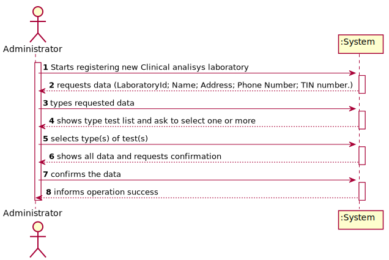
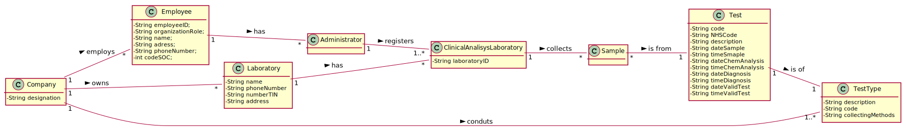
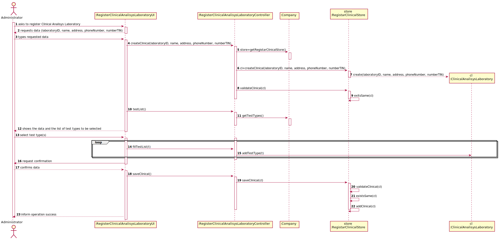
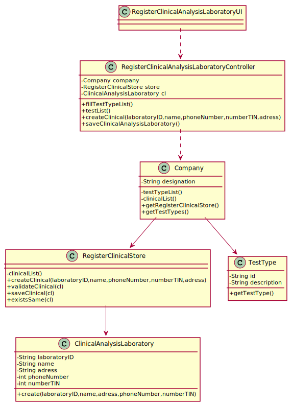

# US 8 - Register a new clinical analysis laboratory stating which kind of test(s) it operates

## 1. Requirements Engineering

*In this section, it is suggested to capture the requirement description and specifications as provided by the client as well as any further clarification on it. It is also suggested to capture the requirements acceptance criteria and existing dependencies to other requirements. At last, identfy the involved input and output data and depicted an Actor-System interaction in order to fulfill the requirement.*

### 1.1. User Story Description

As an administrator, I want to register a new clinical  analysis laboratory stating which kind of test(s) it operates.

### 1.2. Customer Specifications and Clarifications 

*Insert here any related specification and/or clarification provided by the client together with **your interpretation**. When possible, provide a link to such specifications/clarifications.*

**_From the Specifications Document_**

“Many Labs has a network of clinical analysis laboratories in England where analysis of blood(samples are collected)are performed, as well as Covid-19 tests. All Many Labs clinical analysis laboratories perform clinical blood tests,and a subset of these laboratories also performs Covid-19 tests. To register a clinical analisis laboratory , the administrator needs laboratory Id, name, address, phone number and TIN number and needs to stat which kind of test(s) it operates.”

**_From the client clarifications_**

*Question: "What kind of atributes does Clinical Analysis Laboratory has?"

*Answer: "Each Clinical Analysis Laboratory is characterized by the following attributes:
          
Laboratory ID;
Name;
Address;
Phone Number;
TIN number."
     

*Question: "Are two Clinical Analysis Laboratories with the same:
a) Laboratory ID OR 
b) name OR
c) address OR
d) phone Number OR
e) TIN number

allowed to exist?

In other words, should the Clinical Analysis Laboratory created have all their attributes different (besides the types of test which can be the same) from any of the attributes of the already registed Clinical Analysis Laboratory or is any of the attributes allowed to be the same?"

*Answer: "Only the name of two CAL can be same."

*Question: "When starting a new clinical analysis laboratory registration, should the entered requested data be showed to the user for confirmation purposes?"

*Answer: "It is always a good practice to validate and ask for confirmation."

*Question: "Are the test types in US8 typed in or selected from those that the program has?"

*Answer: "The test types are selected from a list."

*Question: "Which type/format has LaboratoryID, address, name, phone number, and TIN number on Clinical Analysis Laboratory?"

*Answer: "Each Clinical Analysis Laboratory is characterized by the following attributes:
Laboratory ID: five alphanumeric characters;
Name: A string with no more than 20 characters;
Address: A string with no more than 30 characters;
Phone Number: 11 digit number;
TIN number: 10 digit number;
Type of tests performed by the lab.

All information is required." 

*Question: "Also, should we the employees be allocated to the clinical lab in which they work? Or, for example, can one medical lab technician work in more than one clinical analysis lab?"

*Answer: "Each Receptionist and each Medical Lab Technician can work in any Clinical Analysis Laboratory of the Many Labs network."

*Question: "We know through the specifications document that "All Many Labs clinical analysis laboratories perform clinical blood tests".
My question therefore is: When creating a new Clinical Analysis Laboratory, should the system automatically record that it operates that type of test or should the person who is creating it select it manually while selecting other types of tests? Or other option?"

*Answer: "The administrator should select, manually, all the types of tests to be performed by the Clinical Analysis Laboratory."

 

### 1.3. Acceptance Criteria

   AC1: All required fields must be filled in.
   AC2: Phone number needs to be 11 numbers.
   AC3: TIN needs to be 10 numbers.
   AC4: Name needs to have no more than 20 chars.
   AC5: Adress needs to have no more than 30 chars.
   AC6: Laboratory ID must have 5 alphanumberic. 

### 1.4. Found out Dependencies

Dependency to "US9 Create new Type of Test" since one or more tests types must exist in order to state the type(s) of test(s) performed in a laboratory.

### 1.5 Input and Output Data

- Input Data
	- Typed data: Laboratory ID;
                      Name;
                      Address;
                      Phone Number;
                      TIN number.
	- Selected data: Type(s) of test(s)
- Output Data
        - List of Clinical Analysis Laboratory with test type selected
	- (In)Success of the operation

### 1.6. System Sequence Diagram (SSD)

### 1.7 Other Relevant Remarks

This US will be used every time that a new Clinical Analysis Laborary is registered

## 2. OO Analysis

### 2.1. Relevant Domain Model Excerpt

### 2.2. Other Remarks

## 3. Design - User Story Realization 

### 3.1. Rationale

**The rationale grounds on the SSD interactions and the identified input/output data.**

| Interaction ID | Question: Which class is responsible for... | Answer  | Justification (with patterns)  |
|:-------------  |:--------------------- |:------------|:---------------------------- |
| Step 1: Starts registering new Clinical Analisys Laboratory | ... interacting with the actor? | ClinicalAnalisysLaboratoryUI   |  Pure Fabrication: there is no reason to assign this responsibility to any existing class in the Domain Model.           |
| 			  		 |	... coordinating the US? | ClinicalAnalisysLaboratoryController | Controller                             |
| 			  		 |	... instantiating a new Lab? | RegisterClinicalStore | Creator (Rule 1): in the DM Organization has a Task.   |
| 			  		 |	... instantiating a new RegisterClinicalStore? | Company | Creator (Rule 1): in the DM Organization has a Task. |
| 			  		 | ... knowing the user using the system?  | UserSession  | IE: Knows the registered user and their roles.  |
| 			  		 |							 | Company  | IE: knows/has its own Employees|
| 			  		 |							 | Employee  | IE: knows its own data (e.g. email) |
| Step 2: Request Data | n/a							 | n/a            | n/a                             |
| Step 3: Types requested data |	... saving the input data? | ClinicalAnalisysLaboratory | IE: The object created in step 1 has its own data.                              |
| Step 4: shows type test list and asks to select one or more | ...knowing the test(s) type(s) to show? | TestType | IE: knows its own data |
| Step 5: select type(s) of test(s) | ... saving the selected Test Type? | ClinicalAnalisysLaboratory | IE: object created in step 1 has a method to add Testypes|
| Step 6: shows all data and requests confirmation |	...  validating the data locally? | ClinacalAnalisysLaboratory | IE: knows its own data |
| Step 6: shows all data and requests confirmation | ... validating the data globally? | RegisterClinicalStore | IE: knows all the ClinicalAnalysisLaboratory objects |                              |  
| Step 7: confirms the data | ... saving the created ClinicalAnalisysLaboratory | RegisterClinicalStore | IE: adopts/records all the ClinicalAnalysisLaboratory objects |                              |      
| Step 8: Informs operation success | ... informing operation success? | RegisterClinicalAnalisysLaboratoryUI | IE: responsible for user interaction |                              |                

### Systematization ##

According to the taken rationale, the conceptual classes promoted to software classes are: 

 * Company
 * ClinicalAnalisysLaboratory

Other software classes (i.e. Pure Fabrication) identified: 

 * ClinicalAnalisysLaboratoryUI
 * ClinicalAnalisysLaboratoryController
 * RegisterClinicalStore

## 3.2. Sequence Diagram (SD)

## 3.3. Class Diagram (CD)

*In this section, it is suggested to present an UML static view representing the main domain related software classes that are involved in fulfilling the requirement as well as and their relations, attributes and methods.*

# 4. Tests 
*In this section, it is suggested to systematize how the tests were designed to allow a correct measurement of requirements fulfilling.* 

**_DO NOT COPY ALL DEVELOPED TESTS HERE_**

**Test 1:** Mutation Test of checkPhoneNumberRules method, of class ClinicalAnalysisLaboratory , PhoneNumber char(digits)!=11 and dont contain non digits. 
 
    @Test(expected = IllegalArgumentException.class)
    public void testCheckPhoneNumberRules1() {
            ClinicalAnalysisLaboratory c = new ClinicalAnalysisLaboratory("12345", "Lab", "Rua 1", "1234567890", "1234567890");
    }

**Test 2:**  Mutation Test of checkNumberTINRules method, of class ClinicalAnalysisLaboratory , TIN chars(digits)==10 and dont contain non digits.

    @Test
    public void testCheckNumberTIN4R() {
        try{
            ClinicalAnalysisLaboratory c = new ClinicalAnalysisLaboratory("12345", "Lab", "Rua 1", "12345678901", "1234567890");
        }
        catch(IllegalArgumentException e){
            fail("IllegalArgumentException");
        }
    }

**Test 3:** Mutation Test of checkNameRules method, of class ClinicalAnalysisLaboratory , Name chars<20.

     
    @Test(expected = IllegalArgumentException.class)
    public void testCheckName2() {
        ClinicalAnalysisLaboratory c = new ClinicalAnalysisLaboratory("12345", "Lablololllllllllllllll645675475", "Rua 1", "12345678901", "1234567890");
    }

**Test 4:** Mutation Test of checkAddressRules method, of class ClinicalAnalysisLaboratory , Address chars==30.
     
    @Test
    public void testAddress4() {
        try{
            ClinicalAnalysisLaboratory c = new ClinicalAnalysisLaboratory("12345", "Lab", "123456789012345678901234567890", "12345678901", "1234567890");
        }
        catch(IllegalArgumentException e){
            fail("IllegalArgumentException");
        }
    }

*It is also recommended to organize this content by subsections.* 

# 5. Construction (Implementation)

*In this section, it is suggested to provide, if necessary, some evidence that the construction/implementation is in accordance with the previously carried out design. Furthermore, it is recommeded to mention/describe the existence of other relevant (e.g. configuration) files and highlight relevant commits.*

**ClinicalAnalysisLaboratory**
  
    public class ClinicalAnalysisLaboratory {
    private String laboratoryID;
    private String name;
    private String adress;
    private String phoneNumber;
    private String numberTIN;
    private final List<TestType> TestTypelist = new ArrayList<>();
    /**
     * @param laboratoryID
     * @param name
     * @param address
     * @param phoneNumber
     * @param numberTIN
     */
    public ClinicalAnalysisLaboratory(String laboratoryID, String name, String address, String phoneNumber, String numberTIN) {
        allcheck(laboratoryID,name,address,phoneNumber,numberTIN);
        this.laboratoryID = laboratoryID;
        this.name = name;
        this.adress = address;
        this.phoneNumber = phoneNumber;
        this.numberTIN = numberTIN;
    }
    public void allcheck(String laboratoryID, String name, String adress, String phonenumber, String numberTIN){
        checkLabIDRules(laboratoryID);
        checkNameRules(name);
        checkAddressRules(adress);
        checkNumberTINRules(numberTIN);
        checkPhoneNumberRules(phonenumber);
    }
    /**
     * @param phoneNumber check if phoneNumber has 11 digits
     */
    private void checkPhoneNumberRules(String phoneNumber) {
        if (phoneNumber.length() != 11 || !phoneNumber.matches("[0-9]+"))
            throw new IllegalArgumentException("Phone Number must be 11 numbers.");
    }
    /**
     * @param numberTIN check if numberTIN has 10 digits
     */
    private void checkNumberTINRules(String numberTIN) {
        if (numberTIN.length() != 10 || !numberTIN.matches("[0-9]+"))
            throw new IllegalArgumentException("TIN number must be 10 numbers.");
    }
    /**
     * @param laboratoryID check if laboratoryID has 5 aplhanumbers
     */
    private void checkLabIDRules(String laboratoryID) {
        if (laboratoryID.length() != 5 || !laboratoryID.matches("[a-zA-Z0-9]+"))
            throw new IllegalArgumentException("LabID must be 5 aphamunbers.");
    }
    /**
     * @param address check if address has no more than 30 chars and more than 1
     */
    private void checkAddressRules(String address) {
        if (address.length() <1 || address.length() >30)
            throw new IllegalArgumentException("Address must be no more than 30 car.");
    }
    /**
     * @param name check if name has no more than 20 chars and more than 1
     */
    private void checkNameRules(String name) {
        if (name.length() < 1 || name.length() > 20)
            throw new IllegalArgumentException("Name must be no more than 20 car.");
    }
    /**
     * @return laboratoryID
     */
    public String getLaboratoryID() {
        return laboratoryID;
    }
    /**
     * @return name
     */
    public String getName() {
        return name;
    }
    /**
     * @return address
     */
    public String getAdress() {
        return adress;
    }
    /**
     * @return phoneNumber
     */
    public String getPhoneNumber() {
        return phoneNumber;
    }
    /**
     * @return numberTIN
     */
    public String getNumberTIN() {
        return numberTIN;
    }
    /**
     * @param laboratoryID
     */
    public void setLaboratoryID(String laboratoryID) {
        this.laboratoryID = laboratoryID;
    }
    /**
     * @param name
     */
    public void setName(String name) {
        this.name = name;
    }
    /**
     * @param adress
     */
    public void setAdress(String adress) {
        this.adress = adress;
    }
    /**
     * @param phoneNumber
     */
    public void setPhoneNumber(String phoneNumber) {
        this.phoneNumber = phoneNumber;
    }
    /**
     * @param numberTIN
     */
    public void setNumberTIN(String numberTIN) {
        this.numberTIN = numberTIN;
    }
    /**
     * @return Test types performed in this lab
     */
    public List<TestType> getTests(){
        return this.TestTypelist ;
    }
    /**
     *
     * @param t The new test type for this lab
     */
    public void addTestType(TestType t){
        this.TestTypelist.add(t);
    }
    /**
     * @return data of ClinicalAnalysisLaboratory
     */
    @Override
    public String toString() {
        return "ClinicalAnalysisLaboratory{" +
                "laboratoryID='" + laboratoryID + '\'' +
                ", name='" + name + '\'' +
                ", address='" + adress + '\'' +
                ", phoneNumber=" + phoneNumber +
                ", numberTIN=" + numberTIN +
                '}';
    }
}

**RegisterClinicalStore**

  public class RegisterClinicalStore {

    private final List<ClinicalAnalysisLaboratory> clinicalList;

    /**
     * @param list
     */
    public RegisterClinicalStore(List<ClinicalAnalysisLaboratory> list){
        this.clinicalList= list;
    }
    /**
     * @param laboratoryID
     * @param name
     * @param address
     * @param phoneNumber
     * @param numberTIN
     * @return new ClinicalAnalysisLaboratory
     */
    public ClinicalAnalysisLaboratory createClinical(String laboratoryID, String name, String address, String phoneNumber, String numberTIN){
        return new ClinicalAnalysisLaboratory(laboratoryID,name,address,phoneNumber,numberTIN);
    }
    /**
     * @param cl The laboratory to be validated
     * @return Validation if the laboratory does not exist
     */
    public boolean validateClinical(ClinicalAnalysisLaboratory cl) {
        if (cl == null)
            return false;
        return  existsSame(this.clinicalList,cl);
    }
    public boolean existsSame(List<ClinicalAnalysisLaboratory> list, ClinicalAnalysisLaboratory c){
        for(ClinicalAnalysisLaboratory cl : list){
            if(cl.getLaboratoryID().compareTo(c.getLaboratoryID())==0 || cl.getAdress().compareTo(c.getAdress())==0 || cl.getNumberTIN().compareTo(c.getNumberTIN())==0 || cl.getPhoneNumber().compareTo(c.getPhoneNumber())==0)
                return false;
        }
        return true;
    }
    /**
     * @param cl The laboratory to be added to the List of ClinicalAnalysisLaboratory
     * @return true if the laboratory was added successfully
     */
    public boolean saveClinical(ClinicalAnalysisLaboratory cl) {
        if (!validateClinical(cl))
            return false;
        return this.clinicalList.add(cl);
    }

}

**RegisterClinicalAnalysisLaboratoryController**

  public class RegisterClinicalAnalysisLaboratoryController {
    private Company company;
    private RegisterClinicalStore store;
    private ClinicalAnalysisLaboratory cl;
    /**
     *
     */
    public RegisterClinicalAnalysisLaboratoryController() {
        this(App.getInstance().getCompany());
    }
    /**
     * @param company
     */
    public RegisterClinicalAnalysisLaboratoryController(Company company) {
        this.company =company;
        this.cl = null;
    }
    /**
     * @param laboratoryID
     * @param name
     * @param address
     * @param phoneNumber
     * @param numberTIN
     * @return True if the new laboratory was added successfully to the company's database
     */
    public boolean createClinical(String laboratoryID, String name, String address, String phoneNumber, String numberTIN) {
        this.store = this.company.getRegisterClinicalStore();
        this.cl = this.store.createClinical(laboratoryID, name, address, phoneNumber, numberTIN);
        return this.store.validateClinical(cl);
    }
    /**
     * @return Validation if the laboratory does not exist in the company
     */
    public boolean saveClinical() {
        return this.store.saveClinical(cl);
    }

    /**
     *
     * @return All labs
     */
    public List<ClinicalAnalysisLaboratory> showAllClinical(){
        return this.company.getClinicalList();
    }

    /**
     *
     * @return list of test types
     */
    public List<TestType> testList(){
        return this.company.getTestTypes();
    }
    /**
     *
     * @param t the Test types
     */
    public void fillTestList(TestType t){
            this.cl.addTestType(t);
    }
}

*It is also recommended to organize this content by subsections.* 

# 6. Integration and Demo 

*In this section, it is suggested to describe the efforts made to integrate this functionality with the other features of the system.*

* Added ClinicalAnalysisLaboratory class
* Added RegisterClinicalAnalysisLaboratoryController class
* Added RegisterClinicalStore class
* Added RegisterClinicalAnalysisLaboratoryUI
* A new option on the Administrator menu options was added: Register Laboratory
* Added coverage and mutation tests for ClinicalAnalysisLaboratory class
* Added coverage and mutation tests for ClinicalAnalysisLaboratoryController class
* Added coverage and mutation tests for RegisterClinicalStore class

# 7. Observations

*In this section, it is suggested to present a critical perspective on the developed work, pointing, for example, to other alternatives and or future related work.*

