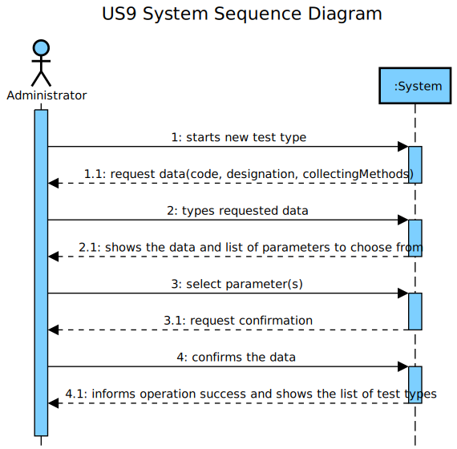

# US 009 - To specify a new type of test

## 1. Requirements Engineering

### 1.1. User Story Description

As an administrator, I want to specify a new type of test and its collecting methods.

### 1.2. Customer Specifications and Clarifications 

**From the specification document:**

>	Despite being out of scope, the system should be developed having in mind the need to easily support other kinds of tests (e.g., urine).

**From the questions:**
Q: Does a type of test holds any attribute besides it's name and collecting methods?
A: The attributes for a new test type are:

-Code: five alphanumeric characters. The code is not automatically generated.
-Description: a string with no more than 15 characters.
-Collecting Method: a string with no more than 20 characters.

Each test type should have a set of categories. Each category should be chosen from a list of categories.
From a previous post: "Each category has a name and a unique code. There are no subcategories."

There exists only one collection method per test type. ok

Q: Are the collecting methods stored simpled as a word or a sentence, or does it also must contain it's description, and/or another attributes?
A: From a previous post: "To make a Covid test you need a swab to collect a sample. To make a blood test you need sample tubes and a syringe.
When the administrator (US9) specifies a new type of test, the administrator also specifies the method to collect a sample. The administrator introduces a brief description for specifying the collecting method. "

### 1.3. Acceptance Criteria

* **AC1:** The tests rely on measuring one or more parameters that can be grouped/organized by categories.
* **AC2:** Code must have 5 chars.
* **AC3:** Description cannot be empty and has, at maximum, 15 chars.
* **AC4:** Collecting Methods cannot be empty and has, at maximum, 20 chars.

### 1.4. Found out Dependencies

* There is a dependency to "US010 Specify a new parameter and categorize it" since the measure parameters.
* There is a dependency to "US011 Specify a new parameter category" since the tests measure parameters that are organized by categories.

### 1.5 Input and Output Data

**Input Data:**
	- Typed data:
		- code, description, collecting methods
	- Selected data:
		- parameter(s)

**Output Data:**

* List of existing test types
* (In)Success of the operation

### 1.6. System Sequence Diagram (SSD)

### 1.7 Other Relevant Remarks

* This US is held whenever a new type of test is created, since the Company mainly performs only two, blood and covid tests, this US will be held an inferior amount of times when compared to the others

## 2. OO Analysis

### 2.1. Relevant Domain Model Excerpt 
*In this section, it is suggested to present an excerpt of the domain model that is seen as relevant to fulfill this requirement.* 

### 2.2. Other Remarks

n/a

## 3. Design - User Story Realization 

### 3.1. Rationale

| Interaction ID | Question: Which class is responsible for... | Answer  | Justification (with patterns)  |
|:-------------  |:--------------------- |:------------|:---------------------------- |
| Step 1  		 |	... interacting with the actor? | CreateTestTypeUI   |  Pure Fabrication: there is no reason to assign this responsibility to any existing class in the Domain Model.           |
| 			  		 |	... coordinating the US? | CreateTestTypeController | Controller                             |
| 			  		 |	... instantiating a new TestType? | TestTypeStore | Indirection: Creates TestTypes for the Company that performs them.   |
| 			  		 |	... instantiating a new TestTypeStore? | Company | IE: Knows all the TestType objects, in the DM Company performs TestType  |
| 			  		 | ... knowing the user using the system?  | UserSession  | IE: Knows the registered user and their roles.  |
| 			  		 |							 | Company  | IE: knows/has its own Employees|
| 			  		 |							 | Employee  | IE: knows its own data (e.g. email) |
| Step 1.1  		 |							 |             |                              |
| Step 2  		 |	...saving the inputted data? | TestType | IE: object created in step 1 has its own data.  |
| Step 2.1  		 |	...knowing the parameters to show? | ParameterStore | IE: adopts/records all the Parameter objects |
| 			  		 |	... instantiating a new ParameterStore? | Company | IE: Knows all the Parameter objects, in the DM Company is capable of analyzing Parameter  |
| Step 3  		 |	... saving the selected category? | TestType  | IE: object created in step 1 has a method to add parameters to its list  |
| Step 3.1  		 |							 |             |                              |              
| Step 4  		 |	... validating all data (local validation)? | TestType | IE: owns its data.| 
| 			  		 |	... validating all data (global validation)? | TestTypeStore | IE: knows all the TestType objects| 
| 			  		 |	... saving the created TestType? | TestTypeStore | IE: adopts/records all the TestType objects | 
| Step 4.1  		 |	... informing operation success?| CreateTestTypeUI  | IE: is responsible for user interactions.  | 
|                                        |	...knowing the test types to show? | TestTypeStore | IE: adopts/records all the TestType objects |

### Systematization ##

According to the taken rationale, the conceptual classes promoted to software classes are: 

 * Company
 * TestType

Other software classes (i.e. Pure Fabrication) identified: 
 
 * CreateTestTypeUI  
 * CreateTestTypeController
 * TestTypeStore

## 3.2. Sequence Diagram (SD)

## 3.3. Class Diagram (CD)

# 4. Tests 
*In this section, it is suggested to systematize how the tests were designed to allow a correct measurement of requirements fulfilling.* 

**_DO NOT COPY ALL DEVELOPED TESTS HERE_**

**Test 1:** Check that it is not possible to create an instance of TestType class without 5 chars code.

	@Test(expected = IllegalArgumentException.class)
	public void testCheckCodeRules2() {  
     		TestType instance = new TestType("123", "description", "Blood, Saliva");    
 	}

**Test 2:** Check that it is not possible to create an instance of TestType class with 0 chars description.

 	@Test(expected = IllegalArgumentException.class)
 	public void testCheckDescriptionRules3() {
     		TestType instance = new TestType("12345", "", "Blood, Saliva");
 	}

**Test 3:** Check that it is not possible to create an instance of TestType class with more than 20 chars collectingMethods.

 	@Test(expected = IllegalArgumentException.class)
 	public void testCheckCollectingMethodsRules2() {
     		TestType instance = new TestType("12345", "description", "1234512345123451234512345123451234512345");
	}

**Test 4:** Check that it is not possible to create an instance of TestType class with 5 empty chars code.

 	@Test(expected = IllegalArgumentException.class)
 	public void testCheckCodeRules4() {  
     		TestType instance = new TestType("     ", "description", "Blood, Saliva");
 	}

**Test 5:** Check the mutation test for an instance of TestType class with 15 chars description.

 	@Test
 	public void testCheckDescriptionRules2() {
     		try{
         		TestType instance = new TestType("12345", "123451234512345", "Blood, Saliva");
        		}
     		catch(IllegalArgumentException e){
         		fail("IllegalArgumentException");
     		}
	}  

**Test 6:** Check the mutation test for an instance of TestType class with 1 chars collectingMethods.

 	@Test
 	public void testCheckCollectingMethodsRules3() {
    		try{
         		TestType instance = new TestType("12345", "description", "1");
     		}
     		catch(IllegalArgumentException e){
         		fail("IllegalArgumentException");
     		}
	}

**Test 7:** Check that it is possible to add a parameter to an instance of TestType class.

 	@Test
 	public void testAddTestTypeParameter(){
     		TestType instance = new TestType("12345", "a", "Blood, Saliva");
     		ParameterCategory pc = new ParameterCategory("1234", "description", "1234");
     		Parameter p = new Parameter("1234", "description", pc);
     		instance.addTestTypeParameter(p);
     		Parameter pp = instance.getParameters().get(0);   
     		assertEquals(p, pp);
 	}

# 5. Construction (Implementation)

*In this section, it is suggested to provide, if necessary, some evidence that the construction/implementation is in accordance with the previously carried out design. Furthermore, it is recommeded to mention/describe the existence of other relevant (e.g. configuration) files and highlight relevant commits.*

**TestType**

	public class TestType {
    		private String code;
    		private String description;
    		private String collectingMethods;
    		private final List<Parameter> TestTypeParameters = new ArrayList<>();
    
    		public TestType(String code, String description, String collectingMethods){
        		checkCodeRules(code);
        		checkDescriptionRules(description);
        		checkCollectingMethodsRules(collectingMethods);
        		this.code = code;
        		this.description = description;
        		this.collectingMethods = collectingMethods;
    		}

    		private void checkCodeRules(String code){
        		if (code.length() != 5)
            			throw new IllegalArgumentException("Code must have five alphanumeric characters.");
        		if (StringUtils.isBlank(code))
            			throw new IllegalArgumentException("Code cannot be blank.");
    		}

    		private void checkDescriptionRules(String description){
       		 	if ((description.length()< 1) || (description.length()> 15))
				throw new IllegalArgumentException("Description must have 1 to 15 chars.");
       		 	if (StringUtils.isBlank(description))
        			throw new IllegalArgumentException("Description cannot be blank.");
    		}   
 
    		private void checkCollectingMethodsRules(String collectingMethods) {
        		if ((collectingMethods.length()< 1) || (collectingMethods.length()> 20))
            			throw new IllegalArgumentException("Collecting Methods must have 1 to 20 chars.");
        		if (StringUtils.isBlank(collectingMethods))
            			throw new IllegalArgumentException("Collecting Methods cannot be blank.");
    		}
    
    		public void setCode(String code){
        		checkCodeRules(code);
        		this.code=code;
    		}

		public void setDescription(String description){
        		checkDescriptionRules(description);
        		this.description=description;
    		}
 
    		public void setMethods(String cm){
        		checkCollectingMethodsRules(cm);
        		this.collectingMethods=cm;
    		}
    
    		public String getCode(){
        		return this.code;
    		}

    		public String getDescription(){
        		return this.description;
    		}

   		public String getMethods(){
        		return this.collectingMethods;
    		}

    		public List<Parameter> getParameters(){
        		return this.TestTypeParameters;
    		}

    		public void addTestTypeParameter(Parameter p){
        		this.TestTypeParameters.add(p);
    		}

		@Override
    		public String toString(){
        		return String.format("Test Type #%s\n"
                			+ "Description: %s\n"
                			+ "Collecting methods: %s", this.code, this.description, this.collectingMethods);
    		}  
	}

**TestTypeStore**

	public class TestTypeStore {
    		private final List<TestType> testTypeList;
    
    		public TestTypeStore(List<TestType> list){
        		this.testTypeList= list;
    		}
     
    		public TestType createTestType(String code, String description, String collectingMethods) {
        		return new TestType(code, description, collectingMethods);
    		}
    
    		public boolean validateTestType(TestType tt) {
        		if (tt == null)
            			return false;
        		return ttExists(this.testTypeList, tt);
    		}
    
    		public boolean saveTestType(TestType tt) {
        		if (validateTestType(tt) == false)
            			return false;
        		else
            			return this.testTypeList.add(tt);
    		}
    
    		public boolean ttExists(List<TestType> list, TestType tt){
        		for(TestType t : list){
            			if(t.getCode().compareTo(tt.getCode())==0)
                			return false;
        		}
        		return true;
    		}   
	}

**TestTypeController**

	public class CreateTestTypeController {
    		private Company company;
    		private TestType tt;
    		private TestTypeStore store;
    		private ParameterStore store2;
    
    		public CreateTestTypeController() {
        		this(App.getInstance().getCompany());
    		}
    
    		public CreateTestTypeController(Company company) {
        		this.company = company;
        		this.tt = null;
    		}
    
    		public boolean createTestType(String code, String description, String collectingMethods) {
        		this.store = this.company.getTestTypeStore(); 
        		this.tt = this.store.createTestType(code, description, collectingMethods);
        		return this.store.validateTestType(tt);
    		}
    
    		public boolean saveTestType() {
        		return this.store.saveTestType(tt);
    		}
    
    		public List<TestType> showAllTestTypes(){
         		List<TestType> getTestTypeList = new ArrayList<>(this.store.getTestTypes());
        		return getTestTypeList;
    		}
    
    		public List<Parameter> parameterList(){
        		this.store2 = this.company.getParameterStore();
        		List<Parameter> getParameterList = new ArrayList<>(this.store2.getParameters());
        		return getParameterList;
    		}
    
    		public void fillParameterList(Parameter p){
            		this.tt.addTestTypeParameter(p);
    		}
	}

# 6. Integration and Demo 

* Added TestType class
* Added coverage and mutation tests for TestType class
* Added CreateTestTypeController class
* Added coverage and mutation tests for CreateTestTypeController class
* Added TestTypeStore class
* Added coverage and mutation tests for TestTypeStore class
* Added CreateTestTypeUI
* A new option on the Administrator menu options was added: Create TestType

# 7. Observations

