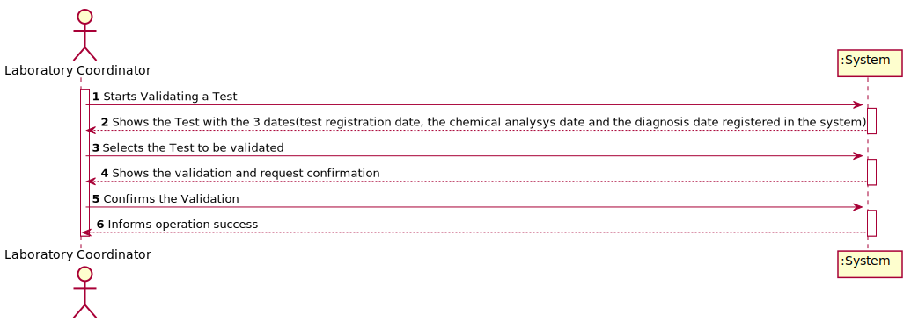
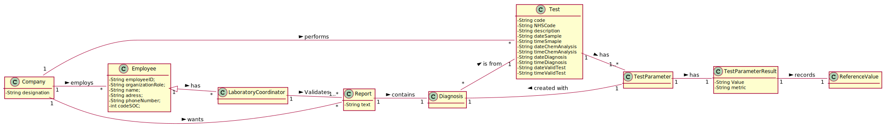
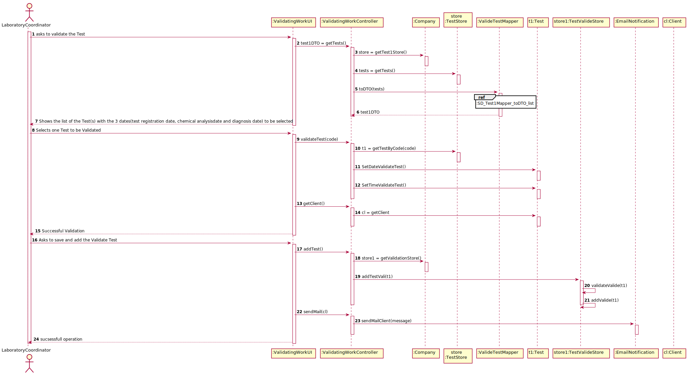
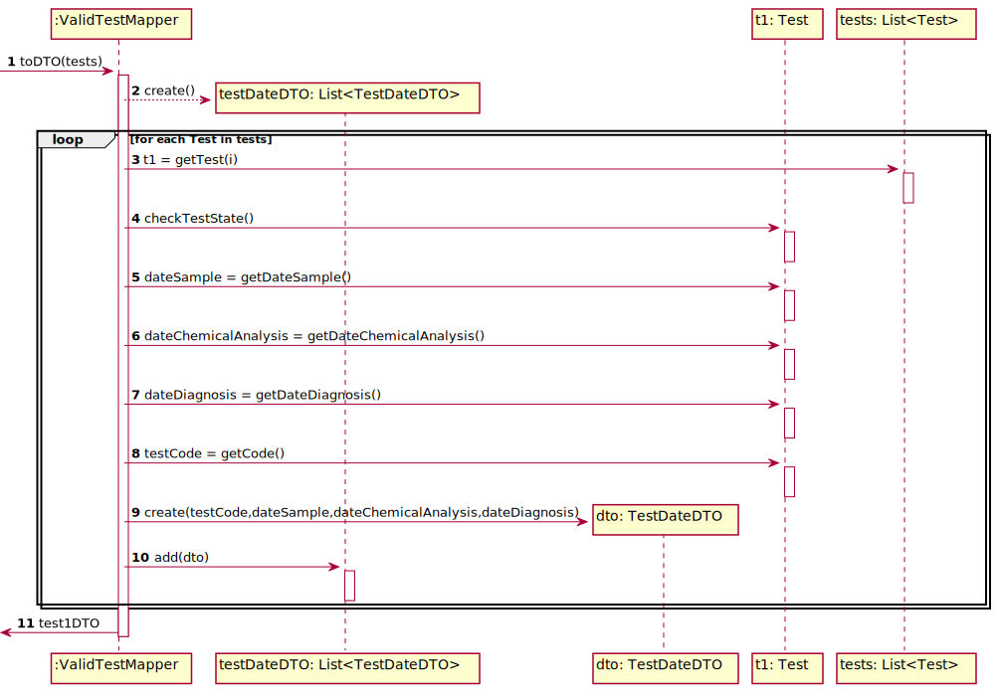
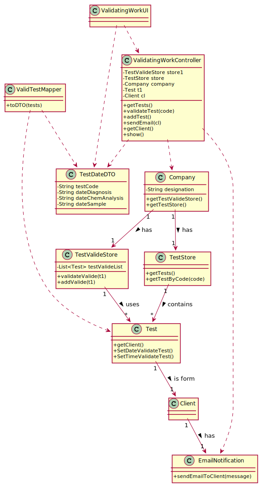

# US 15 - As a laboratory coordinator, I want to validate the work done by the clinical  chemistry technologist and specialist doctor

## 1. Requirements Engineering

*In this section, it is suggested to capture the requirement description and specifications as provided by the client as well as any further clarification on it. It is also suggested to capture the requirements acceptance criteria and existing dependencies to other requirements. At last, identfy the involved input and output data and depicted an Actor-System interaction in order to fulfill the requirement.*

### 1.1. User Story Description

As a laboratory coordinator, I want to validate the work done by the clinical  chemistry technologist and specialist doctor.

### 1.2. Customer Specifications and Clarifications 

*Insert here any related specification and/or clarification provided by the client together with **your interpretation**. When possible, provide a link to such specifications/clarifications.*

**_From the Specifications Document_**

“To validate  the  work done, the  laboratory  coordinator  checks thechemical  test/result  and  associated diagnosis  madeand  confirms  that  everything  was  done  correctly.”

**_From the client clarifications_**

 	**Q1:** When the laboratory coordinator wants to validate a test does all the tests available show up for him or does he search using a code that identifies a specific test?
 	**A1:** The system shows all tests ready to validate (tests that already have the test registration date, the chemical analysys date and the diagnosis date registered in the system) and the laboratory coordinator selects one or more tests to mark as validated. 

 	**Q2:** What should happen to a test if either the test report or the results are invalid? Should we prompt for a redo of either process or simply erase the test?
 	**A2:** The laboratory coordinator only sees the test dates of tests that already have all dates registered in the system (test registration date, the chemical analysys date and the diagnosis date).

 	**Q3:** Should the laboratory coordinator validate the test results one by one or should he do only one validation of all of them?
 	**A3:** The coordinator can validate all or a subset of test results. The system does not show client personal information but shows all dates (test registration date, chemical analysys date and diagnosis date).

 	**Q4:** Does the laboratory coordinator choose which client's results to validate?
 	**A4:** The laboratory coordinator chooses a set of tests he wants to validate.

 	**Q5:** Does the laboratory coordinator review the work of the specialist doctor and clinical chemical technologist's work separately or both at the same time?
 	**A5:** I already answered this question.

 	**Q6:** Does the notification sent to client informing them that they have their results on the central application get sent automatically after the laboratory coordinator confirms the clinical chemistry technologist and specialist doctor's work?
 	**A6:** From the Project Description: "Once the laboratory coordinator confirms that everything was done correctly, the client receives a notification alerting that the results are already available in the central application and informing that he/she must access the application to view those results."
        
 	**Q7:** How should the laboratory coordinator choose the test to operate on, from a list of all the tests with a result and report or by inputting the code unique to a specific test?
 	**A7:** From a list of all tests that have a test registration date, a chemical analysis date and a diagnosis date.

 	**Q8:** Regarding to US 15, what information does the laboratory coordinator needs to be able do validate a test? We got from the description that it's suposed to show all dates. Should the system provide any more information?
 	**A8:** Only the dates.

 	Moreover, the system should record the validation date.

 	**Q9:** To validate a test the laboratory coordinator should validate all the test results and the test report in that specific order?
 	**A9:** Please read carefully my answers! The laboratory coordinator only sees dates of each test.

 	**Q10:** As soon as a test is validated should the system send the notification to a txt file like in sprint B?
 	**A10:** Please read carefully my answers!
 	In the Project Description we get: "Once the laboratory coordinator
 	confirms that everything was done correctly, the client receives a notification alerting that the
 	results are already available in the central application and informing that he/she must access the
 	application to view those results. The client receives the notification by SMS and e-mail. "

 	In a previous post in this forum:
 	"During the development of the Integrative Project we will not use any e-mail or SMS API services to send messages. All the e-mail and SMS messages should be written to a file with the name emailAndSMSMessages.txt. This file simulates the use of e-mail and SMS API services. "

  
### 1.3. Acceptance Criteria

   AC1: To validate the Tests needs have at least 1 test with the 3 dates (test registration date, chemical analysis date and diagnosis date).

### 1.4. Found out Dependencies

Dependency to US14 since to validate the , US15 needs the 3 dates(test registration date, chemical analysis date and diagnosis date) that is only available after US14 is activated. 

### 1.5 Input and Output Data

- Input Data
	- Typed data: 
	- Selected data: Tests with 3 dates (test registration date, chemical analysis date and diagnosis date)
- Output Data
 	- List of Validated Tests with the corresponding Validation date
	- (In)Success of the operation

### 1.6. System Sequence Diagram (SSD)

### 1.7 Other Relevant Remarks

This US will be used every time that Test with the 3 dates (test registration date, chemical analysis date and diagnosis date) 

## 2. OO Analysis

### 2.1. Relevant Domain Model Excerpt

### 2.2. Other Remarks

## 3. Design - User Story Realization 

### 3.1. Rationale

**The rationale grounds on the SSD interactions and the identified input/output data.**

| Interaction ID | Question: Which class is responsible for... | Answer  | Justification (with patterns)  |
|:-------------  |:--------------------- |:------------|:---------------------------- |
| Step 1: Starts Validating Test | ... interacting with the actor? | ValidatingWorkUI   |  Pure Fabrication: there is no reason to assign this responsibility to any existing class in the Domain Model.           |
| 			  		 |	... coordinating the US? | ValidatingWorkController | Controller                             |			  		
| 			  		 | ... knowing the user using the system?  | UserSession  | IE: Knows the registered user and their roles.  |
| 			  		 |							 | Company  | IE: knows/has its own Employees| 
| 			  		 |							 | Employee  | IE: knows its own data (e.g. email) |
| Step 2: Shows the Test with the 3 dates(test registration date, the chemical analysys date and the diagnosis date registered in the system) | ...knowing the valide test(s) to show?						 | TestStore         | By the application of the Creator (R1) it would be the "Company". But, by applying HC + LC to the "Company", this delegates that responsibility to the "TestStore"                            |
| 			  		 |	... instantiating a new TestStore? | Company | Creator (Rule 1): in the DM Company has a Store. |
| Step 3: Selects the Test to be validated |	... finding the Test based in its Code? | TestStore | IE: adopts/records all the Test objects.                             |
| 			  		 |	... finding the Client based in the Test | Test | IE: knows client |  
| 			  		 |	... setting the Validation Date | Test | IE: changes its own data |  
| 			  		 |	... setting the Validation Time | Test | IE: changes its own data |  
| Step 4: shows Validated Test and requests confirmation |	n/a | n/a | n/a |
| Step 7: confirms the data | ...  validating Test locally | Test | IE: knows its own data |                              |    
| Step 7: confirms the data | ...  validating Test globally | ValidateWorkStore | IE: knows all the Test objects |                              |    
| 			  		 |	... instantiating a new ValidateWorkStore? | Company | Creator (Rule 1): in the DM Company has a Store. |  
| 			  		 |	... saving the validated Test? | ValidateWorkStore | IE: records/adopts all the Test objects |  
| 			  		 |	... sending email to client to inform that he can llok at the results? | EmailNotification | Pure Fabrication |  
| Step 8: Informs operation success | ... informing operation success? | ValidatingWorkUI | IE: responsible for user interaction |                              |                

### Systematization ##

According to the taken rationale, the conceptual classes promoted to software classes are: 

 * Company
 * Test

Other software classes (i.e. Pure Fabrication) identified: 

 * ValidatingWorkUI
 * ValidatingWorkController
 * ValidateWorkStore
 * TestStore
 * EmailNotification
 * 

## 3.2. Sequence Diagram (SD)

## 3.3. Class Diagram (CD)

*In this section, it is suggested to present an UML static view representing the main domain related software classes that are involved in fulfilling the requirement as well as and their relations, attributes and methods.*

# 4. Tests 
*In this section, it is suggested to systematize how the tests were designed to allow a correct measurement of requirements fulfilling.* 

**_DO NOT COPY ALL DEVELOPED TESTS HERE_**

**Test 1:**  Test of ValidateTest method, of class TestValideStore.
 
    @Test
    public void testValidateTest2(){
        List<app.domain.model.Test> list = new ArrayList<>();
        TestValideStore store = new TestValideStore(list);
        app.domain.model.Test t1 = new app.domain.model.Test("000000000005");
        t1.setTimeDiagnosis();
        t1.setTimeChemAnalysis();
        t1.setTimeSample();
        t1.setDateChemAnalysis();
        t1.setDateSample();
        t1.setDateDiagnosis();
        t1.setTimeValidTest();
        t1.setDateValidTest();

        boolean expected = store.validateTest(t1);
        assertTrue(expected);
    }

**Test 2:**   Test of Save method, of class TestValideStore.
    @Test
    public void testSave(){
        List<app.domain.model.Test> list = new ArrayList<>();
        TestValideStore store = new TestValideStore(list);
        app.domain.model.Test t1 = new app.domain.model.Test("000000000005");
        t1.setTimeDiagnosis();
        t1.setTimeChemAnalysis();
        t1.setTimeSample();
        t1.setDateChemAnalysis();
        t1.setDateSample();
        t1.setDateDiagnosis();
        t1.setTimeValidTest();
        t1.setDateValidTest();

        boolean expected = store.saveTestVali(t1);
        assertTrue(expected);
    }

*It is also recommended to organize this content by subsections.* 

# 5. Construction (Implementation)

*In this section, it is suggested to provide, if necessary, some evidence that the construction/implementation is in accordance with the previously carried out design. Furthermore, it is recommeded to mention/describe the existence of other relevant (e.g. configuration) files and highlight relevant commits.*

**ValidatingTestController**

public class ValidatingWorkController {
    /**
     * the TestValideStore is used to validate and save the test
     */
    private TestValideStore store1;
    /**
     * the test store taht is used to fet the test list
     */
    private TestStore store;
    /**
     * the company that validates the work
     */
    private Company company;
    /**
     * the test that is validated
     */
    private Test t1;
    /**
     * the client which the test is corresponded
     */
    private Client cl;

    /**
     * Creates a controller getting the Company information from App
     */
    public ValidatingWorkController(){
        this(App.getInstance().getCompany());
        this.store = this.company.getTestStore();
        this.store1 = this.company.getTestVStore();
    }

    /**
     * Creates a controller from the Company, having it as a parameter
     * @param company
     */
    public ValidatingWorkController(Company company) {
        this.company = company;
    }

    /**
     *
     * Gets a DTO list of Test
     *
      @return A list with TestDateDTO

     */
    public  List<TestDateDTO> getTests() {
        List<Test> tests = this.store.getTests();
        ValidTestMapper tm = new ValidTestMapper();
        return tm.toDTO(tests);
    }

    /**
     *
     * gets test by using the code and gets client using this test
     * @param code
     */
    public void validateTest(String code)throws NullPointerException{
        this.t1 = store.getTestByCode(code);
        this.t1.setDateValidTest();
        this.t1.setTimeValidTest();
    }

    /**
     * gets client using test
     * @return client
     * @throws NullPointerException
     */
    public Client getTestClient()throws NullPointerException{
        this.cl = this.t1.getClient();
        return cl;
    }

    /**
     * avalidates the test by setting the validation time and date also adds and saves the validated tests
     * @return true if the test was added to the list
     */
    public boolean addTest()  {
        return this.store1.saveTestVali(this.t1);
    }

    /**
     * sends email to teh client with the intructions
     * @throws IOException
     */
    public void sendEmail (Client cl) throws IOException,NullPointerException {

        String message =  "Hello. " + cl.getName() + " your results are out you can check them in our website";
        EmailNotification.sendEmailToClient(message);
        out.println("Email sent");
    }

    /**
     * shows all the ativutes of the test
     * @return test code , nhs code, validation date and validation time
     */
    public String show(){
        return String.format("Test Code: %s\n"
                        + "NHS code: %s\n"
                        + "Validation date: %s\n"
                        + "Validation time: %s"
                , this.t1.getCode(), this.t1.getNHScode(), this.t1.getDateValidTest(), this.t1.getTimeValidTest());
    }

}

**TestValideStore**

public class TestValideStore {
    /**
     * List of Test
     */
    private final List<Test> testValideList;
    /**
     * Creates a validate test store that contains all validated tests
     *
     * @param testVlist The list containing test
     */
    public TestValideStore(List<Test> testVlist) {
        this.testValideList = testVlist;
    }
    /**
     * Validates the Validated test
     *
     * @param t The validated test to be validated
     * @return Validation if the validated test does not already exists
     */

    public boolean validateTest(Test t) {
        if (t == null)
            return false;
        return  ! this.testValideList.contains(t);
    }
    /**
     * Saves the validated test  if it is valid
     *
     * @param t The validated test to be added to the list of validated validated test
     * @return true if the new validated test was added successfully
     */

    public boolean saveTestVali(Test t) {
        if (!validateTest(t))
            return false;
        else
            return this.testValideList.add(t);
    }

    }
**ValidTestMapper**

public class ValidTestMapper {
    /**
     * Creates a Test1DTO list from a Test list
     *
     * @param tests The list of Test instances to convert
     * @return The list of Test1DTO instances
     */
    public List<TestDateDTO> toDTO(List<Test> tests) throws NullPointerException{
        List<TestDateDTO> testDateDTO = new ArrayList<>();
        for(Test test : tests) {
            if(test.checkTestState()==3)
                testDateDTO.add(this.toDTO1(test));
        }
        return testDateDTO;
    }
    /**
     * Converts a Test instance if it contais the 3 dates (sample,chemAnalysis and diagnosis) into a Test1DTO one
     *
     * @param test The Test to be converted
     * @return The converted Test1DTO
     */
    TestDateDTO toDTO1(Test test) {
         return new TestDateDTO(test.getCode(),test.getDateSample(), test.getTimeSample(), test.getDateChemAnalysis(),test.getTimeChemAnalysis(),test.getDateDiagnosis(),test.getTimeDiagnosis());
    }

}

**TestDateDTO**

public class TestDateDTO  {
    //code of the test
    private String testCode;
    //diagnosis date
    private String dateDiagnosis;
    //chemical analysis date
    private String dateChemAnalysis;
    //sample date
    private String dateSample;
    //sample time
    private String timeSample;
    //diagnosis time
    private String timeDiagnosis;
    //chemAnalysis time
    private String timeChemAanalysis;

    /**
     * Creates a TestDateDTO using the test code , sample date, diagnosis date , chemical analysis date and their time from a Test instance
     *
     * @param code Test code
     * @param dateSample sample date
     * @param dateDiagnosis diagnosis date
     * @param dateChemAnalysis chemical analysis date

     */
    public TestDateDTO(String code, String dateSample ,String timeSample, String dateChemAnalysis,String timeChemAanalysis ,String dateDiagnosis, String timeDiagnosis) {
        this.testCode = code;
        this.dateChemAnalysis = dateChemAnalysis;
        this.timeSample = timeSample;
        this.timeChemAanalysis = timeChemAanalysis;
        this.timeDiagnosis = timeDiagnosis;
        this.dateDiagnosis = dateDiagnosis;
        this.dateSample = dateSample;

    }
    /**
     * Gets the test code of a test DTO
     *
     * @return TestDateDTO's code
     */
    public String getCode() {
        return testCode;
    }

    /**
     * Writes the test code, date of sample, date of diagnosis , date of chemical analysis and their time of this TestDateDTO
     *
     * @return a String with information related to this TestDateDTO
     */
    @Override
    public String toString() {
        return "TestDateDTO{" +
                "testCode='" + testCode + '\'' +
                ", dateDiagnosis='" + dateDiagnosis + '\'' +
                ", dateChemAnalysis='" + dateChemAnalysis + '\'' +
                ", dateSample='" + dateSample + '\'' +
                ", timeSample='" + timeSample + '\'' +
                ", timeDiagnosis='" + timeDiagnosis + '\'' +
                ", timeChemAanalysis='" + timeChemAanalysis + '\'' +
                '}';
    }

**ValidatingTestUI**

public class ValidatingWorkUI implements Runnable {
    Scanner sc = new Scanner(in);

    private ValidatingWorkController vcal;

    public ValidatingWorkUI() {
        this.vcal = new ValidatingWorkController();
    }

    @Override
    public void run() {
        boolean valid = false;

        //try{
        do {
            List<TestDateDTO> testDTO = vcal.getTests();
               if ( testDTO.isEmpty()){
                   out.println("List is empty");
                   break;
               }

                int ind = 0;
                out.println("Chose which Tests will be Validated:(-1 is to leave)");
                for (TestDateDTO tes1DTO : vcal.getTests()) {
                    out.println(ind + ") " + tes1DTO);
                    ind++;
                }
                ind = sc.nextInt();
                if (ind != -1 && ind < vcal.getTests().size())

                    vcal.validateTest(testDTO.get(ind).getCode());

               /* if (cl.getName().compareTo("ola")==0 ){
                    out.println("No client found");
                    break;
                }*/

                out.println("Save?(1 to confirm 0 to delete)");
                int choice = sc.nextInt();
                if (choice == 1) {
                    if (vcal.addTest()) {
                        out.println(vcal.show());
                        try {
                            vcal.sendEmail(vcal.getTestClient());
                        } catch (IOException e) {
                            e.printStackTrace();
                            break;
                        }catch (NullPointerException w){
                            out.println("no clients were found to send email");
                            break;
                        }
                        out.println("success");
                    }
                    out.println("Continue?(1 to confirm 0 to leave)");
                    int choice1 = sc.nextInt();
                    if (choice1 == 1) {
                        // testDTO.remove(ind);
                        valid = false;
                    } else
                        valid = true;
                } else
                    out.println("\nTest not saved");

            }   while (!valid);

        //} catch(NullPointerException e){
           // out.println("no tests were found");
      //  }
    }
}

*It is also recommended to organize this content by subsections.* 

# 6. Integration and Demo 

*In this section, it is suggested to describe the efforts made to integrate this functionality with the other features of the system.*

* Added TestValideStore class
* Added ValidatingTestController class
* Added ValidTestMapper class
* Added ValidatingTestUI class
* Added TestDateDTO class
* A new option on the LabCoordinator menu options was added: Validating Work
* Added coverage and mutation tests for TestValideStore class
* Added coverage and mutation tests for ValidTestMapper class
* Added coverage and mutation tests for TestDateDTO class

# 7. Observations

*In this section, it is suggested to present a critical perspective on the developed work, pointing, for example, to other alternatives and or future related work.*

