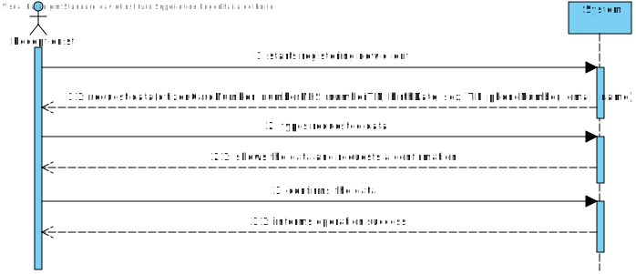
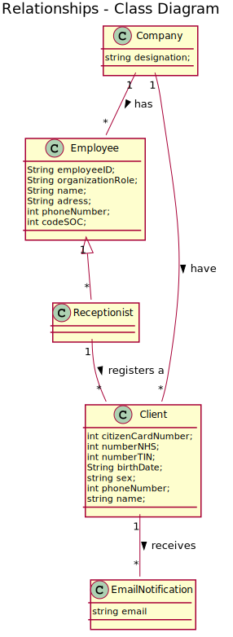
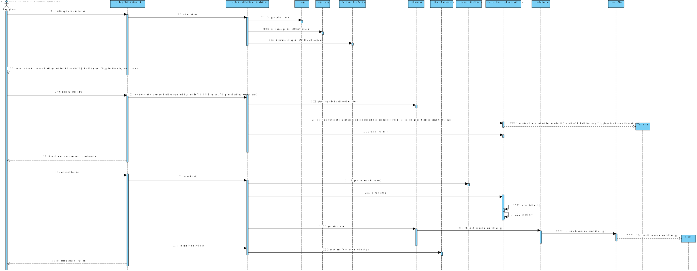
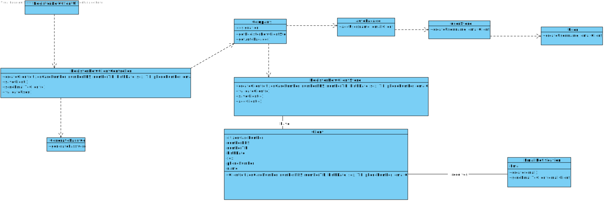

# US 3 - Register a client

## 1. Requirements Engineering

*In this section, it is suggested to capture the requirement description and specifications as provided by the client as well as any further clarification on it. It is also suggested to capture the requirements acceptance criteria and existing dependencies to other requirements. At last, identfy the involved input and output data and depicted an Actor-System interaction in order to fulfill the requirement.*


### 1.1. User Story Description

As a receptionist of the laboratory, I want to register a new client

### 1.2. Customer Specifications and Clarifications 

**_From the Specifications Document_**

"In case of a new client, the receptionist registers the client in the application. To register a client, the
receptionist needs the client’s citizen card number, National Healthcare Service (NHS) number,
birth date, sex, Tax Identification number (TIN), phone number, e-mail and name."

**_From the client clarifications_**

* Q1: Does the receptionist need to be logged in the app to preform the regist.
	* A: Yes.

* Q: "How should the system send a email to the client with the password
    * A: Considering a set of technical restrictions, during the development of the Integrative Project we will not use any e-mail or SMS API services to send messages. All the e-mail and SMS messages should be written to a file with the name emailAndSMSMessages.txt. This file simulates the use of e-mail and SMS API services.


* Q: Recently you said that the maximum acceptable age is 150 years old, so the client can be born in 1870 and the data format is DD/MM/YY, this format can be tricky because, for example, if the data is DD/MM/70 the data can indicate that he born on 1870 or 1970. How can we solve this? Or I am understanding wrong?
    * A: Thank you for identifying this issue. Please consider DD / MM / YYYY format for all dates.

* Q: Should some data of the client (phone number and e-mail address, for example) be edited in the future?
    * A: For now there is no need to have such feature.

* Q: What parameter (asked by the receptionist) should the system use to create the password of the new client
	* A: The password should be randomly generated. It should have ten alphanumeric characters. 

* Q: Should each client have an unique ID, generated during their creation?
    * A: No.

* Q: Which type/format atributes of client should have?
	* A: "Citizen Card"
		16 digit number

		"NHS"
		10 digit number

		"TIF"
		10 digit number

		"Birth day"
		DD/MM/YY

		"Sex"
		Male/Female

        "Phone number" 
		11 digit number

		"Name"
		35 max characters

* Q: Also, are all the fields required/mandatory?
	* A: The sex is opcional. All other fields are required.

* Q: After being registered by the receptionist, should the client receive some kind of confirmation e-mail in order to finish his registration?
	* A: The client only receives an e-mail informing that the registration was successful and that he can start to use the system. The e-mail includes the client's password.

* Q: During the registration of a customer, if he gives a phone number already used by another customer, should the registration continue normally or should it be canceled?
    * A: From a previous post: "The e-mail address and phone number should be unique for each user". The system should present a message informing about the error and asking for a different phone number.

* Q: Is there any restrictions to the client age?
    * A: A client should not have more than 150 years of age. Although there are important developments in the pursuit of eternal youth, for now this value is ok.

* Q: Does the email have to be validated as a valid address or do we just accept whatever input the receptionist writes?
    * A: You should use a regular expression to validate the e-mail address.

* Q3: Also, does the phone number has to be validated as a valid phone number? And can it be registered with a prefix (+44) or just the number?
    * A: This lab only operates in England, there is no need to use the prefix.

* Q: Do clients have to change their password after registration? (first login)
    * A: No.

* Q: Can they change their password whenever they want?
    * A: No. For now, there are no user story or use case to update the password.

	
### 1.3. Acceptance Criteria

* AC1: The client must become a system user.

* AC2: The "auth" component available on the repository must be reused (without notifications).

* AC3: The password should be randomly generated. It should have ten alphanumeric characters.

* AC4: The receptionist needs to log into the system to register the customer.

* AC5: The client's Citizen Card must have 16 digit number.

* AC6: The client's NHS and TIN must have 10 digit number.

* AC7: The client's birth day must be in the following format: DD/MM/YY.

* AC8: The client's sex must be Male or Female.

* AC9: The client's phone number must have 11 digit number.

* AC10: All the fields are required except the phone number, which is optional.

* AC11: The client's name must have 35 max characters.

* AC12: The client's age should not have more than 150 years.

### 1.4. Found out Dependencies

No dependencies were found.

### 1.5 Input and Output Data

- Input Data
	- Typed data: citizenCardNumber, numberNHS, numberTIN, birtdate,
	sex, TIF, phoneNumber, email, name.
	- Selected data: (none)
- Output Data
	- (In)Success of the operation


### 1.6. System Sequence Diagram (SSD)

*Insert here a SSD depicting the envisioned Actor-System interactions and throughout which data is inputted and outputted to fulfill the requirement. All interactions must be numbered.*




### 1.7 Other Relevant Remarks

The receptionist must register a client whenever he is a new client for the company


## 2. OO Analysis

### 2.1. Relevant Domain Model Excerpt 
*In this section, it is suggested to present an excerpt of the domain model that is seen as relevant to fulfill this requirement.* 



### 2.2. Other Remarks

*Use this section to capture some aditional notes/remarks that must be taken into consideration into the design activity. In some case, it might be usefull to add other analysis artifacts (e.g. activity or state diagrams).* 


## 3. Design - User Story Realization 

### 3.1. Rationale

**The rationale grounds on the SSD interactions and the identified input/output data.**

| Interaction ID | Question: Which class is responsible for... | Answer  | Justification (with patterns)  |
|:-------------  |:--------------------- |:------------|:---------------------------- |
| Step 1: Starts registering new client | ... instantiating a new client?| Company | Creator: there is no reason to assign this responsibility to any existing class in the Domain Model. |
|| ... coordinanting the US? | RegisterNewClientController | Controller|
| | ...knowing the user using the system? | UserSession	| IE: cf. A&A component documentation. |
| Step 2: Request Data | n/a							 | n/a            | n/a                             |
| Step 3: Types requested data |	... saving the input data? | Client | IE: The object created in step 1 has its own data.                              |
| |	... instantiating a new RegisterNewClientStore? | Company | Creator (Rule 1): in the DM Company has clients. |
| Step 4: Show the data and requests a confirmation | ... validating the data locally? | Client | IE: knows its own data |
| Step 4: Show the data and requests a confirmation | ... validating the data globally? | Company | IE: knows all the Client objects |
| Step 5: Confirms the data |	... saving the created Client? | Company | IE: adopts/records all the Clients objects |
| | ...generating the password? | GeneratePassword | Pure Fabrication |
| | ...registering the User for the client created? | AuthFacade | IE. User management is the responsibility of the respective external component whose point of interaction is through the class "AuthFacade" |
| | ...sending the email with the password? | EmailNotification | Pure Fabrication |
| Step 6: Informs operation success | ... informing operation success? | RegisterNewClientUI | IE: responsible for user interaction |                              |    

### Systematization ##

According to the taken rationale, the conceptual classes promoted to software classes are: 

 * Company
 * Client

Other software classes (i.e. Pure Fabrication) identified: 
 * RegisterNewClientUI  
 * RegisterNewClientController

## 3.2. Sequence Diagram (SD)

*In this section, it is suggested to present an UML dynamic view stating the sequence of domain related software objects' interactions that allows to fulfill the requirement.* 



## 3.3. Class Diagram (CD)

*In this section, it is suggested to present an UML static view representing the main domain related software classes that are involved in fulfilling the requirement as well as and their relations, attributes and methods.*



# 4. Tests 
*In this section, it is suggested to systematize how the tests were designed to allow a correct measurement of requirements fulfilling.* 

**_DO NOT COPY ALL DEVELOPED TESTS HERE_**

**Test 1:** test of set NHSID
```java
@Test
    public void testSetNHSID() {
        System.out.println("setNHSID");
        Client cl = new Client("Joana", "1234567890123456", "8/05/2001", "1234567890", "1234567890", "contribute@geeksforgeeks.org", "12345678901", "Female");
        cl.setNhsid("1234567809");
        assertEquals(cl.getNhsid(), "1234567809");
    }
```

**Test 2:** test of set Name
```java
 @Test
    public void testSetName() {
        System.out.println("setName");
        Client cl = new Client("Joana", "1234567890123456", "18/05/2001", "1234567890", "1234567890", "contribute@geeksforgeeks.org", "12345678901", "Female");
        cl.setName("Lab");
        assertEquals(cl.getName(), "Lab");
    }

```

**Test 3:** Test of checkPhoneNumberRules, PhoneNumber char(digits)!=11 and dont contain non digits
```java
    @Test(expected = IllegalArgumentException.class)
    public void testCheckPhoneNumberRules1() {
        Client cl = new Client("Joana","1234567890123456","18/05/2001","1234567890","1234567890","contribute@geeksforgeeks.org","","Female");
    }

```

**Test 4:** Test of checkNumberTINRules, TIN chars(digits)!=10 and dont contain non digits
```java
  @Test(expected = IllegalArgumentException.class)
    public void testCheckNumberTIN3() {
        Client cl = new Client("Joana","1234567890123456","18/05/2201","1234567890","12345678A0","contribute@geeksforgeeks.org","12345678901","Female");
    }

```

**Test 5:** Test of checkNameRules, Name chars<20
```java
   @Test(expected = IllegalArgumentException.class)
    public void testCheckName2() {
        Client cl = new Client("1234567890123456789012345678901234567","1234567890123456","18/05/2201","1234567890","1234567890","contribute@geeksforgeeks.org","12345678901","Female");
    }

```

**Teste 6:** Test of checkLabIDRules, LaboratoryID chars!=5
```java
  @Test(expected = IllegalArgumentException.class)
    public void testCheckCCID2() {
        Client cl = new Client("Joana","1234567 90123456","18/05/2201","1234567890","1234567890","contribute@geeksforgeeks.org","12345678901","Female");
    }
```
# 5. Construction (Implementation)

*In this section, it is suggested to provide, if necessary, some evidence that the construction/implementation is in accordance with the previously carried out design. Furthermore, it is recommeded to mention/describe the existence of other relevant (e.g. configuration) files and highlight relevant commits.*

**Client**

```java
public class Client {

    private String name;
    private Email emailm;
    private String nhsid;
    private String tin;
    private String cc;
    private String birth;
    private String sex;
    private String phonenumber;

    public static final String regex = "[0-9]+";


    public Client (String name, String cc, String birth, String nhsid, String tin, String email, String phonenumber, String sex){
        checkParameters( name, cc, birth, nhsid, tin, phonenumber);
        this.name = name;
        this.cc = cc;
        this.birth = birth;
        this.nhsid = nhsid;
        this.tin = tin;
        this.emailm = new Email(email);
        this.phonenumber = phonenumber;
        this.sex = sex;
    }
    public Client (String name, String cc, String birth, String nhsid, String tin, String email, String phonenumber){
        checkParameters( name, cc, birth, nhsid, tin, phonenumber);
        this.name = name;
        this.cc = cc;
        this.birth = birth;
        this.nhsid = nhsid;
        this.tin = tin;
        this.emailm = new Email(email);
        this.phonenumber = phonenumber;
    }

    public void checkParameters(String name, String cc, String birth, String nhsid, String tin, String phonenumber){
        checkNameRules(name);
        checkCCRules(cc);
        checkDateRules(birth);
        checkNhsIDRules(nhsid);
        checkNumberTINRules(tin);
        checkPhoneNumberRules(phonenumber);
    }
    /**
     * @param phoneNumber check if phoneNumber has 11 digits
     */
    private void checkPhoneNumberRules(String phoneNumber) {
        if (phoneNumber.length() != 11 || !phoneNumber.matches(regex))
            throw new IllegalArgumentException("Phone Number must be 11 numbers.");
    }
    /**
     * @param numberTIN check if numberTIN has 10 digits
     */
    private void checkNumberTINRules(String numberTIN) {
        if (numberTIN.length() != 10 || !numberTIN.matches(regex))
            throw new IllegalArgumentException("TIN number must be 10 numbers.");
    }
    /**
     * @param nhsid check if nhsID has 10 numbers
     */
    private void checkNhsIDRules(String nhsid) {
        if (nhsid.length() != 10 || !nhsid.matches(regex))
            throw new IllegalArgumentException("NHSID must be 10 digits.");
    }
    /**
     * @param name check if name has no more than 35 chars and more than 1
     */
    private void checkNameRules(String name) {
        if (name.length() < 1 || name.length() > 35)
            throw new IllegalArgumentException("Name must be no more than 35 car.");
    }
    /**
     * @param cc check if cc has 16 numbers
     */
    private void checkCCRules(String cc) {
        if (cc.length() != 16 || !cc.matches(regex))
            throw new IllegalArgumentException("CC must be 16 digits.");
    }
    /**
     * @param birth check if data has the format
     */
    private void checkDateRules(String birth) {
        int c =3;
        String[] date = birth.split("/");
        if (date.length != c || Integer.parseInt(date[0]) > 31 || Integer.parseInt(date[1]) > 12 || Integer.parseInt(date[2]) < 1870)
            throw new IllegalArgumentException("Format is wrong");
        }

    public String getName() {
        return name;
    }
    public String getEmail() {
        return emailm.getEmail();
    }
    public String getNhsid() {
        return nhsid;
    }
    public String getTin() {
        return tin;
    }
    public String getCc() {
        return cc;
    }
    public String getBirth() {
        return birth;
    }
    public String getSex() {
        return sex;
    }
    public String getPhonenumber() {
        return phonenumber;
    }
    public void setName(String name) {
        this.name = name;
    }
    public void setEmail(Email email) {
        this.emailm = email;
    }
    public void setNhsid(String nhsid) {
        this.nhsid = nhsid;
    }
    public void setTin(String tin) {
        this.tin = tin;
    }
    public void setCc(String cc) {
        this.cc = cc;
    }
    public void setBirth(String birth) {
        this.birth = birth;
    }
    public void setSex(String sex) {
        this.sex = sex;
    }
    public void setPhonenumber(String phonenumber) {
        this.phonenumber = phonenumber;
    }
    public List<User> getUsers(){
        return this.userlist1;
    }

    @Override
    public String toString() {
        return "Client{" +
                "name='" + name + '\'' +
                ", email=" + emailm +
                ", nhsid='" + nhsid + '\'' +
                ", tin='" + tin + '\'' +
                ", cc='" + cc + '\'' +
                ", birth='" + birth + '\'' +
                ", sex='" + sex + '\'' +
                ", phonenumber='" + phonenumber + '\'' +
                '}';
    }
}

```

**RegisterClientStore**

```java

public class RegisterClientStore {

    private final List<Client> clientList;

    /**
     * @param list
     */
    public RegisterClientStore(List<Client> list){
        this.clientList= list;
    }

    /**
     * @param name
     * @param cc
     * @param birth
     * @param nhsid
     * @param tin
     * @param email
     * @param phonenumber
     * @param sex
     * @return
     */
    public Client createClient(String name, String cc, String birth, String nhsid, String tin, String email, String phonenumber, String sex){
        return new Client(name, cc, birth, nhsid, tin, email, phonenumber,  sex);
    }
    /**
     * @param ct The client to be validated
     * @return Validation if the client does not exist
     */
    public boolean validateClient(Client ct) {
        if (ct == null)
            return false;
        return ! this.clientList.contains(ct);
    }
    /**
     * @param ct The client to be added to the List of Clients
     * @return true if the client was added successfully
     */
    public boolean saveClient(Client ct) {
        if (!validateClient(ct))
            return false;
        return this.clientList.add(ct);
    }

    /**
     * @param name
     * @param cc
     * @param birth
     * @param nhsid
     * @param tin
     * @param email
     * @param phone
     * @return
     */
    public Client createClient(String name, String cc, String birth, String nhsid, String tin, String email, String phone) {
        return new Client(name, cc, birth, nhsid, tin, email, phone);
    }
}

```
**RegisterClientController**

```java

public class RegisterClientController {
    private Company company;
    private RegisterClientStore store;
    private Client cl;
    private User user;
    private Email e;

    public static final String psw = GeneratePassword.generatePassword();


    public RegisterClientController() {
        this(App.getInstance().getCompany());
    }
    /**
     *
     * @param company The company responsible for knowing the test types
     */
    public RegisterClientController (Company company) {
        this.company = company;
        this.cl = null;
        this.user=new User();
        this.e=new Email();
    }

    /**
     * @param name
     * @param cc
     * @param birth
     * @param nhsid
     * @param tin
     * @param email
     * @param phonenumber
     * @param sex
     * @return
     */
    public boolean createCliente(String name, String cc, String birth, String nhsid, String tin, String email, String phonenumber, String sex)  {
        this.store = this.company.getClientStore();
        this.cl = this.store.createClient(name,cc,birth,nhsid,tin,email,phonenumber,sex);
        return this.store.validateClient(cl);
    }
    /**
     * @return true if the client was saved successfully
     */
    public boolean saveClient() {
        return this.store.saveClient(cl);

    }


   public void addUser(){
       if (this.company.getAuthFacade().addUser(this.cl.getName(),this.cl.getEmail(),psw)) {
           String password = psw;
           this.user.addUserMap(password, cl);
       }
   }

    /**
     * @return Clients
     */
   public Map<String, Client> showAllUser(){
      return this.user.getUserMap();
   }

    public void sendEmail (String email) throws IOException {
        EmailNotification.sendEmailToClient(email, psw);
    }

    /**
     * @param name
     * @param cc
     * @param birth
     * @param nhsid
     * @param tin
     * @param email
     * @param phone
     * @return
     */
    public boolean createCliente(String name, String cc, String birth, String nhsid, String tin, String email, String phone) {
        this.store = this.company.getClientStore();
        this.cl = this.store.createClient(name,cc,birth,nhsid,tin,email,phone);
        return this.store.validateClient(cl);
    }
}

```

# 6. Integration and Demo 

* Added Client class
* Added coverage and mutation tests for Client class
* Added RegisterClientController class
* Added coverage and mutation tests for RegisterClientController class
* Added RegisterClientStore class
* Added coverage and mutation tests for RegisterClientStore class
* Added RegisterClientUI
* A new option on the Receptionist menu options was added: RegisterClient


# 7. Observations

*In this section, it is suggested to present a critical perspective on the developed work, pointing, for example, to other alternatives and or future related work.*


