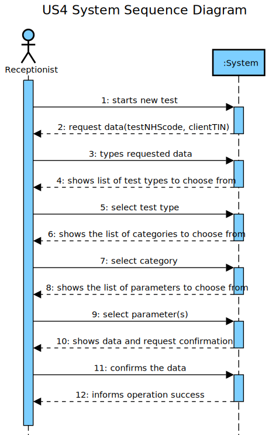
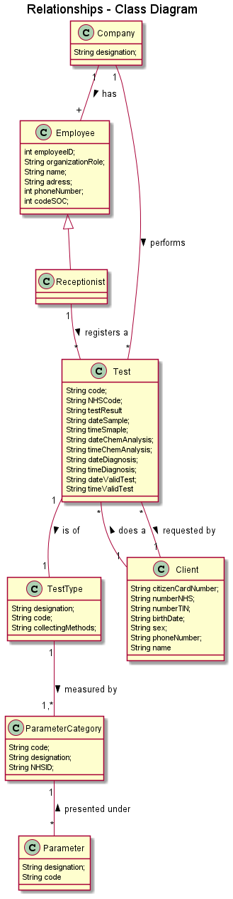
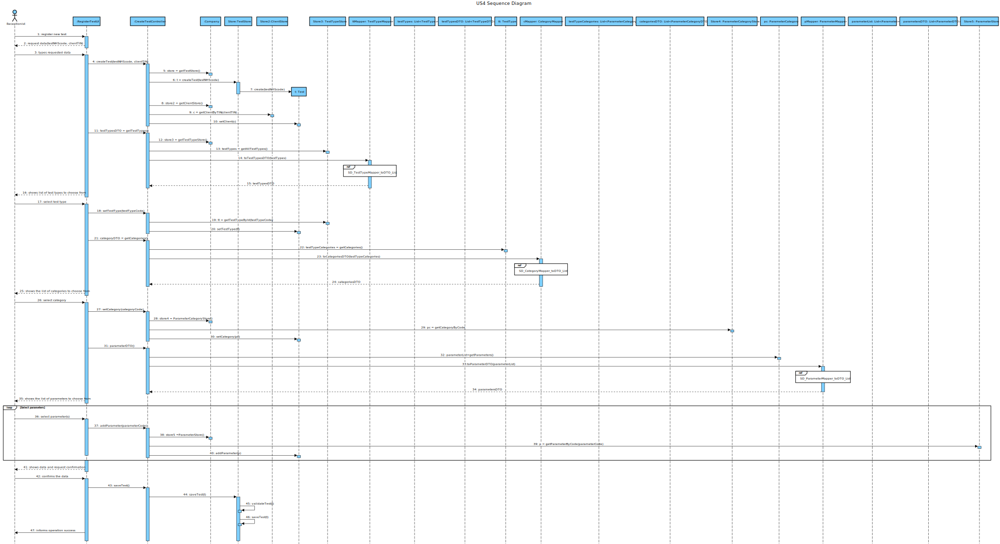
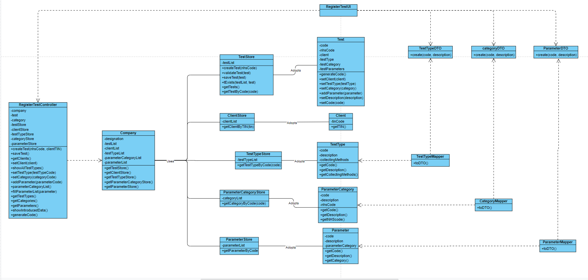

# US 4 - Register new test

## 1. Requirements Engineering

### 1.1. User Story Description

As areceptionist, I intend to register a test to be performed to a registered client.

### 1.2. Customer Specifications and Clarifications 

**_From the Specifications Document_**

“Typically, the client arrives at one of the clinical analysis laboratories with a lab order prescribed by 
a doctor. Once there, a receptionist asks the client’s citizen card number, the lab order (which 
contains the type of test and parameters to be measured), and registers in the application the test to 
be performed to that client.”

**_From the client clarifications_**

Q: Since the Client has a Lab Order which contains the type of test and all the parameters to be measured, all the parameters selected by the Receptionist need to be equal to the Lab Order's parameters?
A: Yes.

Q: About the other Test attributes, do we need to have in consideration any other criteria? Is the code generated or NHS code ooptional ?
A: All test attributes are mandatory. The test attributes are the following:
Test code : sequential number with 12 digits. The code is automatically generated.
NHS code: 12 alphanumeric characters.

Q: When the receptionist chooses the test type, should the categories appear, and then when selecting the category, the receptionist can choose the parameters for the test? Or when the Receptionist chooses the test type, should appear all the parameters that it includes immediately?
A: Firstly, the receptionist should choose a test type. Then choose a category from a set of categories. Last, the receptionist should choose a parameter.

Q: On the project description it says "Each test is characterized by an internal code, an NHS code, a description that identifies the sample collection method...". You said that the code is a 12 digit sequential number. Does this mean that, for example, the first test will have the code "000000000001" and so on?
A: Yes.

Q: And should the description that identifies the sample collection method be automatically filled with the collection method associated with the type of test?
A: Yes. In a previous post I said that "There exists only one collection method per test type".

Q: On the project description we have multiple attributes of date and time ("date and time when the samples were collected", etc). Are these attributes filled by the author of the respective act or is it generated by the system when those acts are performed?
A: The system should automatically generate the date and time of the event (test registration, chemical analysis, diagnosis and validation).

Q: I wanted to ask if the NHS code of which test is unique or not.
A: Yes.

Q: Should we show the list of all clients available or just introduce the client's CCN ?
A: The TIN number should be used to find a client and associate the client with the test.

### 1.3. Acceptance Criteria

- AC1: Code is a sequential number with 12 digits, automatically generated.
- AC2: NHS code is composed of 12 alphanumeric characters.
- AC3: The receptionist must select the parameters to be analysed from all possible parameters in accordance with the test type
- AC4: Before selecting the parameters, the receptionist must choose the category to be measured in the test
- AC5: The receptionist introduces the client's TIN in order to associate the etst to teh client

### 1.4. Found out Dependencies
-US3: Tests are performed in registered clients
-US9: Tests are of a TestType, it measures parameters presented under the test types' categories
-US10: Tests measure parameters
-US11: Tests mesure the parameters presented under categories

### 1.5 Input and Output Data

- Input Data
	- Typed data: NHS code, client's TIN
	- Selected data: test type, category, parameters
- Output Data
	- (In)Success of the operation

### 1.6. System Sequence Diagram (SSD)

### 1.7 Other Relevant Remarks

This US will be used whenever a test is registered, considering it is a clinical test analysis laboratory it and the same client can have multiple tests, this US will be one of the most frequent ones.
Test code is generated when creating a test, it represents the serial number of the test, the first one being 000000000001.

## 2. OO Analysis

### 2.1. Relevant Domain Model Excerpt

### 2.2. Other Remarks

## 3. Design - User Story Realization 

### 3.1. Rationale

**The rationale grounds on the SSD interactions and the identified input/output data.**

| Interaction ID | Question: Which class is responsible for... | Answer  | Justification (with patterns)  |
|:-------------  |:--------------------- |:------------|:---------------------------- |
| Step 1         | ... interacting with the actor? | RegisterTestUI |  Pure Fabrication: there is no reason to assign this responsibility to any existing class in the Domain Model. |
| 		 | ... coordinating the US? | RegisterTestController | Controller. |
| 		 | ... instantiating a new Test? | TestStore | Indirection: Creates Test for the Company that performs them. |
| 		 | ... instantiating a new TestStore? | Company | IE: Knows all the Test objects, in the DM Company performs Tests. |
| 	 	 | ... knowing the user using the system? | UserSession | IE: Knows the registered user and their roles. |
| 		 |					  | Company | IE: knows/has its own Employees. |
| 		 |					  | Employee | IE: knows its own data (e.g. email) |
| Step 2  	 |					  |             |                              |
| Step 3  	 | ...saving the inputted data? | Test | IE: object created in step 1 has its own data. |
		 | ...finding the client based in its TIN? | ClientStore | IE: adopts/records all the Client objects. |
                 | ...instantiating a new ClientStore? | Company | IE: adopts/records all the Clients. |
| Step 4  	 | ...knowing the test types to show? | TestTypeStore | IE: adopts/records all the TestType objects. |
| 		 | ... instantiating a new TestTypeStore? | Company | IE: Knows all the TestType objects, in the DM Company conducts TestType. |
| Step 5         | ... saving the TestType? | Test | IE: object created in step 1 has a method to set its TestType. |
| Step 6  	 | ...knowing the categories to show? | ParameterCategoryStore | IE: adopts/records all the ParameterCategory objects. |              
| Step 7  	 | ... saving the ParameterCategory? | Test | IE: object created in step 1 has a method to set its ParameterCategory. |
| Step 8         | ...knowing the parameters to show? | ParameterStore | IE: adopts/records all the Parameter objects. |
| Step 9  	 | ... adding the Parameter? | Test | IE: object created in step 1 has a method to add Parameter objects to its list. |
| Step 10        |					  |             |                              |
| Step 11  	 | ... validating all data (local validation)? |Test | IE: owns its data.| 
| 		 | ... validating all data (global validation)? | TestStore | IE: knows all the Test objects| 
| 		 | ... saving the created Test? | TestStore | IE: adopts/records all the Test objects | 
| Step 12 	 | ... informing operation success?| RegisterTestUI | IE: is responsible for user interactions. | 

                                        
### Systematization ##

According to the taken rationale, the conceptual classes promoted to software classes are: 

 * Company
 * Client
 * TestType
 * Category
 * Parameter
 * Test

Other software classes (i.e. Pure Fabrication) identified: 

 * createdTestUI
 * createdTestController
 * testStore

## 3.2. Sequence Diagram (SD)

## 3.3. Class Diagram (CD)

# 4. Tests 
*In this section, it is suggested to systematize how the tests were designed to allow a correct measurement of requirements fulfilling.* 

	/**
     	* Test 2: setCode & getCode methods, of class Test.
     	*/
    	@Test
    	public void testSetCode() {
        	System.out.println("setDescription");
        	String nh = "123456789012";
        	app.domain.model.Test instance = new app.domain.model.Test(nh);

        	String expected = "123456789012";
        	instance.setCode(expected);
        	String result = instance.getCode();

        	assertEquals(result, expected);
    	}

	/**
     	* Test 8: setClient & getClient methods, of class Test.
     	*/
   	 @Test
    	public void testSetClient() {
        	System.out.println("setClient");
        	String nh = "123456789012";
        	app.domain.model.Test instance = new app.domain.model.Test(nh);

        	Client c1 = new Client("Joana", "1234567890123456", "8/05/2001", "1234567890", "1234567890", "contribute@geeksforgeeks.org", "12345678901", "Female");
        	instance.setClient(c1);

        	Client expected = new Client("Kara", "9234567890123456", "8/05/2001", "1234567890", "1234567890", "contribut@gksforgeeks.org", "12345678901", "Female");
        	instance.setClient(expected);
        	Client result = instance.getClient();

        	assertEquals(result, expected);
    	}

	
	/**
    	* Test 9: setTestType/getTestType methods, of class Test.
     	*/
    	@Test
    	public void testSetTestType() {
        	System.out.println("setTestType");
        	String nh = "123456789012";
        	app.domain.model.Test instance = new app.domain.model.Test(nh);

        	TestType tt = new TestType("tt003", "UrineTest", "Urine");
        	instance.setTestType(tt);

        	TestType expected = new TestType("tt004", "SalivaTest", "Saliva");
        	instance.setTestType(expected);
        	TestType result = instance.getTestType();

        	assertEquals(result, expected);
    	}

	/**
     	* Test 10: addTestParameter/getParameter methods, of class Test.
     	*/
    	@Test
    	public void testAddTestParameter() {
        	System.out.println("addTestParameter");
        	String nh = "123456789012";
        	app.domain.model.Test instance = new app.domain.model.Test(nh);

        	ParameterCategory pc = new ParameterCategory("12345", "this is a description", "12345");
        	Parameter expected = new Parameter("12345", "description", pc);

        	instance.addTestParameter(expected);
        	Parameter result = instance.getTestParameters().get(0);

        	assertEquals(result, expected);
    	}

# 5. Construction (Implementation)

*In this section, it is suggested to provide, if necessary, some evidence that the construction/implementation is in accordance with the previously carried out design. Furthermore, it is recommeded to mention/describe the existence of other relevant (e.g. configuration) files and highlight relevant commits.*

**Test**

	public class Test {

		private Client testClient;
		private String testCode;
      		private String testNHScode;
    		private TestType testTestType;
		private String testDescription;
    		private ParameterCategory testCategory;
    		private final List<Parameter> testParameters = new ArrayList<>();
    		private final List<Sample> testSamples = new ArrayList<>();
		private List<TestParameter> testResult = new ArrayList<>();
    		private Date dateSample;
    		private Date dateChemAnalysis;    
    		private Date dateDiagnosis;
    		private Date dateValidTest;
    		private Time timeSample;    
    		private Time timeChemAnalysis;
    		private Time timeDiagnosis;
    		private Time timeValidTest;
    		private Report report;

    		public Test(String nh){
        		this.setCode(this.generateCode());
        		this.setNHScode(nh);      
    		}

    
    		public String generateCode(){
        		StringBuilder tc = new StringBuilder();
        		Random val = new Random();  
        		for (int i=0; i<12; i++) {
            			tc.append(val.nextInt(10));
        		}
        		return tc.toString();
    		}

    
    		public final void setCode(String tc){
        		this.checkCodeRules(tc);
       	 		this.testCode=tc;
    		}
    

    		public String getCode(){
        		return this.testCode;
    		}
    

    		public void checkCodeRules(String tc){
        		if (tc.length() != 12)
            			throw new IllegalArgumentException("Code must have 12 alphanumeric characters.");
        		if (StringUtils.isBlank(tc))
            			throw new IllegalArgumentException("Code cannot be blank.");
    		}
    
    

    		public final void setNHScode(String nh){
        		this.checkNHSRules(nh);
        		this.testNHScode=nh;
    		}
    
   
    		public String getNHScode(){
        		return this.testNHScode;
    		}
    

    		public void checkNHSRules(String nh){
        		if (nh.length() != 12)
            			throw new IllegalArgumentException("NHS code must have 12 alphanumeric characters.");
        		if (StringUtils.isBlank(nh))
            			throw new IllegalArgumentException("NHS code cannot be blank.");
    		}
    

    		public void setClient(Client c){
        		this.testClient=c;
    		}
    

    		public Client getClient(){
        		return this.testClient;
    		}
    
    
    		public void setTestType(TestType tt){
        		this.testDescription = tt.getMethods();
        		this.testTestType=tt;
    		}
    
    
    		public TestType getTestType(){
        		return this.testTestType;
    		}
    

    		public void setCategory(ParameterCategory pc){
        		this.testCategory = pc;
    		}
    
    
    		public ParameterCategory getTestCategory(){
        		return this.testCategory;
    		}
    
   
    		public void addTestParameter(Parameter p){
        		if(!this.testParameters.contains(p))
            			this.testParameters.add(p);
    		}
    
   
    		public List<Parameter> getTestParameters(){
        		return this.testParameters;
    		}
    
    
    		@Override
    		public String toString(){
        		return "Code: " + this.testCode + "\nNHS code: " + this.testNHScode;
    		}
    
   
    		public void setDateSample(){
        		this.dateSample = new Date();
    		}
    
  
    		public void setDateChemAnalysis(){
       			this.dateChemAnalysis= new Date();
    		}
    
   
    		public void setDateDiagnosis(){
        		this.dateDiagnosis = new Date();
    		}
    
    
    		public void setDateValidTest(){
        		this.dateValidTest = new Date();
    		}
    
    
    		public String getDateSample(){
        		return this.dateSample.toYMDString();
    		}
    
   
    		public String getDateChemAnalysis(){
        		return this.dateChemAnalysis.toYMDString();
    		}
    
   
    		public String getDateDiagnosis(){
        		return this.dateDiagnosis.toYMDString();
    		}
    

    		public String getDateValidTest(){
        		return this.dateValidTest.toYMDString();
    		}

   
    		public void setTimeSample(){
        		this.timeSample = new Time();
    		}
    

    		public void setTimeChemAnalysis(){
        		this.timeChemAnalysis= new Time();
    		}

 
    		public void setTimeDiagnosis(){
        		this.timeDiagnosis = new Time();
    		}
    

    		public void setTimeValidTest(){
        		this.timeValidTest = new Time();
    		}

   
    		public String getTimeSample(){
        		return this.timeSample.toString();
    		}
    

    		public String getTimeChemAnalysis(){
        		return this.timeChemAnalysis.toString();
    		}
    
   
   		public String getTimeDiagnosis(){
        		return this.timeDiagnosis.toString();
    		}
    

   		public String getTimeValidTest(){
        		return this.timeValidTest.toString();
    		}

   
    		public Test(String nh, Date dateSample, Date dateChemAnalysis, Date dateDiagnosis ){
        		this.setCode(this.generateCode());
        		this.setNHScode(nh);
        		this.dateChemAnalysis = dateChemAnalysis;
        		this.dateSample = dateSample;
        		this.dateDiagnosis = dateDiagnosis;
    		}

    		public void setDescription(String testDescription){
        		this.testDescription = testDescription;
    		}

    		public String getDescription(){
        		return this.testDescription;
    		}
    
    
    		public TestParameter getTestParameterFor(String parameterCode){
        		TestParameter result = null;
        		for(Parameter p : this.getTestParameters()){
            			if(p.getCodeP().compareTo(parameterCode)==0)
                		result = new TestParameter(p);
        		}
        		return result;
    		}

    
    		public List<Sample> getSamples(){
        		return this.testSamples;
    		}
    
    
    		public TestParameter addTestResult(String parameterCode, String result, String metric) throws IOException {
        		TestParameter testParam = getTestParameterFor(parameterCode);
        		Parameter param = testParam.getParameter();
        		ExternalModule em = this.getTestType().getExternalModule();
        		ReferenceValue refValue = em.getReferenceValue(param);
        		testParam.addResult(result, metric, refValue);
        		return testParam;
    		}

    
    		public void setResults(List<TestParameter> tp){
        		this.testResult = tp;
    		}

    		public List<TestParameter> getResults(){
        		return this.testResult;
    		}

    		public Boolean createSample() {
        		String number_barcode;
        		try {
            			GenerateBarcode gb = new GenerateBarcode();
            			number_barcode = gb.generateBarcode();
            			Sample sample = new Sample(number_barcode);
            			return addSample(sample);
        		} catch (OutputException e) {
            			System.out.println(e.getMessage());
           			return false;
        		} catch (BarcodeException e) {
            			System.out.println(e.getMessage());
            			return false;
        		} catch (IOException e) {
            			System.out.println(e.getMessage());
            			return false;
        		}
    		}

    
    		public Boolean addSample(Sample sample) {
        		return this.testSamples.add(sample);
    		}

    
    		public int checkTestState(){
        		int state=0;
        		if(this.dateSample!=null)
            			state++;
        		if(this.dateChemAnalysis!=null)
            			state++;
        		if(this.dateDiagnosis!=null)
            			state++;
        		if(this.dateValidTest!=null)
            			state++;
        		return state;
    		}

    		public void setReport(Report r){
        		this.report=r;
    		}

    		public Report getReport(){
       	 		return this.report;
    		}

    
    		public void setDateValidTestForNull(){
        		this.dateValidTest = null;
    		}

    
    		public void setTimeValidTestForNull(){
        		this.timeValidTest = null;
    		}
	}

*RegisterTestController*

	public class RegisterTestController {    

    		private final Company company;
		private Test t;
    		private ParameterCategory cat;
    		private TestStore store;
		private RegisterClientStore store2;
		private TestTypeStore store3;
    		private ParameterCategoryStore store4;
    		private ParameterStore store5;

    		public RegisterTestController() {
        		this(App.getInstance().getCompany());
    		}
    
    
    		public RegisterTestController(Company company) {
        		this.company = company;
        		this.t = null;
    		}
    
    
    		public boolean createTest(String testNHScode, String clientTINid) {
        		this.store = this.company.getTestStore();
        		this.t = this.store.createTest(testNHScode);
        		this.t.setCode(this.generateCode());
        
        		if(!this.newTest())
            			return false;
        
        		this.store2 = this.company.getClientStore();
        		Client c = this.store2.getClientByTIN(clientTINid);
        		this.t.setClient(c);
        		if(c==null)
            			return false;
        		return this.store.validateTest(t);
    		}

    		public boolean saveTest() {
        		return this.store.saveTest(t);
    		}
    

    		public List<Client> getClients(){
        		this.store2 = this.company.getClientStore();
        		return new ArrayList<>(this.store2.getClients());
    		}
    
   
    		public boolean setClient(String nhsId){
        		this.store2 = this.company.getClientStore();
        		Client c =this.store2.getClientByTIN(nhsId);
        		if(c!=null){
            			this.t.setClient(c);
            			return true;
        		}
        		else
            			return false;
    		}
    

    		public List<TestType> showAllTestTypes(){
        		this.store3 = this.company.getTestTypeStore();
        		return new ArrayList<>(this.store3.getTestTypes());
    		}
    
    
    		public boolean setTestsType(String ttCode){
        		TestType tt = this.store3.getTestTypeById(ttCode);
        		if(tt == null)
            			return false;
        		else{
            			this.t.setTestType(tt);
            			return true;
        		}
    		}
    
    
    		public boolean setCategory(String pcCode){
        		ParameterCategory pc = this.store4.getCategoryByCode(pcCode);
        		if(pc == null)
            			return false;
        		else{
            			this.t.setCategory(pc);
            			this.cat = pc;
            			return true;
        		}
    		}
    
    
    		public boolean addParameter(String pCode){
        		this.store5 = this.company.getParameterStore();
        		Parameter p = this.store5.getParameterByCode(pCode);
        		if(p == null)
            			return false;
       	 		else{
            			this.t.addTestParameter(p);
            			return true;
        		}
    		}
    

    		public List<ParameterCategory> parameterCategoryList(){
        		return new ArrayList<>(this.t.getTestType().getCategories());
    		}
    
    
    		public void fillParameterList(Parameter p){
            		this.t.addTestParameter(p);
    		}
    
   
    		public List<TestTypeDTO> getTestTypes(){
        		this.store3 = this.company.getTestTypeStore();
        		List<TestType> testTypes = this.store3.getTestTypes();
        		TestTypeMapper ttm = new TestTypeMapper();
        		return ttm.testTypeToDTO(testTypes);
    		}
    
    
    		public List<ParameterCategoryDTO> getCategories(){
        		this.store4 = this.company.getParameterCategoryStore();
        		List<ParameterCategory> testTypeCategories = this.t.getTestType().getCategories();
        		ParameterCategoryMapper pcm = new ParameterCategoryMapper();
        		return pcm.parameterToDTO(testTypeCategories);
    		}
    
    
    		public List<ParameterDTO> getParameters(){
        		List<Parameter> parameters = this.cat.getParameters();
        		ParameterMapper pm = new ParameterMapper();
        		return pm.parameterToDTO(parameters);
    		}
    
    
    		public String showIntrucedData(){
        		return String.format("Test Code: %s\n"
                           + "NHS code: %s\n"
                           + "Client's name: %s\n"
                           + "TestType: %s\n"
                           + "Category: %s\n"
                           + "Parameters: %s"
                           , this.t.getCode(), this.t.getNHScode(), this.t.getClient().getName(), this.t.getTestType().getDescription(), this.t.getTestCategory().getDescriptionPC(), this.t.getTestParameters());
    		}
    

    		public boolean newTest(){
        		for(Test test : this.store.getTests()){
            		if(test.getNHScode().compareTo(this.t.getNHScode())==0)
                		return false;
        		}
        		return true;
    		}
    

    		public String generateCode(){
        		int codeNum = this.store.getTests().size()+1;
        		return String.format("%012d", codeNum);
    		}
	}

# 6. Integration and Demo 

* Added Test class
* Added coverage and mutation tests for Test class
* Added RegisterTestController class
* Added coverage and mutation tests for RegisterTestController class
* Added TestStore class
* Added coverage and mutation tests for TestStore class
* Added RegisterTestUI
* A new option on the Receptionist menu options was added: Register test

# 7. Observations