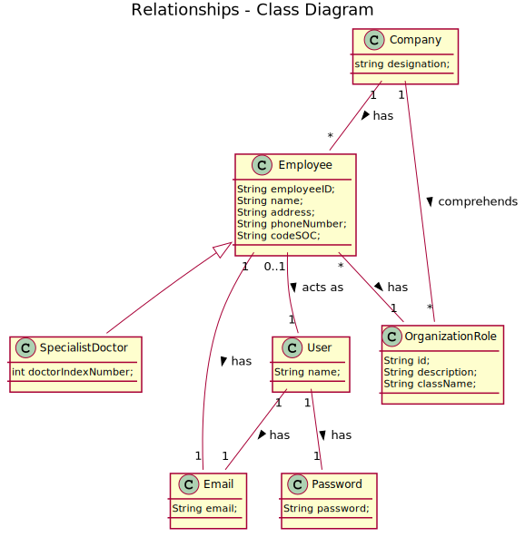
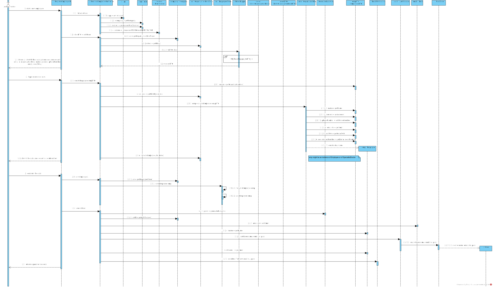
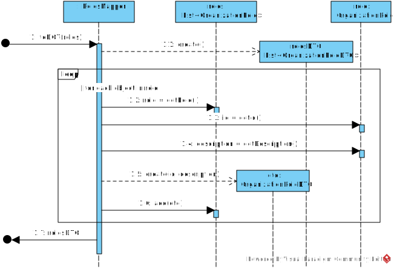

# US7 - Register a new employee

## 1. Requirements Engineering

### 1.1. User Story Description

As an administrator, I want to register a new employee.

### 1.2. Customer Specifications and Clarifications

*Insert here any related specification and/or clarification provided by the client together with **your interpretation**. When possible, provide a link to such specifications/clarifications.*

**_From the Specifications Document_**

From the specifications document it is possible to identify several employees that work in the company Many Labs, such as administrators, receptionists, specialist doctors, medical lab technicians, clinical chemistry technologists, laboratory coordinators.

"All those who wish to use the application must be authenticated with a password."

Each employee must have access to the company's platform. For that, it is required an authentication with an email and a password.

**_From the client clarifications_**

-	**Question:** What are the data that characterize an employee?

	- 	**Answer:** The data is an employeeID, the organization role, a name, an address, a phone number, an email and a Standard Occupational Classification code.

-	**Question:** Is there any employee that has additional data?

	- 	**Answer:** The Specialist Doctor has an additional attribute: The Doctor Index Number.

-	**Question:** The password is generated automatically or is given by administrator as a parameter?

	- 	**Answer:** The password should be randomly generated. It should have ten alphanumeric characters.

-	**Question:** How are the passwords delivered to the new user?

	- 	**Answer:** Each users receives an e-mail informing that the registration was successful and that he can start to use the system. The e-mail includes the user password.

-	**Question:** Relative to registering a new user, how should the system respond in the event of creating a new user with the same attributes of an already existing user?

	- 	**Answer:** This should be treated as an error. The e-mail address and phone number should be unique for each user.

-	**Question:** When creating a new employee, how will the system create the attribute "Employee ID"?

	- 	**Answer:** The employee ID contains the initials of the employee name and a number. The number has 5 digits and increases automatically when a new employee is registered in the system.

- **Questions:** Which is the organization role format?

  -		**Answer** A string with no more than 15 characters.

- **Questions:** When registering a new employee should the administrator write or select his role?

	-	  **Answer** The administrator should write the role when he is registering a new employee.

- **Questions:** How should the system send a email to the employee with the password?

	-	  **Answer** Considering a set of technical restrictions, during the development of the Integrative Project we will not use any e-mail or SMS API services to send messages. All the e-mail and SMS messages should be written to a file with the name emailAndSMSMessages.txt. This file simulates the use of e-mail and SMS API services.

### 1.3. Acceptance Criteria

- AC1: All required fields must be filled in.
- AC2: Each user must have a single role defined in the system.
- AC3: The "auth" component available on the repository must be reused (without modifications).
- AC4: The e-mail address and phone number should be unique for each user.
- AC5: The phone number needs to have 11 digits.
- AC6: The employee's name can´t have more than 35 characters.

### 1.4. Found out Dependencies

No dependencies were found.

### 1.5 Input and Output Data

**Input Data:**

* Typed data:
  * the organization role
  * a name
  * an address
	* a phone Number
  * an email
	* a Standard Occupational Classification code.

* Selected data:
	* none

**Output Data:**
* (In)Success of the operation

### 1.6. System Sequence Diagram (SSD)

### 1.7 Other Relevant Remarks

This US will be used every time that the administrator wants to register a new employee.

## 2. OO Analysis

### 2.1. Relevant Domain Model Excerpt

### 2.2. Other Remarks

## 3. Design - User Story Realization

### 3.1. Rationale

**The rationale grounds on the SSD interactions and the identified input/output data.**

| Interaction ID | Question: Which class is responsible for... | Answer  | Justification (with patterns)  |
|:-------------  |:--------------------- |:------------|:---------------------------- |
| Step 1: Starts new employee | ...interacting with the actor? | RegisterEmployeeUI | Pure Fabrication: there is no reason to assign this responsibility to any existing class in the Domain Model.|
| | ...coordinating the US? | RegisterEmployeeController | Controller|
| | ...instantiating a new Employee?| OrganizationRole | EmployeeStore delegates the creation responsibility to the OrganizationRole objects, using the method Reflexion |
| |	... instantiating a new EmployeeStore? | Company | Creator (Rule 1): in the DM Company has employees. |
| | ...knowing the user using the system? | UserSession	| IE: cf. A&A component documentation. |
| Step 2: shows a list with the organization roles and requests data  | 	...knowing the organization roles? | OrganizationRoleStore | By the application of the Creator (R1) it would be the "Company". But, by applying HC + LC to the "Company", this delegates that responsibility to the "OrganizationRoleStore". | |
| Step 5: Types requested data |	...saving the input data? | Employee | IE: The object created in step 1 has its own data. |
| Step 6: Show the data and requests a confirmation | | | |
| Step 7: Confirms the data  | ...validating the data locally? | Employee | IE: The object created in step 1 has its own data |
||...validating the data globally? | EmployeeStore | IE: knows all the Employee objects |
| |	...saving the created employee? | EmployeeStore | IE: adopts/records all the Employee objects|
| | ...generating the password? | GeneratePassword | Pure Fabrication |
| | ...registering the User for the employee created? | AuthFacade | IE. User management is the responsibility of the respective external component whose point of interaction is through the class "AuthFacade" |
| | ...sending the email with the password? | EmailNotification | Pure Fabrication |
| Step 8: Informs operation success | ... informing operation success? | RegisterEmployeeUI | IE: responsible for user interaction |          |

### Systematization ##

According to the taken rationale, the conceptual classes promoted to software classes are:

 * Company
 * Employee
 * Specialist Doctor
 * OrganizationRole
 * User
 * EmailNotification
 * GeneratePassword

Other software classes (i.e. Pure Fabrication) identified:

 * RegisterEmployeeUI
 * RegisterEmployeeController
 * AuthFacade
 * EmployeeStore
 * OrganizationRoleStore

## 3.2. Sequence Diagram (SD)

## 3.3. Class Diagram (CD)

*In this section, it is suggested to present an UML static view representing the main domain related software classes that are involved in fulfilling the requirement as well as and their relations, attributes and methods.*

# 4. Tests
*In this section, it is suggested to systematize how the tests were designed to allow a correct measurement of requirements fulfilling.*

**_EmployeeTest_**

**Test 1:** Check that the setAddress is working.

@Test
	public void setAddress() {
			System.out.println("setAddress");
			OrganizationRole or = new OrganizationRole("ADMIN", "ADMIN", "Class");
			Employee emp = new Employee(or, "Miguel", "rua da saude", "12345678901", "map2001@iol.pt", "Hello");
			emp.setAddress("rua da felicidade");
			assertEquals(emp.getAddress(), "rua da felicidade");
	}

**Test 2:** Check that it is not possible to create an instance of the Employee class with a name that has more than 35 characters.

@Test (expected = IllegalArgumentException.class)
    public void testName1() {
        OrganizationRole or = new OrganizationRole("ADMIN", "ADMIN", "Class");
        Employee emp = new Employee(or, "MiguelMiguelMiguelMiguelMiguelMiguelMiguel", "rua da saude", "12345678901", "map2001@iol.pt", "Hello");
    }

**_OrganizationRoleStore_**

**Test 3:** Check if the method create OrganizationRole is working.

@Test
    public void testCreateOrganizationRole() {
        System.out.println("createOrganizationRole");
        OrganizationRole or = new OrganizationRole("ADMIN","ADMINISTRATOR","Administrator");
        OrganizationRoleStore ors = new OrganizationRoleStore();
        OrganizationRole result = ors.create("ADMIN","ADMINISTRATOR","Administrator");
        assertEquals(result, or);
    }

**Test 4:** Check that is possible to get the role by the id. That the method for that is working.

@Test
    public void getRoleById() {
        System.out.println("getRole");
        OrganizationRoleStore ors = new OrganizationRoleStore();
        OrganizationRole or = new OrganizationRole("ADMIN","ADMINISTRATOR","Administrator");
        ors.addOrganizationRole("ADMIN","ADMINISTRATOR","Administrator");
        OrganizationRole result = ors.getRoleById("ADMIN");
        assertEquals(result, or);
    }

# 5. Construction (Implementation)

*In this section, it is suggested to provide, if necessary, some evidence that the construction/implementation is in accordance with the previously carried out design. Furthermore, it is recommeded to mention/describe the existence of other relevant (e.g. configuration) files and highlight relevant commits.*

*It is also recommended to organize this content by subsections.*

**_OrganizationRole_**

public class OrganizationRole {

    private String id;
    private String description;
    private String className;

    public OrganizationRole(String id, String description, String className) {
        if (StringUtils.isBlank(id) || StringUtils.isBlank(description) || StringUtils.isBlank(className))
            throw new IllegalArgumentException("Organization role id and/or description and/or name or class name cannot be blank.");
        if (id.length()>15)
            throw new IllegalArgumentException("Id cannot have more than 15 characters.");
        this.id = extractId(id);
        this.description = description;
        this.className = className;
    }

    public Employee createEmployee(EmployeeDTO empDTO) {
        Object emp1 = null;
        try {
            Class c = Class.forName(className);
            Constructor ctorlist[] = c.getDeclaredConstructors();
            Constructor ctl = ctorlist[0];
            Class pvec[] = ctl.getParameterTypes();
            //pvec has the Types of each attribute
            Object arglist[] = new Object[7];
            arglist[0] = this;
            arglist[1] = empDTO.getName();
            arglist[2] = empDTO.getAddress();
            arglist[3] = empDTO.getPhoneNumber();
            arglist[4] = empDTO.getEmail();
            arglist[5] = empDTO.getCodeSOC();
            arglist[6] = empDTO.getDoctorIndexNumber();
            Object arglist2[] = Arrays.copyOf(arglist, pvec.length);
            emp1 = ctl.newInstance(arglist2);

        } catch (IllegalAccessException e) {
            e.printStackTrace();
            System.out.println("I don't have access to that method.");
        } catch (InstantiationException e) {
            e.printStackTrace();
            System.out.println("It wasn't possible to create an employee object.");
        } catch (InvocationTargetException e) {
            e.printStackTrace();
        } catch (ClassNotFoundException e) {
            e.printStackTrace();
        }
        return (Employee) emp1;
    }

    public String getId() {
        return id;
    }

    public String getDescription() {
        return description;
    }

    private String extractId(String id) {
        return id.trim().toUpperCase();
    }

    public boolean hasId(String id)
    {
        if (StringUtils.isBlank(id))
            return false;
        return this.id.equals(extractId(id));
    }

    @Override
    public boolean equals(Object o) {
        // null check
        if (o == null)
            return false;
        // self check
        if (this == o)
            return true;
        // type check and cast
        if (getClass() != o.getClass())
            return false;
        // field comparison
        OrganizationRole obj = (OrganizationRole) o;
        return Objects.equals(this.id, obj.id);
    }

    @Override
    public String toString() {
        return String.format("Id: %s    Description: %s", this.id, this.description);
    }

**_RegisterEmployeeController_**

public class RegisterEmployeeController {

    private Company company;
    private OrganizationRoleStore os;
    private EmployeeStore es;
    private Employee e;

    public RegisterEmployeeController() {
        this(App.getInstance().getCompany());
        this.es = this.company.getEmployeeStore();
        this.os = this.company.getOrganizationRoleStore();
    }

    /**
     * @param company
     */
    public RegisterEmployeeController(Company company) {
        this.company = company;
        this.es = this.company.getEmployeeStore();
    }

    /**
     * @return List of OrganizationRolesDTO
     */
    public List<OrganizationRoleDTO> getRoles() {
        List<OrganizationRole> roles = this.os.getRoles();
        RolesMapper rm = new RolesMapper();
        return rm.toDTO(roles);
    }

    /**
     * @param empDTO A dto containing the employee's attributes collected by the UI
     * @return True if the new employee was successfully created
     */
    public boolean createEmployee(EmployeeDTO empDTO)  {
        String roleId = empDTO.getOrganizationRole();
        OrganizationRole role = os.getRoleById(roleId);
        this.e = role.createEmployee(empDTO);
        return this.es.validateEmployeeAttributes(e);
    }

    /**
     *
     * @return true if employee doesn't already exists in the company and the employee was added successfully to the company's database
     */
    public boolean saveEmployee() {
        return this.es.saveEmployee(e);
    }

    public boolean createUser() {
        try {
            String pass = GeneratePassword.generatePassword();
            if (this.company.getAuthFacade().addUser(e.getName(), e.getEmail().getEmail(), pass)) {
                EmailNotification.sendEmailToClient(e.getEmail().getEmail(), pass);
                return true;
            }
            System.out.println("→ It wasn't possible to add the user.");
            return false;
        } catch (IOException ioException) {
            System.out.println("→ It wasn't possible to send the email.");
            return false;
        }
    }

    public boolean delete() {
        if (es.remove(this.e))
        return true;
        return false;
    }

# 6. Integration and Demo

*In this section, it is suggested to describe the efforts made to integrate this functionality with the other features of the system.*

This functionality integrates the class Email, a class already used in the system.
The constantes used to create the user roles were also used to create organization roles.

# 7. Observations

*In this section, it is suggested to present a critical perspective on the developed work, pointing, for example, to other alternatives and or future related work.*

Maybe in the creation of the organization roles, it is better to create constantes that are adequate to the rules implemented by the client.
