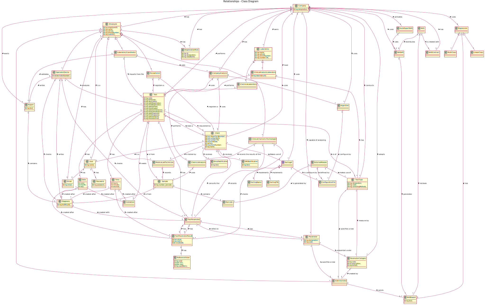

# OO Analysis #

The construction process of the domain model is based on the client specifications, especially the nouns (for _concepts_) and verbs (for _relations_) used.

## Rationale to identify domain conceptual classes ##
To identify domain conceptual classes, start by making a list of candidate conceptual classes inspired by the list of categories suggested in the book "Applying UML and Patterns: An Introduction to Object-Oriented Analysis and Design and Iterative Development".

### _Conceptual Class Category List_ ###

**Business Transactions**

* Test

---

**Transaction Line Items**

* Sample

---

**Product/Service related to a Transaction or Transaction Line Item**

* Parameter
* Result
* Report
* Diagnosis

---

**Transaction Records**

* Report

---  

**Roles of People or Organizations**

* Client
* Administrator
* Receptionist
* Specialist Doctor
* Medical Lab Technician
* Clinical Chemistry Technologist
* Laboratory Coordinator

---

**Places**

* Clinical Analysis Laboratory
* Chemical Laboratory

---

**Noteworthy Events**

* Chemical Analysis

---

**Physical Objects**

*

---

**Descriptions of Things**

* Type of Test
* Category

---

**Catalogs**

*

---

**Containers**

*

---

**Elements of Containers**

*  Laboratory
*  Algorithm
*  Employee

---

**Organizations**

* Company
* NHS

---

**Other External/Collaborating Systems**

*  NHS API
*  SMS Notification
*  Email Notification
*  Barcode
*  BruteForce Algorithm
*  Ordering Algorithm
*  Linear Regression Algorithm

---

**Records of finance, work, contracts, legal matters**

* NHS Contract

---

**Financial Instruments**

*  

---

**Documents mentioned/used to perform some work/**

*
---

###**Rationale to identify associations between conceptual classes**###

An association is a relationship between instances of objects that indicates a relevant connection and that is worth of remembering, or it is derivable from the List of Common Associations:

+ **_Administrator_** specifies a new **_TestType_**
+ **_Administrator_** specifies a new **_Parameter_**
+ **_Barcode_** is generated by **_NHSAPI_**
+ **_BloodTest_** is of **_TestType_**
+ **_BloodTest_** measure by **_Parameter_**
+ **_BruteForceAlgorithm_** type of **_Algorithm_**
+ **_Category_** created by **_Administrator_**
+ **_ChemicalAnalysis_** uses **_Sample_**
+ **_ChemicalLaboratory_** performs **_ChemicalAnalysis_**
+ **_ChemicalLaboratory_** type of **_Laboratory_**
+ **_Client_** does a **_Test_**
+ **_Client_** is tested by **_MedicalLabTechnician_**
+ **_Client_** consult the **_Result_**
+ **_Client_** receives **_EmailNotification_**
+ **_Client_** receives **_SMSNotification_**
+ **_ClinicalAnalysisLaboratory_** collect **_Sample_**
+ **_ClinicalAnalysisLaboratory_** type of **_Laboratory_**
+ **_ClinicalChemistryTechnologist_** checks **_Result_**
+ **_ClinicalChemistryTechnologist_** records the results of the **_ChemicalAnalysis_**
+ **_Company_** performs **_Test_**
+ **_Company_** implements **_Algorithm_**
+ **_Company_** adopts **_Category_**
+ **_Company_** have **_Client_**
+ **_Company_** capable of analysing **_Parameter_**
+ **_Company_** has **_NHSContract_**
+ **_Company_** conducts **_TestType_**
+ **_Company_** owns **_Laboratory_**
+ **_Company_** wants **_Report_**
+ **_Company_** wants **_Employee_**
+ **_Company_** has **_OrganizationRole_**
+ **_CovidTest_** is of **_TestType_**
+ **_CovidTest_** measure by **_Parameter_**
+ **_Employee_** can be **_Administrator_**
+ **_Employee_** can be **_Receptionist_**
+ **_Employee_** can be **_LaboratoryCoordinator_**
+ **_Employee_** can be **_ClinicalChemistryTechnologist_**
+ **_Employee_** can be **_MedicalLabTechnician_**
+ **_Employee_** can be **_SpecialistDoctor_**
+ **_Employee_** has **_OrganizationRole_**
+ **_Employee_** is a **_User_**
+ **_OrderingAlgorithm_** type of **_Algorithm_**
+ **_LaboratoryCoordinator_** validates **_Diagnosis_**
+ **_LaboratoryCoordinator_** checks **_Result_**
+ **_LinearRegressionAlgorithm_** type of **_Algorithm_**
+ **_MedicalLabTechnician_** records **_Sample_**
+ **_NHS_** is related with **_NHSContract_**
+ **_NHS_** receives the **_Report_**
+ **_Parameter_** presented under **_Category_**
+ **_Receptionist_** registers a **_Client_**
+ **_Receptionist_** registers a **_Test_**
+ **_Report_** contains **_Diagnosis_**
+ **_Sample_** is from **_Test_**
+ **_Sample_** contains **_Barcode_**
+ **_SpecialistDoctor_** checks **_Result_**
+ **_SpecialistDoctor_** writes **_Report_**
+ **_SpecialistDoctor_** writes **_Diagnosis_**
+ **_SpecialistDoctor_** checks **_Diagnosis_**
+ **_SpecialistDoctor_** analyzes **_Test_**
+ **_Test_** requested by **_Client_**
+ **_Test_** is of **_TestType_**
+ **_Test_** has **_Parameter_**
+ **_User_** has **_Password_**

| Concept (A)                   | Association                | Concept (B)                 |
|-------------------------------|----------------------------|-----------------------------|
| Administrator                 | specifies a new            | TestType                    |
| Administrator                 | specifies a new            | Parameter                   |
| Barcode                       | is generated by            | NHSAPI                      |               
| BruteForceAlgorithm           | type of                    | Algorithm                   |
| Category                      | created by                 | Administrator               |
| ChemicalAnalysis              | uses                       | Sample                      |
| ChemicalLaboratory            | performs                   | ChemicalAnalysis            |
| ChemicalLaboratory            | type of                    | Laboratory                  |
| Client                        | does a                     | Test                        |
| Client                        | is tested by               | MedicalLabTechnician        |
| Client                        | consults                   | Result                      |
| Client                        | receives                   | EmailNotification           |
| Client                        | receives                   | SMSNotification             |
| ClinicalAnalysisLaboratory    | collect                    | Sample                      |
| ClinicalAnalysisLaboratory    | type of                    | Laboratory                  |
| ClinicalChemistryTechnologist | checks                     | Result                      |
| ClinicalChemistryTechnologist | records the results of the | ChemicalAnalysis            |
| Company                       | performs                   | Test                        |
| Company                       | has                        | NHSContract                 |
| Company                       | have                       | Client                      |    
| Company                       | conducts                   | TestType                    |
| Company                       | uses                       | OrderingAlgorithm           |
| Company                       | owns                       | Laboratory                  |
| Company                       | wants                      | Report                      |
| Company                       | has                        | Employee                    |
| Company                       | has                        | OrganizationRole            |
| CovidTest                     | is of                      | TestType                    |
| CovidTest                     | measure by                 | Parameter                   |    
| Employee                      | can be                     | Administrator                |
| Employee                      | can be                     | Receptionist                 |
| Employee                      | can be                     | LaboratoryCoordinator        |
| Employee                      | can be                     | ClinicalChemistryTechnologist|
| Employee                      | can be                     | MedicalLabTechnician         |
| Employee                      | can be                     | SpecialistDoctor             |
| Employee                      | has                        | OrganizationRole            |
| Employee                      | is a                       | User                        |
| OrderingAlgorithm             | type of                    | Algorithm                   |
| LaboratoryCoordinator         | validates                  | Diagnosis                   |
| LaboratoryCoordinator         | checks                     | Result                      |
| LinearRegressionAlgorithm     | type of                    | Algorithm                   |
| MedicalLabTechnician          | records                    | Sample                      |
| NHS                           | is related with            | NHSContract                 |
| NHS                           | recieves                   | Report                      |
| Parameter                     | presented under            | Category                    |
| Receptionist                  | registers a                | Client                      |
| Receptionist                  | registers a                | Test                        |
| Report						         		| contains                   | Diagnosis                   |
| Sample                        | is from                    | Test                        |
| Sample                        | contains                   | Barcode                     |
| SpecialistDoctor              | checks                     | Result                      |
| SpecialistDoctor              | writes                     | Report                      |
| SpecialistDoctor              | writes                     | Diagnosis                   |
| SpecialistDoctor              | checks                     | Diagnosis                   |
| SpecialistDoctor              | analyzes                   | Test                        |
| Test                          | requested by               | Client                      |
| Test                          | is of                      | TestType                    |
| Test                          | has                        | Parameter                   |
| User                          | has                        | Password                    |
| User                          | has                        | Email                       |

## Domain Model

