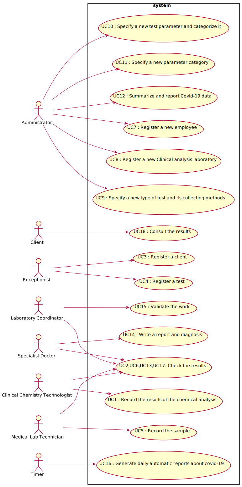

# Use Case Diagram (UCD)

**In the scope of this project, there is a direct relationship of _1 to 1_ between Use Cases (UC) and User Stories (US).**

However, be aware, this is a pedagogical simplification. On further projects and curricular units might also exist _1 to N **and/or** N to 1 relationships between US and UC.

**Insert below the Use Case Diagram in a SVG format**

**For each UC/US, it must be provided evidences of applying main activities of the software development process (requirements, analysis, design, tests and code). Gather those evidences on a separate file for each UC/US and set up a link as suggested below.**

# Use Cases / User Stories
| UC/US  | Description                                                               |                   
|:-------|:--------------------------------------------------------------------------|
| US1 | [As a medical lab technician, I want to record the samples collected in the scope of a given test.] (US1.md)|
| US2 | [As a receptionist of the laboratory, I intend to register a test to be performed to a registered client.] (US2.md)|
| US3 | [As a receptionist of the laboratory, I intend to register a client] (US3.md)|
| US4 | [As a medical lab technician, I want to check the results] (US4.md)|
| US5 | [As clinical chemistry technologist, I want to record the results of the chemical analysis.] (US5.md)|
| US6 | [As a clinical chemistry technologist, I want to check the results.] (US6.md)|
| US7 | [As a administrator of the laboratory, I intend to register an employee] (US7.md)|
| US8 | [As a administrator, I intend to register a new Clinical analysis laboratory] (US8.md)|
| US9| [As an administrator, I want to specify a new type of test and its collecting methods.] (US9.md)|
| US10| [As an administrator, I want to specify a new test parameter and categorize it.] (US10.md)|
| US11| [As an administrator, I want to specify a new parameter category.] (US11.md)|
| US12 | [As a laboratory coordinator, I want to validate the diagnosis given by the specialist doctor ] (US12.md)|
| US13 | [As a laboratory coordinator, I want to check the results.] (US13.md)|
| US14 | [As a client, I want to consult the results.] (US14.md)|
| US15| [As an administrator, I want to summarize and report Covid-19 data.] (US15.md)|
| US16| [As a timer, I want to generate daily (automatic) reports about covid-19.] (US16.md)|
| US17 | [As a specialist doctor, I want to check the results.] (US17.md)|
| US18 | [ As a specialist doctor, I intende to write a report and diagnosis.] (US18.md)|
