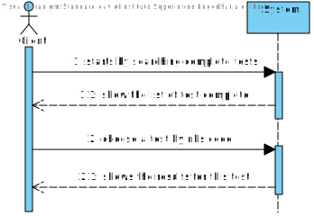
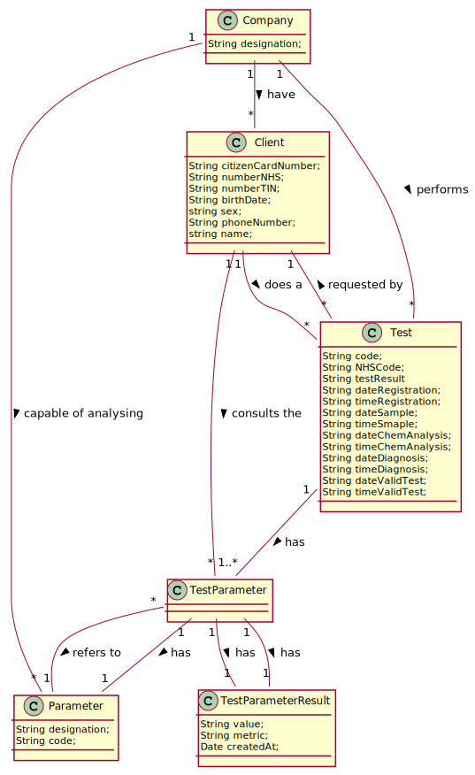
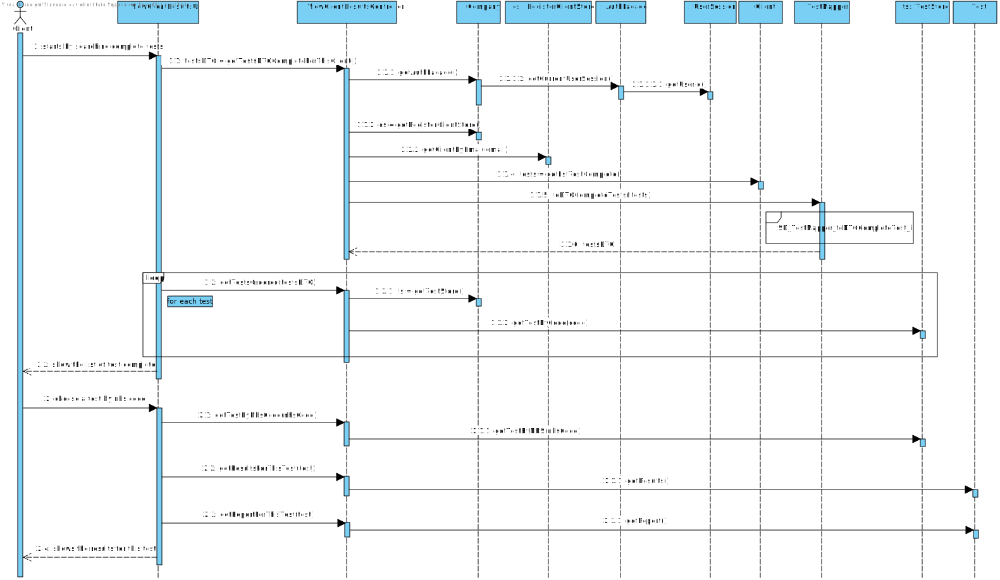
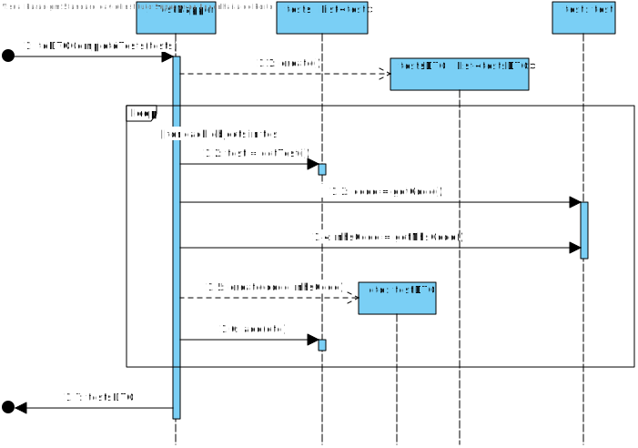
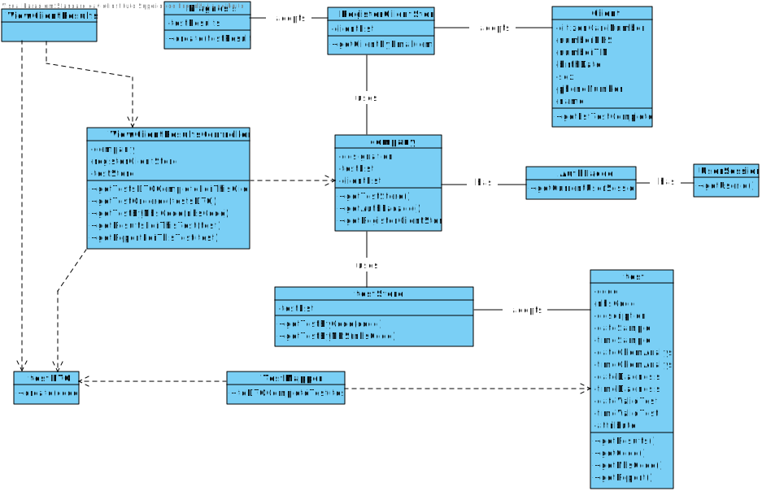

# US 1 - Access the application to view the results of the tests I have performed


## 1. Requirements Engineering

*In this section, it is suggested to capture the requirement description and specifications as provided by the client as well as any further clarification on it. It is also suggested to capture the requirements acceptance criteria and existing dependencies to other requirements. At last, identfy the involved input and output data and depicted an Actor-System interaction in order to fulfill the requirement.*


### 1.1. User Story Description

As a client, I want to access the application to view the results of the tests I have performed

### 1.2. Customer Specifications and Clarifications 

**_From the Specifications Document_**

"Once the laboratory coordinator confirms that everything was done correctly, the client receives a notification alerting that the
results are already available in the central application and informing that he/she must access the application to view those results."

**_From the client clarifications_**
* Q: In US01 which date should be used to arrange the tests in order?The date the test is done or the validation date?
    * A: The test registration date.

* Q: What are the data to show the customer? and in what way do we have to show? do you have any examples you can give us?
    * A: I want to access the application to view the results of the tests I have performed. This includes the report made by the specialist doctor. The client tests must be shown ordered from the most recent to the oldest one. The test results are shown only after the client has selected a test.

* Q: My group is assuming that the client only wants to see the validated tests. Do you want to see tests in other states and if that's the case say the state of the test and show only the information available for that state?
    * A: The client should only see tests that have already been validated.
	
### 1.3. Acceptance Criteria

* AC1: The client tests must be shown ordered from the most recent to the oldest one. 

* AC2: The test results are shown only after the client has selected a test.

### 1.4. Found out Dependencies

For this user story to work, the registered client must exist. That client will have to take the test and then the test has to go through the remaining procedures. Thus, the client will be able to see the results of a test that is already complete.

### 1.5 Input and Output Data

- Input Data
	- Typed data: introduce a test´s nhs code to wiew his results
	- Selected data: chooses a complete test.
- Output Data
	- (In)Success of the operation


### 1.6. System Sequence Diagram (SSD)

*Insert here a SSD depicting the envisioned Actor-System interactions and throughout which data is inputted and outputted to fulfill the requirement. All interactions must be numbered.*




### 1.7 Other Relevant Remarks

The client will only be able to see their results if their tests are already completed.


## 2. OO Analysis

### 2.1. Relevant Domain Model Excerpt 
*In this section, it is suggested to present an excerpt of the domain model that is seen as relevant to fulfill this requirement.* 



### 2.2. Other Remarks

*Use this section to capture some aditional notes/remarks that must be taken into consideration into the design activity. In some case, it might be usefull to add other analysis artifacts (e.g. activity or state diagrams).* 


## 3. Design - User Story Realization 

### 3.1. Rationale

**The rationale grounds on the SSD interactions and the identified input/output data.**

| Interaction ID | Question: Which class is responsible for... | Answer  | Justification (with patterns)  |
|:-------------  |:--------------------- |:------------|:---------------------------- |
| Step 1: Starts by searching complete tests | ... interacting with the actor? | ViewClientControllerUI   |  Pure Fabrication: there is no reason to assign this responsibility to any existing class in the Domain Model.  
| 			  		 |	... coordinating the US? | ViewClientController | Controller                             |	
| 			  		 |	... instantiating a new RegisterClientStore? | Company | Creator (Rule 1): in the DM Company has a Store. |
| 			  		 |	... instantiating a new Client by Email? | RegisterClientStore| IE: knows Client |
| 			  		 |	... who knows the lst complete of tests made bye client? | Client| IE: knows its own data |
| 			  		 |	... instantiating a new TestStore? | Company | Creator (Rule 1): in the DM Company has a Store. |
| 			  		 |	... instantiating a new Test by Code? | TestStore| IE: knows test |
| 			  		 |	... instantiating a AuthFacade? | Company | Company knows the user who is using now the system |
| Step 2: Show a list of complete tests| ... knowing the tests?| TestMapper | By the application of the Creator (R1) it would be the "Company". But, by applying HC + LC to the "Company", this delegates that responsibility to the "TestStore" |
| Step 3: choose a test |.... record the choice?					 |ViewClientUI          | n/a                             |
| 			  		 |	... finding the test based in nhsCode | testStore | IE: knows test |  
| 			  		 |	... finding the Results based in the Test | Test | IE: knows results |  
| 			  		 |	... finding the Report based in the Test | Test | IE: knows report |  
| Step 4: Show the results for this test | n/a | n/a | n/a |
                                    


### Systematization ##

According to the taken rationale, the conceptual classes promoted to software classes are: 

 * Company
 * Test
 * Client

Other software classes (i.e. Pure Fabrication) identified: 
 * ViewClientResultsUI  
 * ViewClientResultsController
 * testStore
 * RegisterClientStore

## 3.2. Sequence Diagram (SD)

*In this section, it is suggested to present an UML dynamic view stating the sequence of domain related software objects' interactions that allows to fulfill the requirement.* 





## 3.3. Class Diagram (CD)

*In this section, it is suggested to present an UML static view representing the main domain related software classes that are involved in fulfilling the requirement as well as and their relations, attributes and methods.*



# 4. Tests 
*In this section, it is suggested to systematize how the tests were designed to allow a correct measurement of requirements fulfilling.* 

**Test 1:** get a list of test complete
```java
   @Test(expected = IllegalArgumentException.class)
    public void getLstTesComplete(){
        List<app.domain.model.Test> lstTests = new ArrayList<>();
        Client cl = new Client("J","1234567890123456","30/18/2001","1234567890","1234567890","contribute@geeksforgeeks.org","12345678901","Female");
        app.domain.model.Test t = new app.domain.model.Test("2345", new Date(), new Date(), new Date());
        t.setClient(cl);
        app.domain.model.Test t2 = new app.domain.model.Test("2345", new Date(), new Date(), new Date());
        t2.setClient(cl);
        app.domain.model.Test t3 = new app.domain.model.Test("2345", new Date(), new Date(), new Date());
        t3.setClient(cl);
        lstTests.add(t);
        lstTests.add(t2);
        lstTests.add(t3);

        assertEquals(lstTests, cl.getLstTestComplete());
    }

```

**Test 2:** compare date between two tests
```java
    @Test
    public void testCompareTo(){
        Date d = new Date();
        Date d2 = new Date();
        assertEquals(0, d.compareTo(d2));
    }

```

**Test 3:** compare time between two tests
```java
    @Test
    public void testCompareTo(){
        Time t = new Time();
        Time t2 = new Time();
        assertEquals(0, t.compareTo(t2));

    }

```

**Test 4:** test of check if the words passing a limit, which is 400 words


# 5. Construction (Implementation)

*In this section, it is suggested to provide, if necessary, some evidence that the construction/implementation is in accordance with the previously carried out design. Furthermore, it is recommeded to mention/describe the existence of other relevant (e.g. configuration) files and highlight relevant commits.*

**Client**

```java
public class Client {
    /**
     * name of the client
     */
    private String name;
    /**
     * email of the client
     */
    private Email emailm;
    /**
     * nhs id of the client
     */
    private String nhsid;
    /**
     * tin number of the client
     */
    private String tin;
    /**
     * citizen card of the client
     */
    private String cc;
    /**
     * birth date of the client
     */
    private String birth;
    /**
     * sex of the client
     */
    private String sex;
    /**
     * phone number of the client
     */
    private String phonenumber;

    /**
     * lists of tests of client
     */
    private List<Test> lstTest =  new ArrayList<>();

    // condition used to do the check
    private static final String REGULAR_EXPRESSION = "[0-9]+";

    /**
     * creates client with the atributes below
     * @param name
     * @param cc
     * @param birth
     * @param nhsid
     * @param tin
     * @param email
     * @param phonenumber
     * @param sex
     */
    public Client (String name, String cc, String birth, String nhsid, String tin, String email, String phonenumber, String sex){
        checkParameters( name, cc, birth, nhsid, tin, phonenumber);
        this.name = name;
        this.cc = cc;
        this.birth = birth;
        this.nhsid = nhsid;
        this.tin = tin;
        this.emailm = new Email(email);
        this.phonenumber = phonenumber;
        this.sex = sex;
    }

    /**
     * creates client with the atributes below
     * @param name
     * @param cc
     * @param birth
     * @param nhsid
     * @param tin
     * @param email
     * @param phonenumber
     */
    public Client (String name, String cc, String birth, String nhsid, String tin, String email, String phonenumber){
        checkParameters( name, cc, birth, nhsid, tin, phonenumber);
        this.name = name;
        this.cc = cc;
        this.birth = birth;
        this.nhsid = nhsid;
        this.tin = tin;
        this.emailm = new Email(email);
        this.phonenumber = phonenumber;
        this.sex = "anonymous";
    }

    public Client() {


    }

    /**
     * checks all the criteria
     * @param name
     * @param cc
     * @param birth
     * @param nhsid
     * @param tin
     * @param phonenumber
     */
    public void checkParameters(String name, String cc, String birth, String nhsid, String tin, String phonenumber){
        checkNameRules(name);
        checkCCRules(cc);
        checkDateRules(birth);
        checkNhsIDRules(nhsid);
        checkNumberTINRules(tin);
        checkPhoneNumberRules(phonenumber);
    }
    /**
     * @param phoneNumber check if phoneNumber has 11 digits
     */
    private void checkPhoneNumberRules(String phoneNumber) {
        if (phoneNumber.length() != 11 || !phoneNumber.matches(REGULAR_EXPRESSION))
            throw new IllegalArgumentException("Phone Number must be 11 numbers.");
    }
    /**
     * @param numberTIN check if numberTIN has 10 digits
     */
    private void checkNumberTINRules(String numberTIN) {
        if (numberTIN.length() != 10 || !numberTIN.matches(REGULAR_EXPRESSION))
            throw new IllegalArgumentException("TIN number must be 10 numbers.");
    }
    /**
     * @param nhsid check if nhsID has 10 numbers
     */
    private void checkNhsIDRules(String nhsid) {
        if (nhsid.length() != 10 || !nhsid.matches(REGULAR_EXPRESSION))
            throw new IllegalArgumentException("NHSID must be 10 digits.");
    }
    /**
     * @param name check if name has no more than 35 chars and more than 1
     */
    private void checkNameRules(String name) {
        if (name.length() < 1 || name.length() > 35)
            throw new IllegalArgumentException("Name must be no more than 35 car.");
    }
    /**
     * check if cc has 16 numbers
     *
     * @param cc citizen card
     */
    private void checkCCRules(String cc) {
        if (cc.length() != 16 || !cc.matches(REGULAR_EXPRESSION))
            throw new IllegalArgumentException("CC must be 16 digits.");
    }
    /**
     * @param birth check if data has the format
     */
    private void checkDateRules(String birth) {
        int c =3;
        String[] date = birth.split("/");
        if (date.length != c || Integer.parseInt(date[0]) > 31 || Integer.parseInt(date[1]) > 12 || Integer.parseInt(date[2]) < 1870)
            throw new IllegalArgumentException("Format is wrong");
        }

    /**
     *
     * @return name
     */
    public String getName() {
        return name;
    }

    /**
     *
     * @return email
     */
    public String getEmail() {
        return emailm.getEmail();
    }

    /**
     *
     * @return nhsid
     */
    public String getNhsid() {
        return nhsid;
    }

    /**
     *
     * @return TIN
     */
    public String getTin() {
        return tin;
    }

    /**
     *
     * @return CC
     */
    public String getCc() {
        return cc;
    }

    /**
     *
     * @return birth date
     */
    public String getBirth() {
        return birth;
    }

    /**
     *
     * @return sex
     */
    public String getSex() {
        return sex;
    }

    /**
     *
     * @return Phone number
     */
    public String getPhonenumber() {
        return phonenumber;
    }

    /**
     *Changes the Client name if it is valid
     * @param name
     */
    public void setName(String name) {
        checkNameRules(name);
        this.name = name;
    }

    /**
     *
     * @param email
     */
    public void setEmail(Email email) {
        this.emailm = email;
    }

    /**
     *Changes the Client nhsid if it is valid
     * @param nhsid
     */
    public void setNhsid(String nhsid) {
        checkNhsIDRules(nhsid);
        this.nhsid = nhsid;
    }

    /**
     *Changes the Client TIN if it is valid
     * @param tin
     */
    public void setTin(String tin) {
        checkNumberTINRules(tin);
        this.tin = tin;
    }

    /**
     *Changes the Client cc if it is valid
     * @param cc
     */
    public void setCc(String cc) {
        checkCCRules(cc);
        this.cc = cc;
    }

    /**
     *Changes the Client birth date if it is valid
     * @param birth
     */
    public void setBirth(String birth) {
        checkDateRules(birth);
        this.birth = birth;
    }

    /**
     *
     * @param sex
     */
    public void setSex(String sex) {
        this.sex = sex;
    }

    /**
     *Changes the Client phone number if it is valid
     * @param phonenumber
     */
    public void setPhonenumber(String phonenumber) {
        checkPhoneNumberRules(phonenumber);
        this.phonenumber = phonenumber;
    }


    /**
     * add test to a list
     * @param test tests complete done by client
     */
    public void addTest(Test test){
        this.lstTest.add(test);
    }

    /**
     * returns a tests done for client
     * @return lists of test make by client
     */
    public List<Test> getLstTestComplete() {
        return lstTest;
    }

    /**
     *
     * @return Client atributes
     */
    @Override
    public String toString() {
        return "Client{" +
                "name='" + name + '\'' +
                ", email=" + emailm +
                ", nhsid='" + nhsid + '\'' +
                ", tin='" + tin + '\'' +
                ", cc='" + cc + '\'' +
                ", birth='" + birth + '\'' +
                ", sex='" + sex + '\'' +
                ", phonenumber='" + phonenumber + '\'' +
                '}';
    }


}


```

**Date**

```java
public class Date implements Comparable{

    /**
     * The date's year
     */
    private int year;
    
    /**
     * The date's month
     */
    private int month;
    
    /**
     * The date's day
     */
    private int day;

    /**
     * Creates a new date with year, month and day
     *

     */
    public Date() {
        this.setDate();
    }

    /**
     * Gets the date's year
     *
     * @return this date's year
     */
    public int getYear() {
        return this.year;
    }

    /**
     * Gets the date's month
     *
     * @return this date's month
     */
    public int getMonth() {
        return this.month;
    }

    /**
     * Gets the date's day
     *
     * @return this date's day
     */
    public int getDay() {
        return this.day;
    }

    /**
     * Sets new year, month and day to a date
     */
    public void setDate() {
        Calendar hoje = Calendar.getInstance();
        this.year = hoje.get(Calendar.YEAR);
        this.month = hoje.get(Calendar.MONTH) + 1;
        this.day = hoje.get(Calendar.DAY_OF_MONTH);
    }

    /**
     * this method compare a date to another
     * @param o obj which will be compared
     * @return if 0 it means, the date are equal. if > 0 it is
     * that a date is lower than the other
     */
    public int compareTo(Object o) {
        Date d = (Date) o;
        int diff = this.year - d.year;

        if(diff != 0) {
            return diff;
        }

        diff = this.month - d.month;

        if(diff != 0) {
            return diff;
        }

        return this.day - d.day;
    }

    /**
     * Gives a date description with year, month and day
     *
     * @return String with information about the date
     */
    @Override
    public String toString() {
        return String.format("%d %s %d", this.day,
                this.month, this.year);
    }

    /**
     * Shows the date in YYYY/MM/DD format
     *
     * @return String with information about the date
     */
    public String toYMDString() {
        return String.format("%04d/%02d/%02d", this.year, this.month, this.day);
    }

    public int compareTo(Date obj){

        if(this.year > obj.getYear()){
            return 1;
        }
        if(this.year < obj.getYear()){
            return -1;
        }
        if(this.year == obj.getYear()){
            if(this.month > obj.getMonth()){
                return 1;
            }
            if(this.month < obj.getMonth()){
                return -1;
            }
            if(this.month == obj.getMonth()){
                if(this.day > obj.getDay()){
                    return 1;
                }
                if(this.day < obj.getDay()){
                    return -1;
                }
            }
        }
        return 0;
    }

}

```

**Time**

```java
public class Time {

    /**
     * The hours
     */
    private int hours;
    
    /**
     * The minutes
     */
    private int minutes;
    
    /**
     * The seconds
     */
    private int seconds;

    /**
     * Creates an instance of time with hours, minutes an seconds
     *
     */
    public Time() {
        this.setTime();
    }

    /**
     * Gets the time's hours
     *
     * @return this time's hours
     */
    public int getHours() {
        return this.hours;
    }

    /**
     * Gets the time's minutes
     *
     * @return this time's minutes
     */
    public int getMinutes() {
        return this.minutes;
    }

    /**
     *  Gets the time's seconds
     *
     * @return this time's seconds
     */
    public int getSeconds() {
        return this.seconds;
    }

    /**
     * Sets new hours, minutes and seconds to a time
     *
     */
    public void setTime() {
        Calendar c = Calendar.getInstance();
        this.hours = c.get(Calendar.HOUR_OF_DAY);
        this.minutes = c.get(Calendar.MINUTE);
        this.seconds = c.get(Calendar.SECOND);
    }

    /**
     * this method compare a time to another
     * @param o obj which will be compared
     * @return if 0 it means, the time are equal. if > 0 it is
     * that a time is lower than the other
     */
    public int compareTo(Object o) {
        Time t = (Time) o;
        int diff = this.hours - t.hours;

        if(diff != 0) {
            return diff;
        }

        diff = this.minutes - t.minutes;

        if(diff != 0) {
            return diff;
        }

        return this.seconds - t.seconds;
    }

    /**
     * Gives a time description in %02d%02d%02d format
     *
     * @return String with information about the time
     */
    @Override
    public String toString() {
        return String.format("%02d:%02d:%02d", this.hours, this.minutes, this.seconds);
    }

    
}


```
**RegisterClientStore**

```java
public class RegisterClientStore {

    private final List<Client> clientList;

    /**
     * creates RegisterClientStore with all the client already registered
     * @param list
     */
    public RegisterClientStore(List<Client> list){
        this.clientList= list;
    }

    /**
     * creates client using constructor from Client
     * @param name
     * @param cc
     * @param birth
     * @param nhsid
     * @param tin
     * @param email
     * @param phonenumber
     * @param sex
     * @return the created client
     */
    public Client createClient(String name, String cc, String birth, String nhsid, String tin, String email, String phonenumber, String sex){
        return new Client(name, cc, birth, nhsid, tin, email, phonenumber,  sex);
    }
    /**
     * @param ct The client to be validated
     * @return Validation if the client does not exist
     */
    public boolean validateClient(Client ct) {
        if (ct == null)
            return false;
        return ! this.clientList.contains(ct);
    }
    /**
     * @param ct The client to be added to the List of Clients
     * @return true if the client was added successfully
     */
    public boolean saveClient(Client ct) {
        if (!validateClient(ct))
            return false;
        return this.clientList.add(ct);
    }

    /**
     * creates client using the constructor form Client
     * @param name
     * @param cc
     * @param birth
     * @param nhsid
     * @param tin
     * @param email
     * @param phone
     * @return created client
     */
    public Client createClient(String name, String cc, String birth, String nhsid, String tin, String email, String phone) {
        return new Client(name, cc, birth, nhsid, tin, email, phone);
    }
    
    /**
     * Gets the list of registered clients
     * @return the list of clients
     */
    public List<Client> getClients(){
        return this.clientList;
    }

    /**
     *  returns client using nhs
     * @param tin client TIN
     * @return client with the same nhs
     */
    public Client getClientByTIN(String tin){
        Client c = null;
        for(Client ccc : this.clientList){
            if(ccc.getTin().compareTo(tin)==0)
                c = ccc;
        }
        return c;
    }

    /**
     *
     * returns client using email
     * @param email client´s email
     * @return client wtih the same email
     */
    public Client getClientByEmail(String email){
        for(Client c : this.clientList){
            if(c.getEmail().compareTo(email)==0)
                return c;
        }
        return null;
    }
}

```

**TestStore**

```java
public class TestStore {
    /**
     * List of tests registered 
     */
    private final List<Test> testList;
    
    /**
     * Creates a test type store that contains all test types registered
     * 
     * @param list The list containing the tests known by the Company
     */
    public TestStore(List<Test> list){
        this.testList= list;
    }
     
    /**
     * Create an instance of test by calling the test constructor
     * 
     * @param testNHScode NHS code associated to the added test
     * @return A new parameter category
     */
    public Test createTest(String testNHScode) {
        return new Test(testNHScode);
    }
    
    /**
     * Validates the created test
     * 
     * @param t The test to be validated
     * @return Validation if the test does not already exists
     */
    public boolean validateTest(Test t) {
        if (t == null)
            return false;
        return tExists(this.testList, t);
    }
    
    /**
     * Saves the test if it is valid
     * 
     * @param t The test to be added to the list of tests
     * @return true if the new test was added successfully
     */
    public boolean saveTest(Test t) {
        if (!validateTest(t))
            return false;
        else
            return this.testList.add(t);
    }
    
    /**
     * Checks if the test code is valid for creation
     * 
     * @param list List containing all known tests
     * @param t The test to be validated 
     * @return true if the test code is not already registered
     */
    public boolean tExists(List<Test> list, Test t){
        for(Test test : list){
            if(test.getCode().compareTo(t.getCode())==0)
                return false;
        }
        return true;
    }
    
    /**
     * Gets the list of tests
     * 
     * @return the list of test
     */
    public List<Test> getTests(){
        List<Test> tests = null;
        tests = this.testList;
        return tests;
    }
    /**
     * Get a test by its test code
     *
     * @param code The Test code
     * @return The test if it was found, null if not
     */
    public Test getTestByCode(String code){
        for(Test test : this.testList){
            if(test.getCode().compareTo(code)==0)
                return test;
        }
        return null;
    }

    /**
     * Gets a test from a sample's barcode
     *
     * @param barcode The sample's barcode
     * @return The test with the desired sample
     */
    public Test getTestByBarcode(String barcode){
        for(Test t : this.testList){
            for(Sample s : t.getSamples()){
                if(s.getBarcode().compareTo(barcode)==0)
                    return t;
            }
        }
        return null;
    }

    /**
     * Gets a test from a nhs code
     *
     * @param nhs The sample's nhs code
     * @return The test with the desired nhs code
     */
    public Test getTestByNHS(String nhs){
        for(Test t : this.testList){
            if(t.getNHScode().compareTo(nhs)==0)
                return t;
        }
        return null;
    }

    /**
     * Generates the serial code of the test
     *
     * @return The serial code
     */
    public String generateCode(){
        int codeNum = this.testList.size()+1;
        return String.format("%012d", codeNum);
    }

}
```

**ViewClientResultsController**

```java
public class ViewClientResultsController {

    /**
     * The company that knows the tests
     */
    private final Company company;

    /**
     * Client who do the test
     */
    private Client client;

    /**
     * The client store to get the client
     */
    private RegisterClientStore cStore;

    /**
     * The test store to get the test chosen by client
     */
    private TestStore testStore;

    /**
     * Creates a controller getting the Company information from App
     */
    public ViewClientResultsController() {
        this(App.getInstance().getCompany());
    }


    public ViewClientResultsController(Company company) {
        this.company = company;
    }

    public String getEamilOfClient() {
        return this.company.getAuthFacade().getCurrentUserSession().getUserId().toString();
    }

    /**
     * this method return client by email
     *
     * @return client by email
     */
    public Client getClientByEmail() {
        String email = getEamilOfClient();
        this.cStore = this.company.getClientStore();
        return this.cStore.getClientByEmail(email);
    }

    /**
     * this method give us the test complete for this client
     *
     * @return list of test dto from client
     */
    public List<TestDTO> getTestsDTOCompleteForThisClient() {
        this.client = getClientByEmail();
        List<Test> tests = this.client.getLstTestComplete();
        TestsMapper tm = new TestsMapper();
        return tm.toDTOCompleteTests(tests);
    }


    /**
     * this method gets the lists of tests ordered
     *
     * @param testDTOS list of tests dto
     * @return list of test ordered
     */
    public List<Test> getTestsOrdered(List<TestDTO> testDTOS) {
        List<Test> lstTestsOrdered = new ArrayList<>();
        this.testStore = this.company.getTestStore();

        for (TestDTO testDTO : testDTOS) {
            lstTestsOrdered.add(this.testStore.getTestByCode(testDTO.getCode()));
        }

        Collections.sort(lstTestsOrdered);
        return lstTestsOrdered;
    }

    /**
     * this method return a test by a code
     *
     * @param nhsCode test´s nhs code
     * @return test
     */
    public Test getTestByNhsCode(String nhsCode) {
        this.testStore = this.company.getTestStore();
        return this.testStore.getTestByNHS(nhsCode);
    }

    /**
     * this method give us the results for this test
     *
     * @param t client´s test
     * @return list of parameters
     */
    public List<TestParameter> getResultsForThisTest(Test t) {
        return t.getResults();
    }

      /**
     * this method give us the report for this test
     *
     * @param t client´s test
     * @return report
     */
    public Report getReportForThisTest(Test t) {
        return t.getReport();
    }

}
```

# 6. Integration and Demo 

* update Test class
* Added coverage and mutation tests for Test class
* update Client class
* Added coverage and mutation tests for Client class
* update ViewClientResultsController class
* Added coverage and mutation tests for ViewClientResultsController class
* update TestStore class
* Added coverage and mutation tests for TestStore class
* update RegisterClientStore class
* Added coverage and mutation tests for RegisterClientStore class
* Added ViewClientResultsUI
* A new option on the Client menu options was added: ViewClientResults


# 7. Observations

*In this section, it is suggested to present a critical perspective on the developed work, pointing, for example, to other alternatives and or future related work.*


