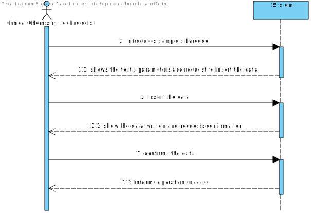
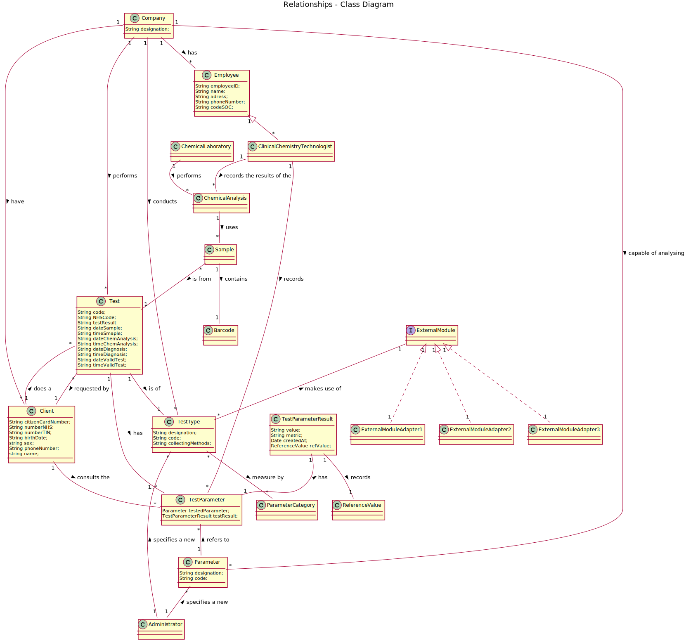
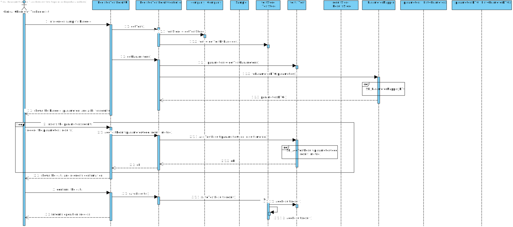
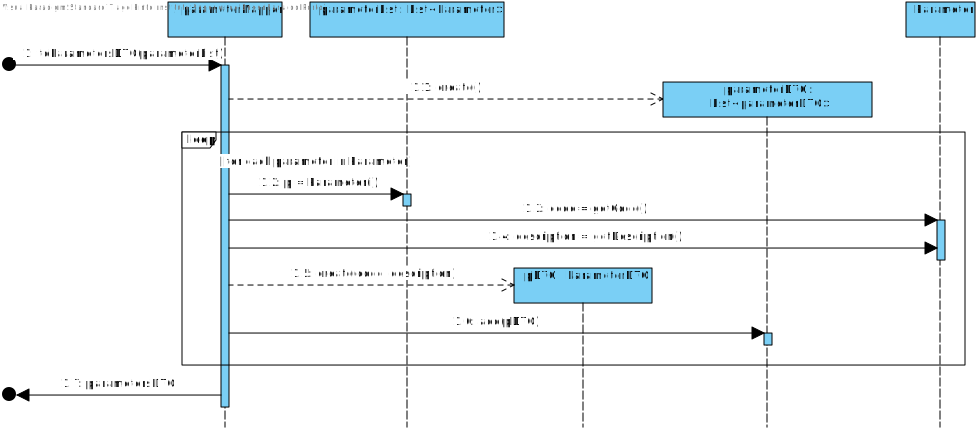
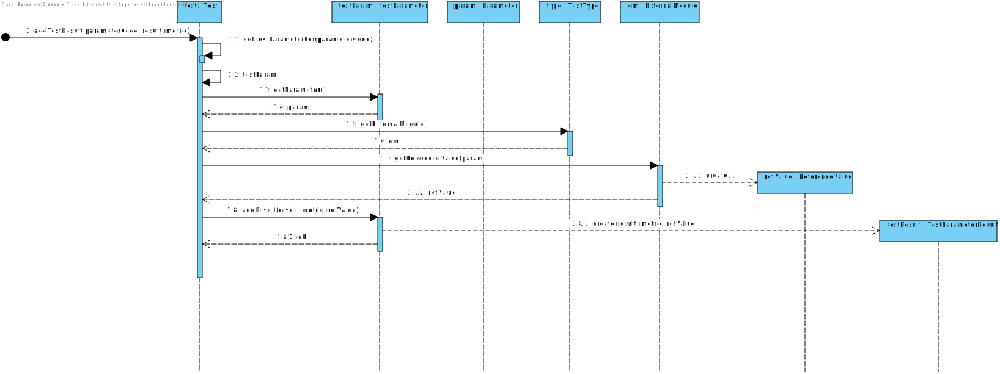
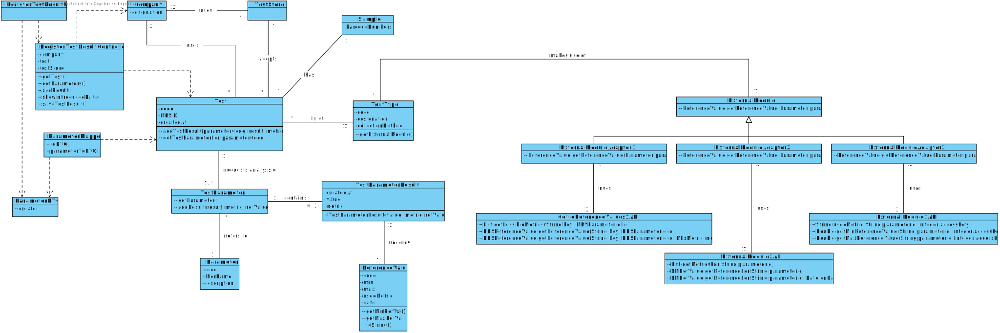

# US 12 - Record the results of a given test

## 1. Requirements Engineering

### 1.1. User Story Description

As a clinical chemistry technologist, I intend to record the results of a given test.

### 1.2. Customer Specifications and Clarifications 

**_From the Specifications Document_**

"At the company's headquarters, the clinical chemistry technologist receives the samples (delivered by a courier) and performs the chemical analysis, recording the results in the software application."

**_From the client clarifications_**

-	**Question:** When the Clinical Chemistry Technologist wants to record the results of a test, how does he has access to that test? By internal code, NHS code?

	- 	**Answer:** Each sample has a unique barcode. The clinical chemistry technologist should use the sample barcode number to find the test for which the sample was collected.

- **Question:** Should the system present a result for each test parameter or a single result for the test to be recorded?

	- 	**Answer:** The Clinical Chemistry Technologist should register a value/result for each parameter of the test.

-	**Question:** From the Acceptance Criteria we get that "the API request should include, at most: (i) a key to access the module (e.g.: “KEY1234”); (ii) a parameter identifier; (iii) the reference date; and (iv) reference measurement unit (e.g. "mg").". Does this "at most" express that there are some parameters of the API request that are optional? If so, could you clarify the parameters that are optional?

	- 	**Answer:** "At most" means the maximum number of parameters that will be used. Depending on the API being used, all parameters above may be required or some may be optional.

-	**Question:** Are the reference values, for each parameter, going to be delivered to the groups? If so, when and how?

	- 	**Answer:** You should use the APIs available in moodle to obtain the reference values.

-	**Question:** When the Clinical Chemistry Technologist wants to record the results of a test, how does he has access to that test? By internal code, NHS code? 

	- 	**Answer:** Each sample has a unique barcode. The clinical chemistry technologist should use the sample barcode number to find the test for which the sample was collected.

-	**Question:** Should the system present a result for each test parameter or a single result for the test to be recorded?

	- 	**Answer:** The Clinical Chemistry Technologist should register a value/result for each parameter of the test.

	
### 1.3. Acceptance Criteria

- **AC1:** The application should use an external module that is responsible for providing the test reference values.

- **AC2:** The application can use an external module for each type of test.

- **AC3:** The API request should include:
	- a key to access the module;
	- a parameter identifier;
	- the reference date;
	- reference measurement unit;

- **AC5:** The result should be always recorded in the software application.

- **AC6:** The result can't be empty.

### 1.4. Found out Dependencies

There is two dependencies:

- "US4 Register a test to be performed to a registered client" since the Clinical Chemistry Technologist needs that exists a test;

- "US5 Record the samples collected in the scope of a given test" since the Clinical Chemistry Technologist needs the samples to perform the chemical analysis and then, record the results;

### 1.5 Input and Output Data

- Input Data
	- Typed data:
		- sample's barcode
		- result of the test's parameters
	- Selected data: none
- Output Data
	- (In)Success of the operation

### 1.6. System Sequence Diagram (SSD)

### 1.7 Other Relevant Remarks

None.

## 2. OO Analysis

### 2.1. Relevant Domain Model Excerpt 

### 2.2. Other Remarks

*Use this section to capture some aditional notes/remarks that must be taken into consideration into the design activity. In some case, it might be usefull to add other analysis artifacts (e.g. activity or state diagrams).* 

## 3. Design - User Story Realization - FALTA FAZER

### 3.1. Rationale

**The rationale grounds on the SSD interactions and the identified input/output data.**

| Interaction ID | Question: Which class is responsible for... | Answer  | Justification (with patterns)  |
|:-------------  |:--------------------- |:------------|:---------------------------- |
| Step 1: Introduces sample's barcode | ... interacting with the actor? | recordResultSampleUI | Pure Fabrication: there is no reason to assign this responsibility to any existing class in the Domain Model |
|  | ... coordinating the US | recordResultSampleController | Controller |
|  | ... finding a test? | TestStore | Indirection: Knows all samples |
|  | ... finding the parameters? | Test | IE: Knows all the Test parameters |
| Step 1.1: show the test's parameters and request to insert the data | ... knowing the test's parameters? | Test | By the application of the Creator (R1) it would be the "Company". But, by applying HC + LC to the "Company", this delegates that responsibility to the "Test". |
| Step 2: Inserts the parameter's results | n/a							 | n/a            | n/a  
|  | ... saving the input data? | Test | IE: object created in step 1 has its own data. |
|  | ...knowing the parameters to show?  | Test | IE: records all the parameters. |                           |
| Step 3: Confirms the data |	... saving the input data? | Test | IE: The object created in step 1 has its own data.                              |                        |             
|  | ... who records the test results? | testResult | IE: The object records the parameters' results. |

### Systematization ##

According to the taken rationale, the conceptual classes promoted to software classes are: 
	
* Company
* Test
* TestResult

Other software classes (i.e. Pure Fabrication) identified:

* RecordResultSampleUI
* RecordResultSampleController
* TestStore

## 3.2. Sequence Diagram (SD)

### US12-SD

### SD-ParameterMapper-DTO

### SD-AddTestResult

## 3.3. Class Diagram (CD)

# 4. Tests 

**Test 1:**

	@Test
    public void testGetMinRefVal() {
        System.out.printf("getMinRefVal\n");
        ReferenceValue rf = new ReferenceValue("1234", "ml", 50, 300, null);
        double expRes = 50;
        assertEquals(expRes, rf.getMinRefVal(), 0.0);
    }

**Test 2:**

	@Test
    public void testGetMaxRefVal() {
        System.out.printf("getMaxRefVal\n");
        ReferenceValue rf = new ReferenceValue("1234", "ml", 50, 300, null);
        double expRes = 300;
        assertEquals(expRes, rf.getMaxRefVal(), 0.0);
    }
    
**Test 3:**

	@Test
    public void testGetParameter() {
        System.out.printf("getParameter\n");
        ParameterCategory cat = new ParameterCategory("1234", "category", "12345");
        Parameter p = new Parameter("1234", "Parameter", cat);
        TestParameter tp = new TestParameter(p);

        assertEquals(tp.getParameter(), p);
    }
    
**Test 4:**

	@Test
    public void testAddResultAndGetTestResult() {
        System.out.printf("addResult\n");
        Date date = new Date();
        ReferenceValue rv = new ReferenceValue("1234", "ml", 50, 300, date);
        TestParameterResult tpr = new TestParameterResult("Positive", "ml", rv);
        ParameterCategory cat = new ParameterCategory("1234", "Category", "12345");
        Parameter p = new Parameter("1234", "Parameter", cat);
        TestParameter tp = new TestParameter(p);

        tp.addResult("Positive", "ml", rv);
        assertEquals(tpr.toString(), tp.getTestResult().toString());
    }
    
**Test 5:**

	@Test
    public void testGetRefValue() {
        System.out.printf("testGetRefValue\n");
        ReferenceValue rf = new ReferenceValue("1234", "ml", 50, 300, null);
        TestParameterResult tpr = new TestParameterResult("Positive", "ml", rf);

        assertEquals(tpr.getRefValue(), rf);
    }
    

# 5. Construction (Implementation)

**TestParameter**
	
	/**
	 * Represents a parameter measured in a test
	 *
	 * @author renan
	 */
	public class TestParameter {
	    /**
	     * The tested parameter
	     */
	    private final Parameter testedParameter;
	    
	    /**
	     * The result for this parameter's test
	     */
	    private TestParameterResult testResult;
	    
	    /**
	     * Creates an instance of TestParameter
	     * 
	     * @param param The tested parameter
	     */
	    public TestParameter(Parameter param){
	        this.testedParameter = param;
	    }
	    
	    /**
	     * Gets the tested parameter
	     * 
	     * @return The parameter
	     */
	    public Parameter getParameter(){
	        return this.testedParameter;
	    }
	    
	    /**
	     * Adds the test results of this parameter
	     * 
	     * @param result Result of the tested parameter
	     * @param metric Metric used to measure the test
	     * @param refValue Reference value generated by an external API
	     */
	    public void addResult(String result, String metric, ReferenceValue refValue){
	        this.testResult = new TestParameterResult(result, metric, refValue); 
	    }
	
	    /**
	     * Gets the results of this test parameter
	     *
	     * @return This TestParameter's TestParameterResult
	     */
	    public TestParameterResult getTestResult(){
	        return this.testResult;
	    }
	
	    /**
	     * Generates a string with information concerning the result
	     * 
	     * @return the string with information
	     */
	    @Override
	    public String toString(){
	        return String.format("Parameter: %s\n"
	                           + "Parameter Test Results:\n%s", this.testedParameter.getDescriptionP() ,this.testResult);
	    }
	    public String toString2(){
	        return "" + this.testResult;
	    }
	    
**TestParameterResult**
	
	/**
	 * Represents the result of a parameter test
	 *
	 * @author renan
	 */
	public class TestParameterResult {
	    /**
	     * Result of the tested parameter
	     */
	    private final String value;
	    
	    /**
	     * Metric used to measure the test
	     */
	    private final String metric;
	    
	    /**
	     * Reference value generated by an external API
	     */
	    private final ReferenceValue refValue;
	    
	    
	    
	    /**
	     * Creates a parameter test result
	     * 
	     * @param result Result of the tested parameter
	     * @param metric Metric used to measure the test
	     * @param refValue Reference value generated by an external API
	     */
	    public TestParameterResult(String result, String metric, ReferenceValue refValue){
	        this.value=result;
	        this.metric=metric;
	        this.refValue=refValue;
	    }
	
	    /**
	     * Gets the result of this test
	     *
	     * @return this TestParameter's result
	     */
	    public String getResult(){
	        return this.value;
	    }
	
	    /**
	     * Gets the reference values of this test
	     *
	     * @return this TestParameter's reference values
	     */
	    public ReferenceValue getRefValue(){
	        return this.refValue;
	    }
	    
	    /**
	     * Creates a string with information concerning the result
	     * 
	     * @return The string
	     */
	    @Override
	    public String toString(){
	        return String.format("Result: %s\n"
	                           + "Metric: %s\n"
	                           + "Reference Value: %s", this.value, this.metric, this.refValue);
	    }
	}
	
**ExternalModuleAdapter1**

	package app.domain.model;
	import com.example3.CovidReferenceValues1API;
	
	/**
	 * Adapter for the CovidReferenceValues API
	 */
	public class ExternalModuleAdapter1 implements ExternalModule{
	
	    /**
	     * API in charge of Covid reference values
	     */
	    private CovidReferenceValues1API covidAPI;
	
	    public ExternalModuleAdapter1(){
	        this.covidAPI = new CovidReferenceValues1API();
	    }
	
	    /**
	     * Gets the reference values of a parameter
	     *
	     * @param param the parameter being tested
	     * @return ReferenceValue for the parameter
	     */
	    @Override
	    public ReferenceValue getReferenceValue(Parameter param) {
	        String paramCode = param.getCodeP();
	        String usedMetric = this.covidAPI.usedMetric(param.getCodeP(), 12345);
	        double min = this.covidAPI.getMinReferenceValue(param.getCodeP(), 12345);
	        double max = this.covidAPI.getMaxReferenceValue(param.getCodeP(), 12345);
	        Date date = new Date();
	
	        return new ReferenceValue(paramCode, usedMetric, min, max, date);
	    }
	}

**ExternalModuleAdapter2**

	package app.domain.model;
	import com.example1.ExternalModule3API;
	
	/**
	 * Adapter for the BloodReferenceValues API 1
	 */
	public class ExternalModuleAdapter2 implements ExternalModule{
	
	    /**
	     * API in charge of Blood reference values
	     */
	    private ExternalModule3API bloodAPI;
	
	    /**
	     * Creates an instance of the adapter
	     */
	    public ExternalModuleAdapter2(){
	        this.bloodAPI = new ExternalModule3API();
	    }
	
	    /**
	     * Gets the reference values of a parameter
	     *
	     * @param param the parameter being tested
	     * @return ReferenceValue for the parameter
	     */
	    @Override
	    public ReferenceValue getReferenceValue(Parameter param) {
	        String paramCode = param.getCodeP();
	        String usedMetric = this.bloodAPI.usedMetric(param.getCodeP(), 12345);
	        double min = this.bloodAPI.getMinReferenceValue(param.getCodeP(), 12345);
	        double max = this.bloodAPI.getMaxReferenceValue(param.getCodeP(), 12345);
	        Date date = new Date();
	
	        return new ReferenceValue(paramCode, usedMetric, min, max, date);
	    }
	}

**ExternalModuleAdapter3**

	package app.domain.model;
	import com.example2.ExternalModule2API;
	import com.example2.EMRefValue;
	
	public class ExternalModuleAdapter3 implements ExternalModule{
	
	    /**
	     * API in charge of Blood reference values
	     */
	    private ExternalModule2API bloodAPI;
	
	    /**
	     * Creates an instance of the adapter
	     */
	    public ExternalModuleAdapter3(){
	        this.bloodAPI = new ExternalModule2API();
	    }
	
	    /**
	     * Gets the reference values of a parameter
	     *
	     * @param param the parameter being tested
	     * @return ReferenceValue for the parameter
	     */
	    @Override
	    public ReferenceValue getReferenceValue(Parameter param) {
	        EMRefValue refs = bloodAPI.getReferenceFor(param.getCodeP());
	
	        String paramCode = refs.getParameterID();
	        String usedMetric = refs.getMetric();
	        double min = refs.getMinValue();
	        double max = refs.getMaxValue();
	        Date date = new Date();
	
	        return new ReferenceValue(paramCode, usedMetric, min, max, date);
	    }
	}

# 6. Integration and Demo 

* Added TestParameter class
* Added TestParameterResult class
* Added TestParameter class
* Added RegisterTestResultUI
* Added RegisterTestResultController
* Added coverage and mutation tests for TestParameterResult class
* Added coverage and mutation tests for TestParameter class
* Added coverage and mutation tests for ReferenceValue class

# 7. Observations