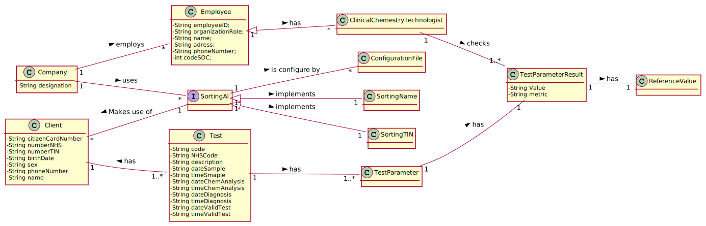

# US 13 - As a clinical  chemistry technologist, I want to check Clients Test Results

## 1. Requirements Engineering

*In this section, it is suggested to capture the requirement description and specifications as provided by the client as well as any further clarification on it. It is also suggested to capture the requirements acceptance criteria and existing dependencies to other requirements. At last, identfy the involved input and output data and depicted an Actor-System interaction in order to fulfill the requirement.*

### 1.1. User Story Description

As a clinical  chemistry technologist, I intend to consult the historical tests performed by a particular client and to be able to check tests details/results.
### 1.2. Customer Specifications and Clarifications 

*Insert here any related specification and/or clarification provided by the client together with **your interpretation**. When possible, provide a link to such specifications/clarifications.*

**_From the Specifications Document_**

“ At the same time the results are also available in the central application where the medical lab technicians who collect the samples, the clinical chemistry technologist, the specialist doctor,and the laboratory coordinator can check them.To facilitate the access to the results, the application must allow ordering the clients by TIF and by name. The ordering algorithm to be used by the application must be defined through a configuration file.It  is  intended  that  the  choice  of the ordering algorithm is based  on the algorithm complexity (mainly the execution  time). Therefore,  at  least  two  sorting  algorithms should  be  evaluated and documented in  the  application  user  manual  (in  the  annexes)  that  must  be  delivered  with  the application.”

**_From the client clarifications_**

 	

  
### 1.3. Acceptance Criteria

   AC1: there needs to have at least 2 sorting algorithms(by name or tin) and they must be defined through a configuration file.

### 1.4. Found out Dependencies

US15 Validating the Test because CCT only sees the Validated Tests and US3 Register Client because there needs to have Clients

### 1.5 Input and Output Data

- Input Data
	- Typed data: 
	- Selected data: Client to see the Test
- Output Data
 	- List of the clients test
	- (In)Success of the operation

### 1.6. System Sequence Diagram (SSD)

### 1.7 Other Relevant Remarks

This US will be used every time that Test with the 3 dates (test registration date, chemical analysis date and diagnosis date) 

## 2. OO Analysis

### 2.1. Relevant Domain Model Excerpt

### 2.2. Other Remarks

## 3. Design - User Story Realization 

### 3.1. Rationale

**The rationale grounds on the SSD interactions and the identified input/output data.**

| Interaction ID | Question: Which class is responsible for... | Answer  | Justification (with patterns)  |
|:-------------  |:--------------------- |:------------|:---------------------------- |
| Step 1: Starts ordering the Clients by Name or TIN | ... interacting with the actor? | CheckResultUI   |  Pure Fabrication: there is no reason to assign this responsibility to any existing class in the Domain Model.           |
| 			  		 |	... coordinating the US? | CheckResultController | Controller                             |			  		
| 			  		 | ... knowing the user using the system?  | UserSession  | IE: Knows the registered user and their roles.  |
| 			  		 |							 | Company  | IE: knows/has its own Employees| 
| 			  		 |							 | Employee  | IE: knows its own data (e.g. email) |
| Step 2: Shows the Client | ...knowing the Clients to show?						 | TestValideStore         | By the application of the Creator (R1) it would be the "Company". But, by applying HC + LC to the "Company", this delegates that responsibility to the "TestValideStore"                            |
| 			  		 |	... instantiating a new TestValideStore? | Company | Creator (Rule 1): in the DM Company has a Store. |
| Step 3: Selects the Client to see the test |	... finding the Test based on the Client? | Client | IE: knows Test                             |
| 			  		 
| Step 4: shows the Test |	n/a | n/a | n/a |
| Step 5: Asks for conirmation| 	n/a | n/a | n/a |
| Step 6: Informs operation success | ... informing operation success? | CheckResultUI | IE: responsible for user interaction |                              |                

### Systematization ##

According to the taken rationale, the conceptual classes promoted to software classes are: 

 * Company
 * Client
 

Other software classes (i.e. Pure Fabrication) identified: 

 * CheckResultUI
 * CheckResultController
 * TestValideStore

 * 

## 3.2. Sequence Diagram (SD)

## 3.3. Class Diagram (CD)

*In this section, it is suggested to present an UML static view representing the main domain related software classes that are involved in fulfilling the requirement as well as and their relations, attributes and methods.*

# 4. Tests 
*In this section, it is suggested to systematize how the tests were designed to allow a correct measurement of requirements fulfilling.* 

**_DO NOT COPY ALL DEVELOPED TESTS HERE_**

**Test 1:**  Test of ValidateTest method, of class TestValideStore.
 
    @Test
    public void testValidateTest2(){
        List<app.domain.model.Test> list = new ArrayList<>();
        TestValideStore store = new TestValideStore(list);
        app.domain.model.Test t1 = new app.domain.model.Test("000000000005");
        t1.setTimeDiagnosis();
        t1.setTimeChemAnalysis();
        t1.setTimeSample();
        t1.setDateChemAnalysis();
        t1.setDateSample();
        t1.setDateDiagnosis();
        t1.setTimeValidTest();
        t1.setDateValidTest();

        boolean expected = store.validateTest(t1);
        assertTrue(expected);
    }

**Test 2:**   Test of Save method, of class TestValideStore.
    @Test
    public void testSave(){
        List<app.domain.model.Test> list = new ArrayList<>();
        TestValideStore store = new TestValideStore(list);
        app.domain.model.Test t1 = new app.domain.model.Test("000000000005");
        t1.setTimeDiagnosis();
        t1.setTimeChemAnalysis();
        t1.setTimeSample();
        t1.setDateChemAnalysis();
        t1.setDateSample();
        t1.setDateDiagnosis();
        t1.setTimeValidTest();
        t1.setDateValidTest();

        boolean expected = store.saveTestVali(t1);
        assertTrue(expected);
    }

*It is also recommended to organize this content by subsections.* 

# 5. Construction (Implementation)

*In this section, it is suggested to provide, if necessary, some evidence that the construction/implementation is in accordance with the previously carried out design. Furthermore, it is recommeded to mention/describe the existence of other relevant (e.g. configuration) files and highlight relevant commits.*

**CheckResultController**

public class CheckResultController {
    /**
     * the TestValideStore is used to validate and save the test
     */
    private TestValideStore store1;

    /**
     * the company that validates the work
     */
    private Company company;
    /**
     * the test that is validated
     */
    private Test t;
    /**
     * the client which the test is corresponded
     */
    private Client c;

    /**
     * Creates a controller getting the Company information from App
     */
    public CheckResultController() throws IOException, ClassNotFoundException {
        this(App.getInstance().getCompany());
        this.store1 = this.company.getValidationStore();
    }

    /**
     * Creates a controller from the Company, having it as a parameter
     *
     * @param company
     */
    public CheckResultController(Company company) {
        this.company = company;
    }

    /**
     * sorts the list of clients by name or tin
     * @return client list sorted by Name or TIN
     * @throws IOException
     */
    public List<Client> sortList() throws IOException {

        this.store1 = this.company.getValidationStore();
        List<Test> list = this.store1.getTestsValids();
        List<Client> listC = new ArrayList<>();
        for (Test t : list){
            listC.add(t.getClient());
        }

        //this.c.sorting(listC);
        SortingAl sa = App.sort1();
        Collections.sort(listC,sa);

        return listC;

    }

    /**
     * shows the list of clients
     * @param cl client list
     */
    public void showSort(List<Client> cl){
        int ind = 0;

        for (Client c : cl) {

            out.println(ind + ")" + c.getName() + " : " + c.getTin());

            ind++;

        }
    }

    /**
     * gets clients test result using client
     * @param c client
     * @return clients test
     */
    public List<Test> getTestFromCL(Client c) {
        return c.getLstTestComplete();

    }

    /**
     * converts the list items into an String
     * @param cl list of client
     * @return list of client in String
     */
    public String convert(List<Client> cl){
        int i = 0;
        StringBuilder sb = new StringBuilder();
        for (Client c : cl){
            sb.append(i +"-"+c.getName() +" "+c.getTin()+"\n");
            i++;
        }
        return sb.toString();
    }

    /**
     * converts the list items into a String
     * @param clTest list of test from client
     * @return String of the items in the list
     */
    public String convert2(List<Test> clTest){

        StringBuilder sb = new StringBuilder();
        for (Test t : clTest){
            sb.append("Client Name: " + t.getClient().getName() +"\n"+

                    "Client TIN: " + t.getClient().getTin() +"\n"+

                    "Test Code: " + t.getCode() +"\n"+

                    "Test NHS code: " + t.getNHScode() + "\n" +

                    "Test Result: " + t.getResults().toString());

        }
        return sb.toString();
    }
    public int sizeMatters(List<Client> cl){
        return cl.size();
    }

    /**
     * Shows the Clients test in a format
     * @param clTest list of test of the client
     */
    public void showTest(List<Test> clTest){
        for (Test t : clTest) {

            out.println("Client Name: " + t.getClient().getName() +"\n"+

                    "Client TIN: " + t.getClient().getTin() +"\n"+

                    "Test Code: " + t.getCode() +"\n"+

                    "Test NHS code: " + t.getNHScode() + "\n" +

                    "Test Result: " + t.getResults().toString());

        }

    }

}

**TestValideStore**

public class TestValideStore {
    /**
     * List of Test
     */
    private final List<Test> testValideList;
    /**
     * Creates a validate test store that contains all validated tests
     *
     * @param testVlist The list containing test
     */
    public TestValideStore(List<Test> testVlist) {
        this.testValideList = testVlist;
    }
    /**
     * Validates the Validated test
     *
     * @param t The validated test to be validated
     * @return Validation if the validated test does not already exists
     */

    public boolean validateValide(Test t) {
        if (t == null)
            return false;
        return  ! this.testValideList.contains(t);
    }
    /**
     * Saves the validated test  if it is valid
     *
     * @param t The validated test to be added to the list of validated validated test
     * @return true if the new validated test was added successfully
     */
    public boolean addValide(Test t) {
        if (!validateValide(t)) {
            return false;
        }else {
            Client c = t.getClient();
            c.addTest(t);
            return this.testValideList.add(t);
        }
    }

    /**
     * Gets the number of covid positive tests in a specific date
     *
     * @param date The date
     * @return Number of positive cases
     */
    public int covidCasesPerDay(String date){
        int cases=0;
        for(Test t: this.testValideList){
            if(t.getDateRegistration().toYMDString().compareTo(date)==0 && t.getTestType().getCode().compareTo("tt001")==0){
                for(TestParameter tp : t.getResults()){
                    if(tp.getParameter().getCodeP().compareTo("IgGAN")==0 && stringToDouble(tp.getTestResult().getResult())>1.4){
                        cases++;
                    }
                }

            }
        }
        return cases;
    }
    /**
     * Gets the list of tests
     *
     * @return the list of test
     */
    public List<Test> getTestsValids(){
        List<Test> tests = null;
        tests = this.testValideList;
        return tests;
    }

    public double stringToDouble(String result){
        StringBuilder s= new StringBuilder();
        for(int i=0; i<result.length(); i++){
            if(result.charAt(i) == ',')
                s.append(".");
            else
                s.append(result.charAt(i));
        }
        return Double.parseDouble(s.toString());
    }
}

**CheckResultUI**

public class CheckResultUI implements Runnable {
    Scanner sc = new Scanner(in);

    private CheckResultController crc = new CheckResultController();

    public CheckResultUI() throws IOException, ClassNotFoundException {
        // this is a constructor empty for yhis class
    }

    public void run() {

        boolean flag = false;

        do {

            out.println("Client list");

            out.println("Choose the Client to view the results(-1 to leave)");

            List<Client> list = new ArrayList<>();

            try {

                list = crc.sortList();
                crc.showSort(list);

            } catch (IOException e) {

                e.printStackTrace();

            }

            int ind = sc.nextInt();

            if (ind != -1 && ind < list.size()) {

                out.println("Test of the Client");

                out.println();

                out.println();

                crc.showTest(this.crc.getTestFromCL(list.get(ind)));

            }
            out.println("Continue to view the Clients(1 yes 0 no)");

            int ch = sc.nextInt();

            if (ch == 0) {

                flag = true;

            }

        } while (!flag);

    }

}

**SortingAl**

public interface SortingAl extends Comparator<Client> {
     /**
      *
      * @param o1 Client to be compared
      * @param o2 Client to be compared
      * @return integer of the compared objects
      */
     public int compare(Client o1, Client o2);
}

**SortingAlName**

public class SortingAlName implements SortingAl {
    /**
     * compares clients Name
     * @param o1 Client to be compared
     * @param o2 Client to be compared
     * @return integer of the compared objects
     */
    public int compare(Client o1, Client o2) {

        int result = o1.getName().compareTo(o2.getName());

        if (result == 0) {

            return 0;
        } else {

            if (result > 0) {

                return 1;

            } else {

                return -1;

            }

        }
    }
}

**SortingAlTIN**

public class SortingAlTIN extends Client implements SortingAl{
    /**
     * compares clients TIN
     * @param o1 Client to be compared
     * @param o2 Client to be compared
     * @return integer of the compared objects
     */
    public int compare(Client o1, Client o2) {

        int result = o1.getTin().compareTo(o2.getTin());

        if (result == 0) {

            return 0;
        } else {

            if (result > 0) {

                return 1;

            } else {

                return -1;

            }

        }
    }

}

*It is also recommended to organize this content by subsections.* 

# 6. Integration and Demo 

*In this section, it is suggested to describe the efforts made to integrate this functionality with the other features of the system.*

* Added TestValideStore class
* Added CheckResultUI class
* Added CheckResultController class
* Added SortingAl interface
* Added SortingAlName class
* Added SortingAlTIN class
* Added coverage and mutation tests for TestValideStore class

# 7. Observations

*In this section, it is suggested to present a critical perspective on the developed work, pointing, for example, to other alternatives and or future related work.*

