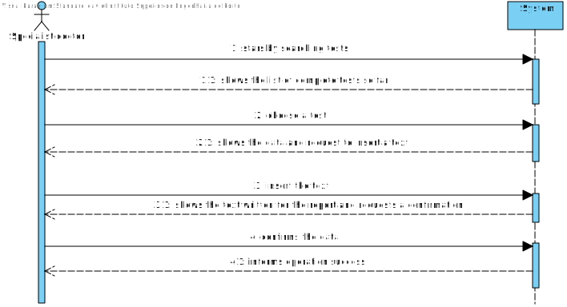
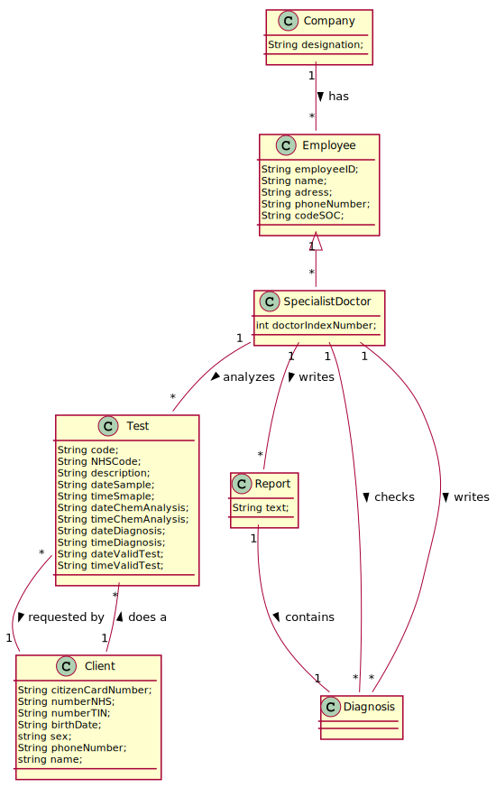
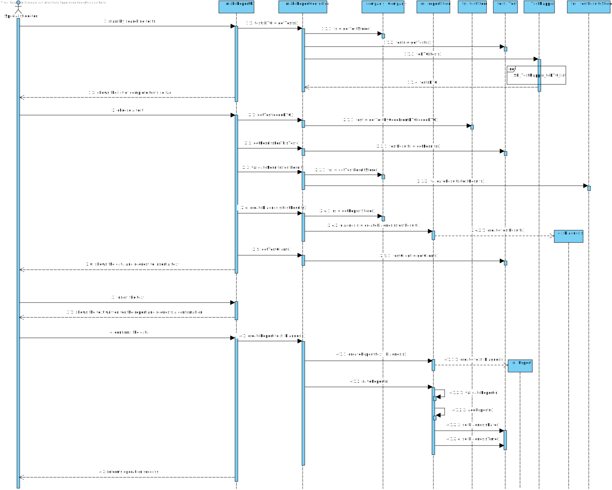
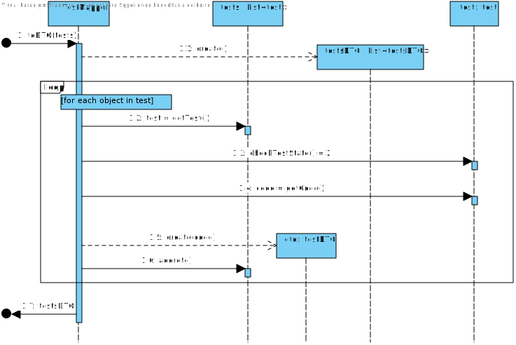
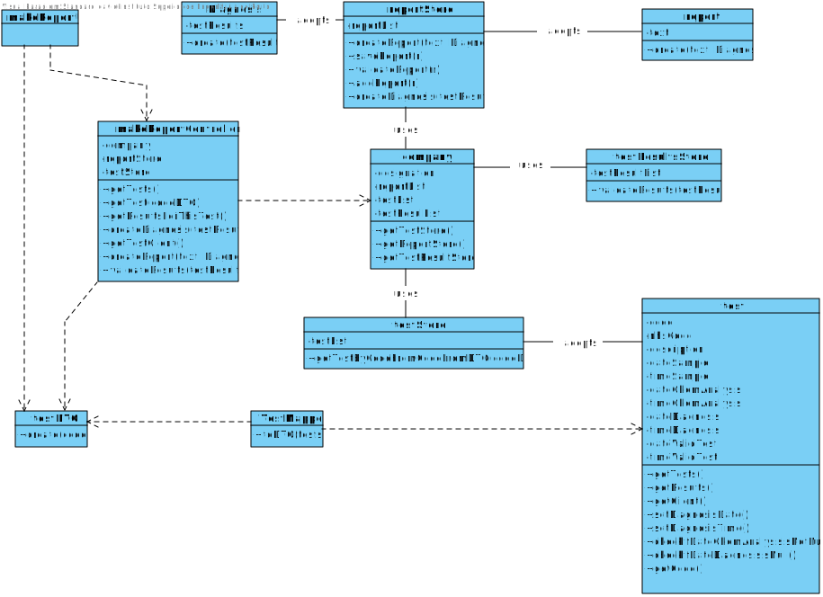

# US 14 - Make the diagnosis and write a report for a given test.


## 1. Requirements Engineering

*In this section, it is suggested to capture the requirement description and specifications as provided by the client as well as any further clarification on it. It is also suggested to capture the requirements acceptance criteria and existing dependencies to other requirements. At last, identfy the involved input and output data and depicted an Actor-System interaction in order to fulfill the requirement.*


### 1.1. User Story Description

As a specialist doctor, I intend to make the diagnosis and write a report for a given test.

### 1.2. Customer Specifications and Clarifications 

**_From the Specifications Document_**

"At the company's headquarters, the clinical chemistry technologist receives the samples (delivered by a courier) and performs the chemical analysis, recording the results in the software application.

After completing the chemical analysis, the results of all chemical analyses are analysed by a specialist doctor who makes a diagnosis and writes a report that afterwards will be delivered to the client.

To facilitate and simplify the validation work performed by the specialist doctor, the application uses an external module that is responsible for doing an automatic validation using test reference values."

**_From the client clarifications_**

* Q: Regarding the tests that the Specialist Doctor can write a report about. Should the SD chose from a list of tests? and Should him only receive a list of test that have completed all the previous steps?
	* A: The system shows all tests ready (that have completed all the previous steps) to make the diagnosys and the Specialist Doctor selects one test. Then, the Specialist Doctor writes the report for the selected test.

* Q: What kind of validation should the external module do? Should it show the test reference values next to the test parameter results for the Specialist Doctor [and Clinical chemistry technologist] to validate it by himself?
    * A: The system should "show the test reference values next to the test parameter results".

* Q: Although it was not asked for, should we order the list of tests to be displayed by date of chemical analysis older to newer?
    * A: Sorting is not required in this sprint.

* Q: Once the specialist doctor decides to write the report for a given test, should the results of the chemical analysis and the reference values be presented on the screen? If not, how should the specialist doctor access the data related to the diagnosis he needs to make?
    * A: After selecting a test (to make the diagnosis/report) the results of the chemical analysis and the reference values should be presented on the screen. Then the Specialist Doctor should write the report.

* Q:  While in the "Make a diagnosis and write a report" option of the main menu, should the specialist doctor be able to make a diagnosis and write a report for more than one test? Or does he need to exit and enter the "Make a diagnosis and write a report" option every time he wants to make a new diagnosis and write a new report?
    * A:After writing a report the SD can choose to write other reports without leaving the use case.

* Q: Is there a limit of characters for the report and the diagnosis that will be made by the Specialist Doctor?
    * A: Yes, at most 400 words.

* Q: What characterizes a diagnosis? What it needs to have in it to be a valid diagnosis?
    * A: The report contains the diagnosis. The report is free text and should have no more than 400 words.

* Q: Can the Specialist Doctor edit a report once it has already been written? If yes, in what occasion should he be able to edit? Can he edit after the Laboratory Coordinator has already approved the report?
    * A: No. No.

	
### 1.3. Acceptance Criteria

* AC1: The specialist doctor must become a system user.

* AC2: The report is a free text and must contain a maximum of 400 words.

* AC4: The report contains the diagnosis.

* AC5: The specialist doctor is not allowed to edit the report once it has already been written by him.


### 1.4. Found out Dependencies

There must be already completed (that means a test that has completed up to the part of the analysis and has not yet made the diagnosis) client's tests in the system.

There must have already created a result on a client's test.

### 1.5 Input and Output Data

- Input Data
	- Typed data: write a text for the report and the diagnosis.
	- Selected data: chooses a complete test (that means a test that has completed up to the part of the analysis and has not yet made the diagnosis) from a customer to make their report and diagnosis
- Output Data
	- (In)Success of the operation


### 1.6. System Sequence Diagram (SSD)

*Insert here a SSD depicting the envisioned Actor-System interactions and throughout which data is inputted and outputted to fulfill the requirement. All interactions must be numbered.*




### 1.7 Other Relevant Remarks

The specialist doctor must report and diagnose for a client who already has a complete test


## 2. OO Analysis

### 2.1. Relevant Domain Model Excerpt 
*In this section, it is suggested to present an excerpt of the domain model that is seen as relevant to fulfill this requirement.* 



### 2.2. Other Remarks

*Use this section to capture some aditional notes/remarks that must be taken into consideration into the design activity. In some case, it might be usefull to add other analysis artifacts (e.g. activity or state diagrams).* 


## 3. Design - User Story Realization 

### 3.1. Rationale

**The rationale grounds on the SSD interactions and the identified input/output data.**

| Interaction ID | Question: Which class is responsible for... | Answer  | Justification (with patterns)  |
|:-------------  |:--------------------- |:------------|:---------------------------- |
| Step 1: Starts by searching tests | ... interacting with the actor? | makeReportUI   |  Pure Fabrication: there is no reason to assign this responsibility to any existing class in the Domain Model.  
| 			  		 |	... coordinating the US? | makeReportController | Controller                             |	
| 			  		 |	... instantiating a new TestStore? | Company | Creator (Rule 1): in the DM Company has a Store. |
| Step 2: Show a list of tests| ... knowing the tests?| TestMapper | By the application of the Creator (R1) it would be the "Company". But, by applying HC + LC to the "Company", this delegates that responsibility to the "TestStore" |
| Step 3: choose a test |.... record the choice?					 |makeReportUI          | n/a                             |
| 			  		 |	... finding the test based in thecodeDTO | testStore | IE: knows test |  
| 			  		 |	... finding the Results based in the Test | Test | IE: knows results |  
| 			  		 |	... instantiating a new TestResultStore? | Company | Creator (Rule 1): in the DM Company has a Store. |
| 			  		 |	... validating results? | testResultsStore | |
| 			  		 |	... instantiating a new ReportStore? | Company | Creator (Rule 1): in the DM Company has a Store. |
| 			  		 |	... create a new Diagnosis? | Diagnosis | IE: knows its own data |  
| 			  		 |	... finding the Client based in the Test | Test | IE: knows client |  
| Step 4: show the data and request to insert a text |	... who show the data? | makeReportUI | IE: The object created in step 1 has its own data.                              |
| Step 5: insert the text | .... saving the imput data? | makeReportUI | 
| Step 6: Show the text wirtten and requests a confirmation | n/a | n/a | n/a |
| Step 7: Confirms the data |	... saving the created report? | Company | IE: adopts/records all the Report objects |
||... | ... validating the data locally? | Report | IE: knows its own data |
||... validating the data globally? | Company | IE: knows all the Report objects |
| 			  		 |	... setting the Diagnosis Date | Test | IE: changes its own data |  
| 			  		 |	... setting the Diagnosis Time | Test | IE: changes its own data |  
| Step 8: Informs operation success | ... informing operation success? |makeReportUI | IE: responsible for user interaction |                              |             

### Systematization ##

According to the taken rationale, the conceptual classes promoted to software classes are: 

 * Company
 * Test
 * Report

Other software classes (i.e. Pure Fabrication) identified: 
 * makeReportUI  
 * makeReportController
 * testStore
 * reportStore

## 3.2. Sequence Diagram (SD)

*In this section, it is suggested to present an UML dynamic view stating the sequence of domain related software objects' interactions that allows to fulfill the requirement.* 





## 3.3. Class Diagram (CD)

*In this section, it is suggested to present an UML static view representing the main domain related software classes that are involved in fulfilling the requirement as well as and their relations, attributes and methods.*



# 4. Tests 
*In this section, it is suggested to systematize how the tests were designed to allow a correct measurement of requirements fulfilling.* 

**Test 1:** test of set text
```java
    @Test
    public void setText(){
        System.out.println("setText");
        app.domain.model.ParameterCategory pc = new ParameterCategory("09876","ola","12345");
        Parameter pa = new Parameter("01234","ola",pc);
        TestParameter t1 = new TestParameter(pa);
        List<TestParameter> list = new ArrayList<>();
        list.add(t1);
        Diagnosis d1 = new Diagnosis(list);
        Report r1 = new Report("ola",d1);

        r1.setText("oli");
        String result = "oli";
        assertEquals(result,r1.getText());
    }

```

**Test 2:** test of set Diagnosis
```java
    @Test
    public void setDiagnosis(){
        System.out.println("setText");
        app.domain.model.ParameterCategory pc = new ParameterCategory("09876","ola","12345");
        Parameter pa = new Parameter("01234","ola",pc);
        TestParameter t1 = new TestParameter(pa);
        List<TestParameter> list = new ArrayList<>();
        list.add(t1);
        Diagnosis d1 = new Diagnosis(list);
        Report r1 = new Report("ola",d1);

        app.domain.model.ParameterCategory pc1 = new ParameterCategory("09876","ola1344","12345");
        Parameter pa1 = new Parameter("01234","ola324",pc1);
        TestParameter t11 = new TestParameter(pa1);
        List<TestParameter> list1 = new ArrayList<>();
        list.add(t11);
        Diagnosis d2 = new Diagnosis(list1);
        r1.setDiagnosis(d2);


        assertEquals(d2,r1.getDiagnosis());

    }

```

**Test 3:** Test of toString from report
```java
    @Test
    public void testtoString(){
        System.out.println("TostringTest");
        app.domain.model.ParameterCategory pc = new ParameterCategory("09876","ola","12345");
        Parameter pa = new Parameter("01234","ola",pc);
        TestParameter t1 = new TestParameter(pa);
        List<TestParameter> list = new ArrayList<>();
        list.add(t1);
        Diagnosis d1 = new Diagnosis(list);
        Report r1 = new Report("ola",d1);

        String result = r1.toString();
        String actual = "### Report ### \n" +
                "Text: ola\n" +
                "Diagnosis: ### Diagnosis ### \n" +
                "Diagnosis: [Parameter: ola\n" +
                "Parameter Test Results:\n" +
                "null]";
        assertNotEquals(result,actual);

    }

```

**Test 4:** test of check if the words passing a limit, which is 400 words

```java
 @Test(expected = IllegalArgumentException.class)
    public void testCheckText1(){
        System.out.println("checkTest");
        app.domain.model.ParameterCategory pc = new ParameterCategory("09876","ola","12345");
        Parameter pa = new Parameter("01234","ola",pc);
        TestParameter t1 = new TestParameter(pa);
        List<TestParameter> list = new ArrayList<>();
        list.add(t1);
        Diagnosis d1 = new Diagnosis(list);
        Report r1 = new Report("T t t t t t t t t t t t t t t t t t t t t t t t t t t t t t t t t t t t t t t t t t t t t t t t t t T t t t t t t t t t t t t t t t t t t t t t t t t t t t t t t t t t t t t t t t t t t t t t t t t t T t t t t t t t t t t t t t t t t t t t t t t t t t t t t t t t t t t t t t t t t t t t t t t t t t\n" +
                "T t t t t t t t t t t t t t t t t t t t t t t t t t t t t t t t t t t t t t t t t t t t t t t t t t T t t t t t t t t t t t t t t t t t t t t t t t t t t t t t t t t t t t t t t t t t t t t t t t t t T t t t t t t t t t t t t t t t t t t t t t t t t t t t t t t t t t t t t t t t t t t t t t t t t t\n" +
                "T t t t t t t t t t t t t t t t t t t t t t t t t t t t t t t t t t t t t t t t t t t t t t t t t t\n" +
                "T t t t t t t t t t t t t t t t t t t t t t t t t t t t t t t t t t t t t t t t t t t t t t t t t t t t t t t t\n",d1);


    }
```

# 5. Construction (Implementation)

*In this section, it is suggested to provide, if necessary, some evidence that the construction/implementation is in accordance with the previously carried out design. Furthermore, it is recommeded to mention/describe the existence of other relevant (e.g. configuration) files and highlight relevant commits.*

**Diagnosis**

```java
public class Diagnosis {

    private List<TestParameter> list;
    /**
     * @param list is used to describe the diagnosis done
     */
    public Diagnosis(List<TestParameter> list ){
        this.list = list;
    }

    public List<TestParameter> getList() {
        return list;
    }

    public String toString(){
        return "### Diagnosis ### \n" + "Diagnosis: " + this.list + "\n" ;
    }
}
```

**Report**

```java
public class Report {
    /**
     * text for report
     */
    private String text;
    /**
     * Test Diagnosis
     */
    private Diagnosis diagnosis;
    
    
    /**
     * creates an Report instance with atributes text and diagnosis and checks is the text is 400 words or less
     * @param text is used to describe the diagnosis done
     * @param diagnosis is what was done to "test" the patient
     */
    public Report(String text, Diagnosis diagnosis){
        checkText(text);
        this.text = text;
        this.diagnosis = diagnosis;
    }

    /**
     * get the text for report
     * @return text
     */
    public String getText() {
        return text;
    }

    /**
     * changing the text for report
     * @param text
     */
    public void setText(String text) {
        this.text = text;
    }

    /**
     * get the diagnosis for report
     * @return diagnosis
     */
    public Diagnosis getDiagnosis() {
        return diagnosis;
    }

    /**
     * changing the diagnosis for test
     * @param diagnosis
     */
    public void setDiagnosis(Diagnosis diagnosis) {
        this.diagnosis = diagnosis;
    }

    /**
     * get the data in string form
     * @return string with the data of report
     */
    public String toString(){
        return "### Report ### \n" + "Text: " + this.text + "\n" + "Diagnosis: " + this.diagnosis + "\n";
    }

    /**
     * checks if text has 400 or less words
     * @param text
     */
    public void checkText(String text){
        int cont = text.split(" ",-1).length -1; //pega a quantidade de espaços em branco
        String[] array = new String[cont];//define o vetor que conterá as palavras separadas da string
        array = text.split(" ");//separa a string colocando as palavras no vetor
        System.out.println(array.length);
        if (array.length > 400)
            throw new IllegalArgumentException("Text Field must be 400 words or less");

    }

}

```

**ReportStore**

```java
public class ReportStore {
    
    //User Story: Create new report for diagnosis 

    /**
     * List of Reports 
     */
    private final List<Report> reportList;
    
    /**
     * Report Store constructor
     * @report list
     */
    
    public ReportStore(List<Report> list){
        this.reportList = list;
    }
    
    /**
     * @param text text used to describe the diagnosis done 
     * @param diagnosis diagnosis made by the doctor
     * @return report report that has the text and the diagnosis
     */
    public Report createReport(String text, Diagnosis diagnosis){
        return new Report(text,diagnosis);
    }
    
    /**
     * @param r The report to be validated
     * @return Validation if the report does not already exists
     */
    public boolean validateReport(Report r){
        if (r == null){
            return false;
        } else {
            return ! this.reportList.contains(r);
        }
    }
    
    /**
     * @param r The report to be added to the list of reports
     * @return True if the new report was added successfully
     */
    public boolean saveReport(Report r){
        if (!validateReport(r))
            return false;

        return this.reportList.add(r);
    }
    
    
    /**
     * Returns the list of reports
     * @return reports list
     */
    public List<Report> getReports(){
        return this.reportList;
    }

}
```
**MakeReportController**

```java
public class MakeReportController {
    
    private Company company;
    private Report r;
    private ReportStore reportStore;
    private TestStore testStore;
    private Test t2 ;
    private Client testClient;
    private TestResultStore trs;
    private Diagnosis diagnosis;

    public MakeReportController(){

        this(App.getInstance().getCompany());
        this.testStore = this.company.getTestStore();
        this.reportStore = this.company.getReportStore();
    }
    
    /**
     * @param company The company responsible for knowing the reports
     */
    public MakeReportController(Company company){

        this.company = company;
        this.r = null;
    }
    /**
     *
     * Gets a DTO list of Test
     *
     @return A list with TestReporDTO
     */
    public  List<TestReporDTO> getTests() {
        List<Test> tests = this.testStore.getTests();
        TestReportMapper tm = new TestReportMapper();
        return tm.toDTO(tests);
    }
    /**
     *
     * this method gives us the test that has that code coming from the dto
     * @param code the code that identifies the test
     * @return test the test that is identified by the code
     */
    public Test getTest(String code){
        this.t2 = this.testStore.getTestByCode(code);
        return this.t2;
    }
    /**
     *
     * Gets the results of this test
     * @return A list with
     */
    public List<TestParameter>  getResultsforthisTest(){
        return this.t2.getResults();
    }
    /**
     *
     * this method will validate results with a external module
     * @return true if validation it´s successful, false if it´s not been validate
     */
    public boolean validateResults(){
        List<TestParameter> testResult = getResultsforthisTest();
        this.trs = this.company.getTestResultStore();
        return this.trs.validateResults(testResult);
    }
    /**
     *
     * this create a diagnosis with a results from one test
     *
     * @return diagnosis created with results from test
     */
   public Diagnosis createDiagnosis(){
        this.reportStore = this.company.getReportStore();
        List<TestParameter> testResult = getResultsforthisTest();
        this.diagnosis = new Diagnosis(testResult);
        return this.diagnosis;
   }

    /**
     *
     * this method will get a client from a test
     *
     * @return client from one test
     */

   public Client getTestClient(){
        this.testClient = this.t2.getClient();
        return testClient;
    }
    /**
     * @param text The text written to describe the test done
     * @param diagnosis The diagnosis that is within the report 
     * @return True if the new report was added successfully to the company's database
     */
    public boolean createReport(String text, Diagnosis diagnosis){
        this.reportStore = this.company.getReportStore();
        this.r = this.reportStore.createReport(text, diagnosis);
        return this.reportStore.validateReport(r);
    }
    
    /**
     * @return Validation if the report does not alraedy exists 
     */
    public boolean saveReport(){
        this.t2.setDateDiagnosis();
        this.t2.setTimeDiagnosis();
        this.t2.setReport(r);
        return this.reportStore.saveReport(r);
    }

    public Test getTest(){
        return this.t2;
    }
}

```

# 6. Integration and Demo 

* update Test class
* Added coverage and mutation tests for Test class
* Added Report class
* Added coverage and mutation tests for Report class
* Added makReportController class
* Added coverage and mutation tests for makReportController class
* Added reportStore class
* Added coverage and mutation tests for reportStore class
* update testStore class
* Added coverage and mutation tests for testStore class
* Added makeReportUI
* A new option on the Specialist Doctor menu options was added: makeReport


# 7. Observations

*In this section, it is suggested to present a critical perspective on the developed work, pointing, for example, to other alternatives and or future related work.*


