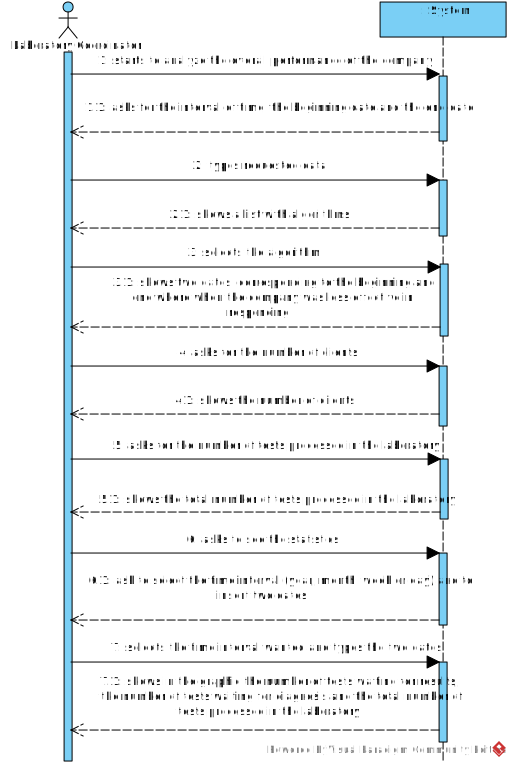
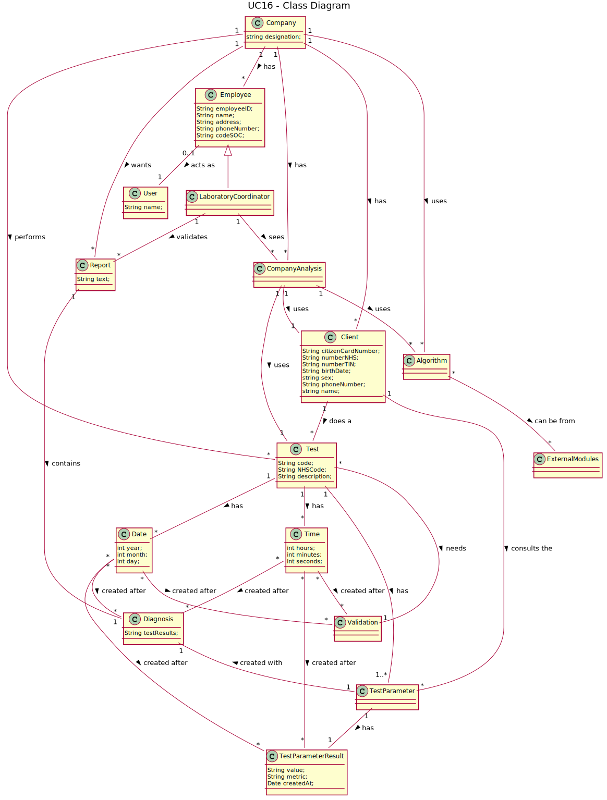
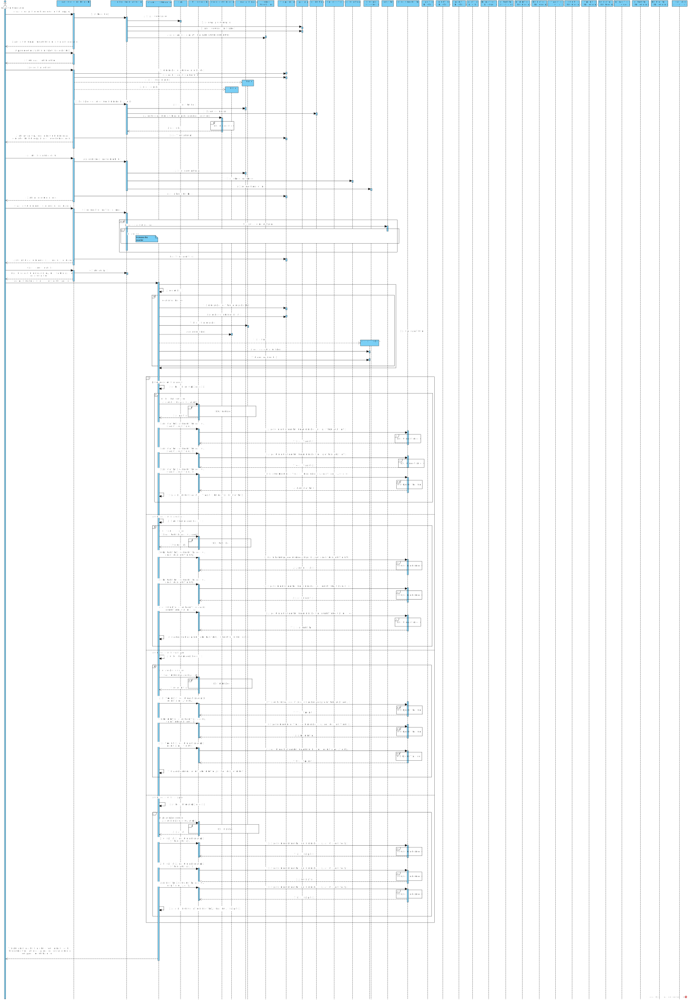
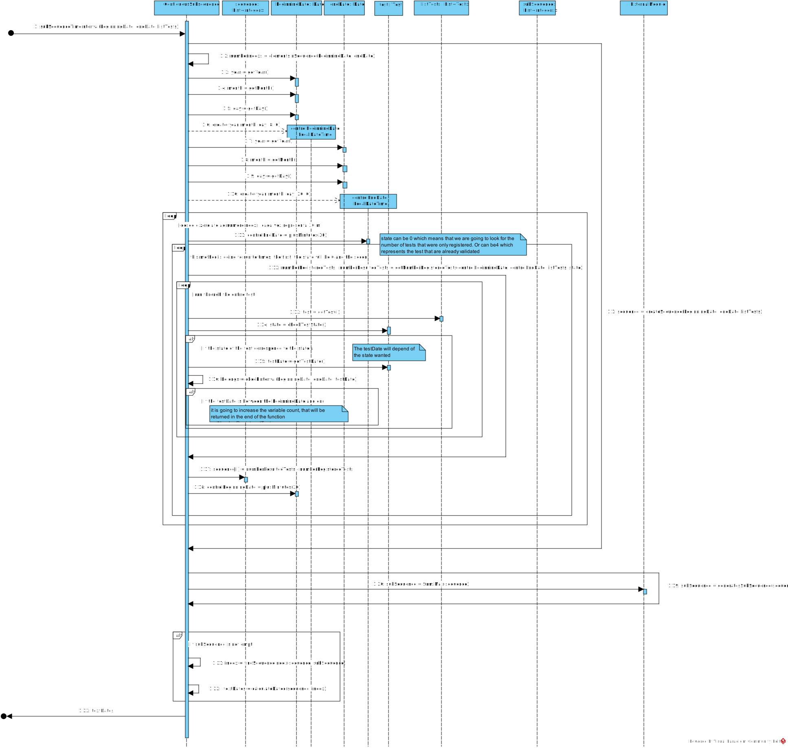
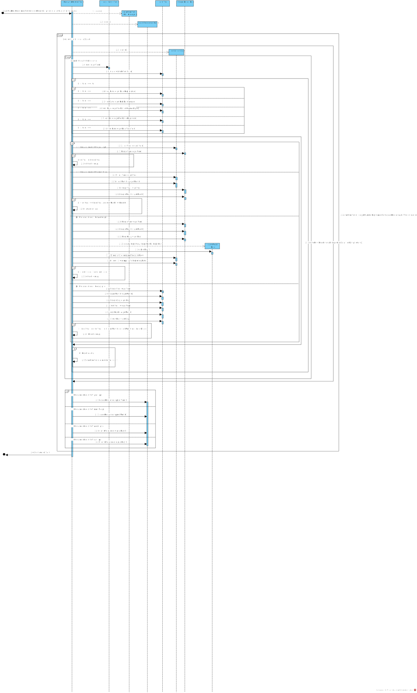
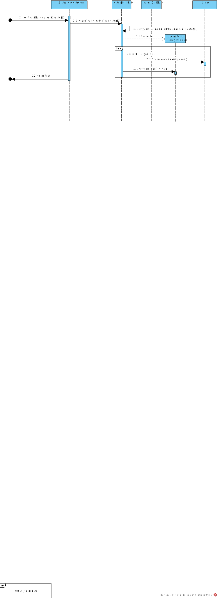
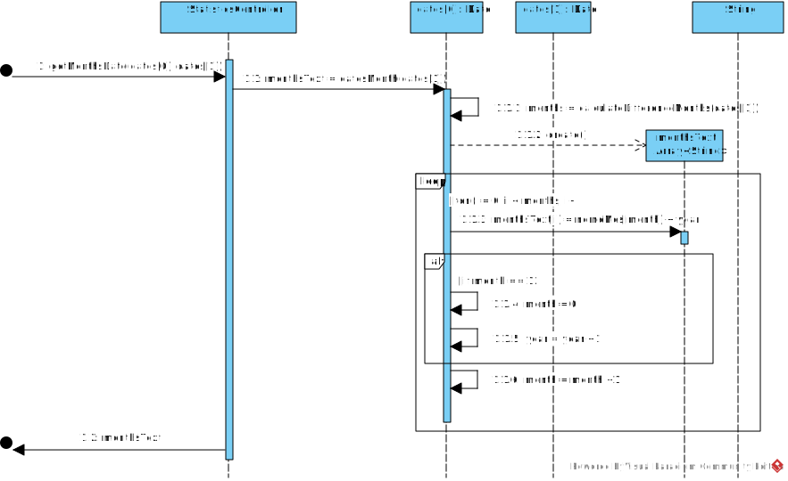
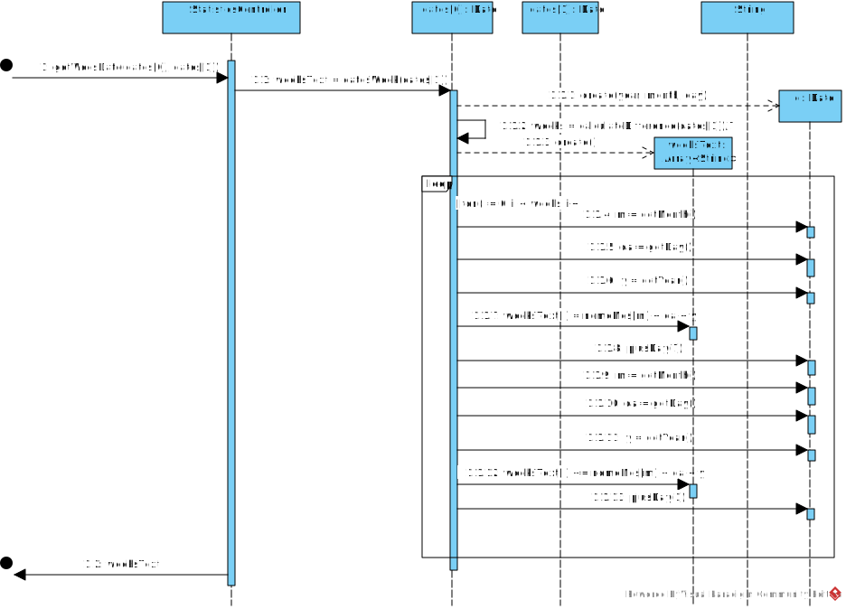
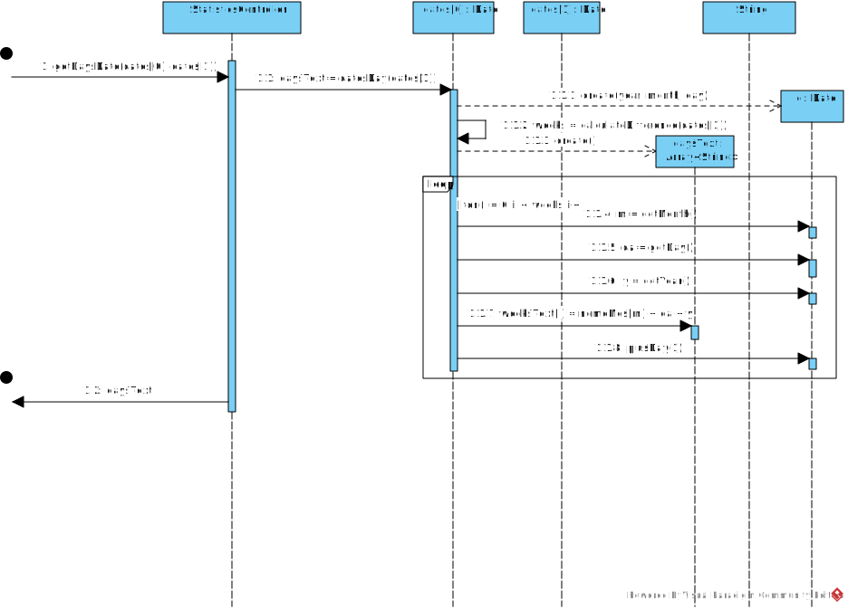
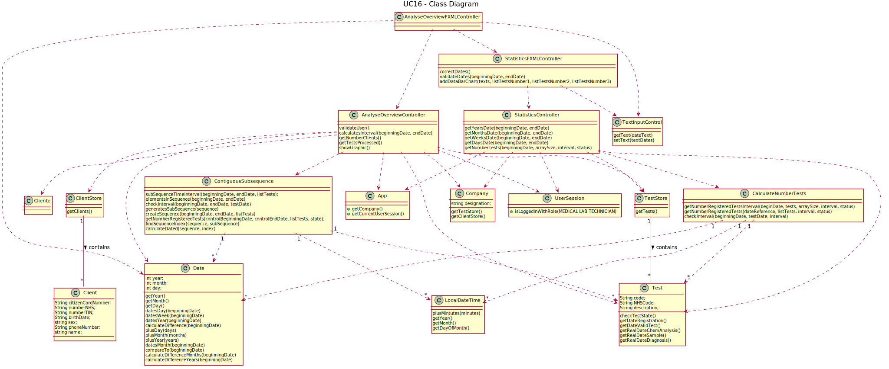

# US16 - Analyze the overall performance of the company

## 1. Requirements Engineering

### 1.1. User Story Description

As a laboratory coordinator, I want to have an overview of all the tests performed by Many Labs and analyze the overall performance of the company (for instance, check the sub-intervals in which there were more samples waiting for the result). To facilitate overall analysis, the application should also display statistics and graphs.

### 1.2. Customer Specifications and Clarifications

*Insert here any related specification and/or clarification provided by the client together with **your interpretation**. When possible, provide a link to such specifications/clarifications.*

**_From the Specifications Document_**

Many Labs wants to decrease the number of tests waiting for its result. To evaluate this, it proceeds as following: for any interval of time (introduced manually by a laboratory coordinator), for example one week (6 working days with 12 working hours per day), the difference between the number of new tests and the number of results available to the client during each half an hour period is computed. In that case, a list with 144 integers is obtained, where a positive integer means that in such half an hour more tests were processed than results were obtained, and a negative integer means the opposite. Now, the problem consists in determining what the contiguous subsequence of the initial sequence is, whose sum of their entries is maximum. This will show the time interval, in such week, when the company was less effective in responding. So, the application should implement a brute-force algorithm (an algorithm which examines each subsequence) to determine the contiguous subsequence with maximum sum, for any interval of time registered. The implemented algorithm should be analyzed in terms of its worst-case time complexity, and it should be compared to a provided benchmark algorithm.
The complexity analysis must be accompanied by the observation of the execution time of the algorithms for inputs of variable size in order to observe the asymptotic behavior. The time complexity analysis of the algorithms should be properly documented in the application user manual (in the annexes) that must be delivered with the application.

**_From the client clarifications_**

-	**Question:** Should the interval of time considered for the evaluation be asked to the Laboratory Coordinator?
	- 	**Answer:** Yes.

-	**Question:** How should we ask for the interval of time?
	- 	**Answer:** The laboratory coordinator should introduce two dates that define an interval, the beginning date and the end date. This interval will be used to find the contiguous subsequence with maximum sum.

-	**Question:** What is the meaning of "overview" here? Should the laboratory coordinator see the number of tests waiting for samples, the number of tests waiting for results, the number of tests waiting for diagnoses. Or should he see the information available for each one of the tests in the application?
	- 	**Answer:** The laboratory coordinator should be able to check the number of clients, the number of tests waiting for results, the number of tests waiting for diagnosis and the total number of tests processed in the laboratory in each day, week, month and year. Moreover, the laboratory coordinator should be able to check the contiguous subsequence with maximum sum. The system should show these statistics for a given interval that should be selected/defined by the user". The application should present these statistics using four graphs/charts, one for each time resolution (day, week, month and year). Moreover, the application should also show to the laboratory coordinator the total number of clients and the total number of validated tests that exist in the system.

- **Question:** When referring to "the application should also display statistics and graphs" is it up to the team to decide which API or resource should be used to generate graphs and statistics, or do you prefer something specific?
  -   **Answer:** With JavaFX you can draw high quality graphs and there is no need to use other tools.

-	**Question:** After the Laboratory Coordinator types the requested data and views the analysis of the company performance, should he be able to re-type different data and view the results for a different interval of time and/or algorithm? To make the re-type of the data easier, should there be a "clear" button, that is responsible for clearing the text fields for data entry?
	- 	**Answer:** The laboratory coordinator should be able to explore different parameter values (settings) and check the results. Each team should prepare a simple and intuitive interface that requires a minimum number of interactions with the user.

-	**Question:** Can we assume that every day in the interval defined by the coordinator is a working day with 12 working hours each?
	- 	**Answer:** Yes.

-	**Question:** What days are working days?
	- 	**Answer:** Sunday is not a working day. All the other days of the week are working days.

-	**Question:** What is the interval of time of working hours in a day?
	- 	**Answer:** A working day is from 8h00 to 20h00.

-	**Question:** The elements used in the algorithm refer to a half-hour interval?
	- 	**Answer:** Yes.

-	**Question:** How do we obtain the number to be used in the algorithm do we subtract tests that got a result in that interval and the tests registered?
	- 	**Answer:** Yes.

-	**Question:** What is the total number of tests processed in the laboratory? Is it the number of tests that were given results in that time span or is it the number of tests that were validated in that time span?
	- 	**Answer:** The total number of tests processed in the laboratory is the total number of tests that were validated by the laboratory coordinator.

### 1.3. Acceptance Criteria

- AC1: While evaluating the performance the laboratory coordinator should have the ability to dynamically select the algorithm to be applied from the ones available on the system (the benchmark algorithm provided in Moodle and the brute-force algorithm to be developed). Support for easily adding other similar algorithms is required.
- AC2: The laboratory coordinator should use a graphical user interface to access the features available in this use case.

### 1.4. Found out Dependencies

* There is a dependency to "US4 Register a test" since at least a test must exist to show any statistics.

* There is a dependency to "US4 Register a client" since at least a client must exist to show the number of clients.

### 1.5 Input and Output Data

**Input Data:**

* Typed data:
	* Beginning date for the contiguous sequence
	* End date for the contiguous sequence
	* Beginning date for the graphics
	* End date for the graphics

* Selected data:
	* The algorithm to be used
	* Select the interval: it can be Year, Month, Week or Day

**Output Data:**
* Shows the graphics with the statistics
* The number of clients
* The number of tests processed in the laboratory
* And two date corresponding to the contiguous sequence

### 1.6. System Sequence Diagram (SSD)

### 1.7 Other Relevant Remarks

- The system should support several APIs.

## 2. OO Analysis

### 2.1. Relevant Domain Model Excerpt

### 2.2. Other Remarks

## 3. Design - User Story Realization

### 3.1. Rationale

**The rationale grounds on the SSD interactions and the identified input/output data.**

| Interaction ID | Question: Which class is responsible for... | Answer  | Justification (with patterns)  |
|:-------------  |:------------------ |:------------|:---------------------------- |
| Step 1: Starts to analyze the overall performance of the company.  | ...interacting with the actor? | AnalyseOverviewFXMLController | Pure Fabrication: there is no reason to assign this responsibility to any existing class in the Domain Model.|
| | ...coordinating the US? | AnalyseOverviewController | Controller|
| | ...knowing the user using the system? | UserSession	| IE: cf. A&A component documentation. |
| Step 2: Asks for the interval of time, the beginning date and the end date. | n/a | n/a | n/a |
| Step 3: Types requested data. | n/a | n/a | n/a |
| Step 4: Shows a list with algorithms.  | ...knowing the algorithms? | AnalyseOverviewController | IE: Knows the algorithms created. |
| Step 5: Selects one algorithms. | ...knows the selected algorithm? | AnalyseOverviewFXMLController | IE: AnalyseOverviewFXMLController has its own methods and data. |
| | ...knowing the number of tests? | TestStore | IE : TestStore has Tests. |
| | ...knows TestStore? | Company | IE: in the DM Company has Tests.|
| | ...calculates the contiguous sum? | ContiguousSubsequence | Pure Fabrication: The class was created to calculate the contiguous sum. |
| | ...instanciates ContiguousSubsequence? | AnalyseOverviewController | Creator: AnalyseOverviewController closely use instance of ContiguousSubsequence.|
| Step 6: Shows two dates, corresponding to the beginning and
end where when the company was less effective in responding. | n/a | n/a | n/a |
| Step 7: Asks for the number of clients. | ...knowing the number of clients? | ClientStore | IE : ClientStore has Clients. |
| | ...knows ClientStore? | Company | IE: in the DM Company has Clients.|
| Step 8: Shows the number of clients. | n/a | n/a | n/a |
| Step 9: Asks for the number of tests processed in the laboratory. | ...knowing that the test was already processed? | Test | IE: Test has its own data. |
| Step 10: Shows the total number of tests processed in the laboratory. | n/a | n/a | n/a |
| Step 11: Asks to see the statistics. | ...interacting with the actor? | StatisticsFXMLController | Pure Fabrication: there is no reason to assign this responsibility to any existing class in the Domain Model.|
| | ...change the class that does de interation? | AnalyseOverviewFXMLController | IE: AnalyseOverviewFXMLController knows  StatisticsFXMLController |
| | ...coordinating that part of the US? | StatisticsController | Controller|
| Step 12: Ask to select the time interval (year, month, week or day) and
requests to dates. | n/a | n/a | n/a |
| Step 13: Selects the time interval wanted and types the two dates. |
| | ...calculating the interval of time to show on the graphics? | Date | Pure Fabrication: Date was created to work with time. |
| | ...calculating the number of tests in each time interval? | CalculateNumberTests | Pure Fabrication: The class was created for that. |
| | ...instanciates CalculateNumberTests? | StatisticsFXMLController | Creator: StatisticsFXMLController closely use instance of CalculateNumberTests.|
| | ...knowing if the test is wanting for results? | Test | IE : Test has its own data. |
| | ...knowing if the test is wanting for diagnoses? | Test | IE : Test has its own data. |
| | ...generating and showing the graphs? | AnalyseOverviewFXMLController | IE: responsible for user interaction |
| Step 14: Shows in the graphic the number of tests waiting for results,
the number of tests waiting for diagnosis and the total number of
tests processed in the laboratory. | n/a | n/a | n/a |

### Systematization ##

According to the taken rationale, the conceptual classes promoted to software classes are:

 * Company
 * Test
 * Client

Other software classes (i.e. Pure Fabrication) identified:

* AnalyseOverviewFXMLController
* AnalyseOverviewController
* StatisticsFXMLController
* StatisticsController
* ContiguousSubsequence
* UserSession
* TestStore
* ClientStore
* CalculateNumberTests

## 3.2. Sequence Diagram (SD)

## 3.3. Class Diagram (CD)

*In this section, it is suggested to present an UML static view representing the main domain related software classes that are involved in fulfilling the requirement as well as and their relations, attributes and methods.*

# 4. Tests
*In this section, it is suggested to systematize how the tests were designed to allow a correct measurement of requirements fulfilling.*

# 5. Construction (Implementation)

*In this section, it is suggested to provide, if necessary, some evidence that the construction/implementation is in accordance with the previously carried out design. Furthermore, it is recommeded to mention/describe the existence of other relevant (e.g. configuration) files and highlight relevant commits.*

*It is also recommended to organize this content by subsections.*

# 6. Integration and Demo

*In this section, it is suggested to describe the efforts made to integrate this functionality with the other features of the system.*

# 7. Observations

*In this section, it is suggested to present a critical perspective on the developed work, pointing, for example, to other alternatives and or future related work.*
