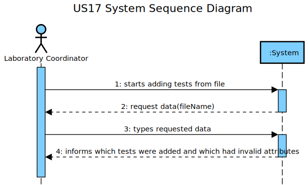
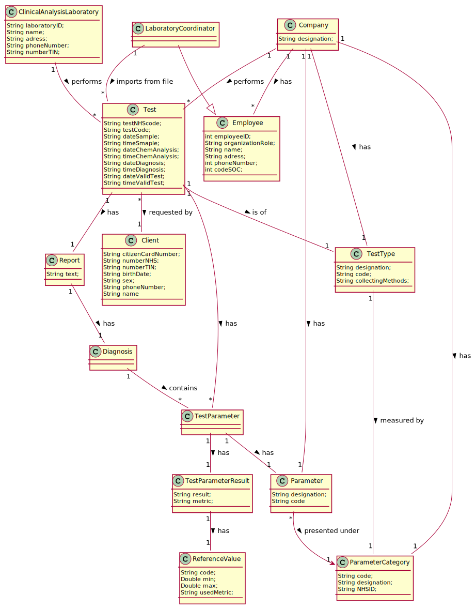
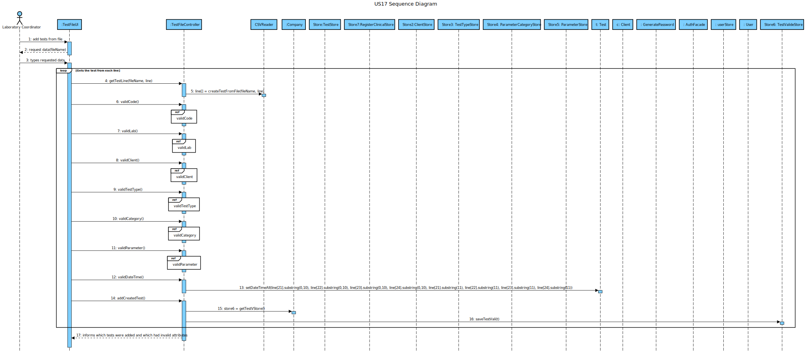
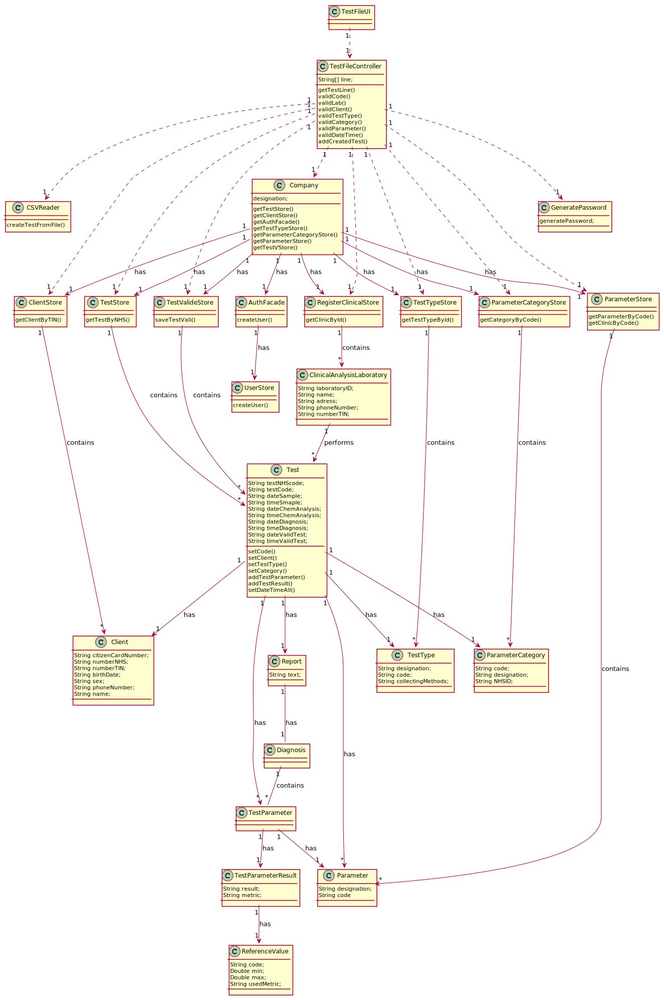

# US 17 - Register tests from file

## 1. Requirements Engineering

### 1.1. User Story Description

As a laboratory coordinator, I want to import clinical tests from a CSV file

### 1.2. Customer Specifications and Clarifications 

**_From the Specifications Document_**
"Each test is characterized by an internal code, an NHS
code, a description that identifies the sample collection method, the date and time when the samples
were collected, the date and time of the chemical analysis, the date and time of the diagnosis made 
by the specialist doctor, the date and time when the laboratory coordinator validated the test, and the 
test type"
"To register a client, the receptionist needs the client’s citizen card number, National Healthcare Service (NHS) 
number, birth date, sex, Tax Identification number (TIF), phone number, e-mail and name".

**_From the client clarifications_**

Q: Various. For example, the sample barcode, which is useful. Or the category code, which I mentioned in the question above.
They are not in the CSV... should we insert some random value?
A: If the information is not available in the system for a given test, that test should not be loaded into the system. 
If the information available in the CSV file is correct but incomplete, then, to load the tests that are correct (but incomplete) 
each team should first create the entities/instance in the system. For instance, if the Lab_ID, of a Clinical Analysis Laboratory, 
exists in the CSV file with the correct format (with five alphanumeric characters) then each team should first create a Clinical 
Analysis Laboratory with the given Lab_ID. If a subset of required attributes are not available in the CSV file, then each team 
should define attribute values to create a valid instance. After "setting" the system, each team should load all (correct) tests 
from the CSV file. Regarding the barcode, if the "Test_Chemical_DateHour" attribute is not available in the CSV file for a given test,
then the barcode should not be generated. If the "Test_Chemical_DateHour" attribute is available in the CSV file, then the a barcode 
number is automatically generated by the system. Remember that the barcode number is a sequential number that is automatically generated.
Regarding the "Test_Code" attribute, this is an internal code to identify tests in our company. When loading tests from CSV files, if the 
code already exists in the system, then the application should generate a new code for the given test (that is being loaded from the CSV file). 
Remember that the "Test_code" attribute is a sequential number with 12 digits and it is automatically generated.

Each team should prepare the system to load all (correct) data available in the CSV files.

### 1.3. Acceptance Criteria

- AC1: NHS code is unique, can't add a test with a NHS code already registered in the system
- AC2: Test Type must exist in order to create a test from the file, if invalid it throws an exception
- AC3: ParameterCategory must exist in order to create a test from the file, if invalid it throws an exception
- AC4: Parameters must exist in order to create a test from the file, if invalid it throws an exception
- AC5: If the client does not exist, it mus be created with the information in the file
- AC6: The Clinic must be registered in the system, if not it throws an exception
- AC7: If there is a sample collection date, a barcode must be generated
- AC8: If there is a analysis data, the results must be recorded
- AC9: If there is a diagnosis date, the report should be generated with the results
- AC10: If there is a validation date, the test must be considered as valid

### 1.4. Found out Dependencies

-US03: Tests are performed in registered clients
-US04: Tests have unique nhs codes
-US09: Tests are of a TestType, it measures parameters presented under the test types' categories
-US10: Tests measure parameters
-US11: Tests mesure the parameters presented under categories
-US12: Tests have results and reference values
-US14: Tests have a diagnosis
-US15: Tests can be validated

### 1.5 Input and Output Data

- Input Data
	- Typed data: CSV file to be read
- Output Data
	-Tests created from the file
	- (In)Success of the operation

### 1.6. System Sequence Diagram (SSD)

### 1.7 Other Relevant Remarks

This US allows the laboratory cooderdinator to add tests from a file, but in order for it to work they must be valid.
The test's NHS code must be new while the test type, category and parameters must be already registered in the system.
If the client is not found it must be created with information from the file.

## 2. OO Analysis

### 2.1. Relevant Domain Model Excerpt

### 2.2. Other Remarks

## 3. Design - User Story Realization 

### 3.1. Rationale

**The rationale grounds on the SSD interactions and the identified input/output data.**

| Interaction ID | Question: Which class is responsible for... | Answer  | Justification (with patterns)  |
|:-------------  |:--------------------- |:------------|:---------------------------- |
| Step 1         | ... interacting with the actor? | TestFileUI |  Pure Fabrication: there is no reason to assign this responsibility to any existing class in the Domain Model. |
| 		 | ... coordinating the US? | TestFileController | Controller. |
| 		 | ... Reading information from a file? | CSVReader |  Pure Fabrication: there is no reason to assign this responsibility to any existing class in the Domain Model. |
| 	 	 | ... knowing the user using the system? | UserSession | IE: Knows the registered user and their roles. |
| 		 |					  | Company | IE: knows/has its own Employees. |
| 		 |					  | Employee | IE: knows its own data (e.g. email) |
| Step 2  	 |					  |             |                              |
| Step 3	 | ... validating a test code?		  | TestStore | IE: adopts/records all the Test objects. |
|		 | ... instantiating a new TestStore? | Company | IE: Knows all the Test objects, in the DM Company performs Tests + HCLC |
|		 | ... creating the test using the code? | TestStore | Indirection: Creates Test for the Company that performs them. |
|		 | ... finding the clinic based in its id? | RegisterClinicalStore | IE: adopts/records all the Clinics. |
|		 | ... instantiating a new RegisterClinicalStore | Company | IE: adopts/records all the Clinics + HCLC|
|		 | ... Adding the test to the clinic's test list? | ClinicalAnalysisLaboratory | IE: Has a method to add tests to its own list |
|		 | ... finding the client based in its TIN? | ClientStore | IE: adopts/records all the Client objects. |
|                | ... instantiating a new ClientStore? | Company | IE: adopts/records all the Clients + HCLC |
|		 | ... Adding the test to the client's test list? | Client | IE: Has a method to add tests to its own list |
|		 | ... Creating a client if needed? | ClientStore | Indirection: Creates clients for the Company that have them. |
|		 | ... Creating a user if needed? | UserStore | IE: adopts/records all the Users. |
|		 | ... locating a specific test type to add to the test | TestTypeStore | IE: adopts/records all the TestTypes. |
|		 | ... instantiating a new TestTypeStore? | Company | IE: Knows all the TestType objects, in the DM Company conducts TestType+ HCLC |
|		 | ... saving the TestType? | Test | IE: object created in step 2 has a method to set its TestType. |
|		 | ... locating a specific category to add to the test | ParameterCategoryStore | IE: adopts/records all the ParameterCategory objects. |
|		 | ... instantiating a new ParameterCategoryStore? | Company | IE: adopts/records all the ParameterCategory objects + HCLC |
|		 | ... saving the ParameterCategory?| Test | IE: object created in step 2 has a method to set its ParameterCategory. |
|		 | ... locating a specific parameter to add to the test | ParameterStore | IE: adopts/records all the Parameter objects. |
|		 | ... instantiating a new ParameterStore? | Company | IE: adopts/records all the Parameter objects + HCLC |
|		 | ... adding the Parameter? | Test | IE: object created in step 2 has a method to add Parameter objects to its list. |
|		 | ... adding times and dates to the test | Test | IE: object created in step 2 has a method to set its times and dates. |
|		 | ... adding a valid test to the list of valid tests | TestValideStore | IE: adopts/records all the valid tests.
|		 | ... instantiating a new TestValideStore? | Company | IE: adopts/records all the valid tests + HCLC |
|	  	 | ... validating all data (local validation)? |Test | IE: owns its data.| 
| 		 | ... validating all data (global validation)? | TestStore | IE: knows all the Test objects| 
| 		 | ... saving the created Test? | TestStore | IE: adopts/records all the Test objects | 
| Step 4	 | ... informing operation success?| RegisterTestUI | IE: is responsible for user interactions. | 

                                        
### Systematization ##

According to the taken rationale, the conceptual classes promoted to software classes are: 

 * Company
 * Test
 * Client
 * TestType
 * Category
 * Parameter
 * Clinical Analysis Laboratory
 * Test Parameter
 * Diagnosis

Other software classes (i.e. Pure Fabrication) identified: 

 * TestFileUI
 * TestFileController
 * CSVReader 

## 3.2. Sequence Diagram (SD)

## 3.3. Class Diagram (CD)

# 4. Tests 
*In this section, it is suggested to systematize how the tests were designed to allow a correct measurement of requirements fulfilling.* 
	private CSVReader reader = new CSVReader();

    	String expRes = "123456654321";

    	@Test
    	public void testCSVReader1() {
        	System.out.println("CSVReader1");
        	assertEquals(expRes, reader.createTestFromFile("test1.txt", 0)[0]);
    	}

    	@Test()
    	public void testCSVReader2() {
        	System.out.println("CSVReader2");
        	String[] result = reader.createTestFromFile("client.csv", 1);
        	assertTrue(result==null);
    	}

    	@Test
    	public void testCSVReader3() {
        	System.out.println("CSVReader3");
        	String[] result = reader.createTestFromFile("client33.csv", 0);
        	assertTrue(result==null)
	}
	

# 5. Construction (Implementation)

* CSVReader *
	public class CSVReader {

    	public String[] createTestFromFile(String fileName, int i){
        	String[] lstNull = new String[0];
        	try(FileInputStream fileIn = new FileInputStream(fileName)) {
            		Scanner sc = new Scanner(fileIn);
            		for(int k=0; k<i+1; k++)
                		sc.nextLine();

            		if(sc.hasNext()) {
                		String testLine = sc.nextLine();
                		return testLine.split(";");

            		}
            	} catch(IOException e) {
            		out.println("File not found");
        	}
        	return null;
    	}

	}

* TestFileController *

	public class TestFileController {
    		private final Company company;
    		private Test t;
    		private String[] testInfo;
    		private TestStore store;

    		private static final String MESSAGE_SAMPLE = "Sample Date/Time: ";
    		private static final String MESSAGE_PC002 = "pc002";
    		private static final String MESSAGE_METRIC = "metric";
    		private static final String MESSAGE_PARAMETER_INVALID = "Parameter invalid";

    		public TestFileController() throws IOException, ClassNotFoundException {
        		this(App.getInstance().getCompany());
    		}

    		public TestFileController(Company company) {
        		this.company = company;
        		this.t = null;
    		}

    		public boolean getTestLine(String f, int i){
        		CSVReader csv = new CSVReader();
        		String[] line = csv.createTestFromFile(f, i);
        		if(line==null)
            			return false;
        		this.testInfo = line;
        		return true;
    		}

    		public void validCode(){
        		this.store = this.company.getTestStore();
        		if(this.store.getTestByNHS(this.testInfo[1])==null){
            			this.t = new Test(this.testInfo[1]);
            			this.t.setCode(this.testInfo[0]);
        		}
       			 else
            			throw new IllegalArgumentException("The nhs code is invalid");
    		}

    		public void validLab(){
        		RegisterClinicalStore store7 = this.company.getRegisterClinicalStore();
        		ClinicalAnalysisLaboratory lab = store7.getClinicById(this.testInfo[2]);
        		if(lab!=null)
            			lab.addTest(this.t);
        		else
            			throw new IllegalArgumentException("The lab is invalid");
    		}

    		public void validClient() throws IOException{
        		RegisterClientStore store2 = this.company.getClientStore();
        		Client c = store2.getClientByTIN(this.testInfo[5]);
        		if(c!=null){
            			this.t.setClient(c);
        		}
        		else{
                		c = new Client(this.testInfo[8],
                        	this.testInfo[3],
                        	this.testInfo[6],
                        	this.testInfo[4],
                        	this.testInfo[5],
                        	this.testInfo[9],
                        	this.testInfo[7]);
            			this.t.setClient(c);
            			String p = GeneratePassword.generatePassword();
            			User user=new User();
            			if (this.company.getAuthFacade().addUserWithRole(c.getName(), c.getEmail(), p, Constants.ROLE_CLIENT)) {
               				user.addUserMap(p, c);
                			store2.saveClient(c);
            			}
                		sendEmail(c.getEmail(), p);
        		}
    		}

    		public void validTestType(){
        		TestTypeStore store3 = this.company.getTestTypeStore();
        		if(this.testInfo[11].compareTo("Covid")==0) {
            			TestType tt = store3.getTestTypeById("tt001");
            			this.t.setTestType(tt);
        		}
        		else if(this.testInfo[11].compareTo("Blood")==0) {
            			TestType tt = store3.getTestTypeById("tt002");
            			this.t.setTestType(tt);
        		}
        		else
            			throw new IllegalArgumentException("The test type is invalid");
    		}

    		public void validCategory(){
        		ParameterCategoryStore store4 = this.company.getParameterCategoryStore();
        		if(this.testInfo[12].compareTo("NA")!=0) {
            			ParameterCategory pc = store4.getCategoryByCode(MESSAGE_PC002);
            			this.t.setCategory(pc);
        		}
        		else if(this.testInfo[19].compareTo("NA")!=0) {
            			ParameterCategory pc = store4.getCategoryByCode("pc001");
            			this.t.setCategory(pc);
        		}
        		else
            			throw new IllegalArgumentException("No valid category was found");
    		}

    		public void validParameter() throws IOException {
        		ParameterStore store5 = this.company.getParameterStore();
        		int valid=0;
        		if(this.testInfo[14].compareTo("NA")!=0) {
            			Parameter p = store5.getParameterByCode("WBC00");
            			if(this.t.getTestCategory().getCodePC().compareTo(MESSAGE_PC002)==0) {
               			this.t.addTestParameter(p);
                		this.t.getResults().add(this.t.addTestResult("WBC00", testInfo[14], MESSAGE_METRIC));
                		valid++;
            		}
            		else
                		throw new IllegalArgumentException(MESSAGE_PARAMETER_INVALID);
        		}

        		if(this.testInfo[15].compareTo("NA")!=0) {
            			Parameter p = store5.getParameterByCode("PLT00");
            			if(this.t.getTestCategory().getCodePC().compareTo(MESSAGE_PC002)==0) {
                			this.t.addTestParameter(p);
                			this.t.getResults().add(this.t.addTestResult("PLT00", testInfo[15], MESSAGE_METRIC));
                			valid++;
            			}
            			else
                			throw new IllegalArgumentException(MESSAGE_PARAMETER_INVALID);
        		}

        		if(this.testInfo[16].compareTo("NA")!=0) {
            			Parameter p = store5.getParameterByCode("RBC00");
            			if(this.t.getTestCategory().getCodePC().compareTo(MESSAGE_PC002)==0) {
                			this.t.addTestParameter(p);
                			this.t.getResults().add(this.t.addTestResult("RBC00", testInfo[16], MESSAGE_METRIC));
                			valid++;
            			}
            			else
                			throw new IllegalArgumentException(MESSAGE_PARAMETER_INVALID);
        		}

        		if(this.testInfo[20].compareTo("NA")!=0) {
            			Parameter p = store5.getParameterByCode("IgGAN");
            			if(this.t.getTestCategory().getCodePC().compareTo("pc001")==0) {
                			this.t.addTestParameter(p);
                			this.t.getResults().add(this.t.addTestResult("IgGAN", testInfo[20], MESSAGE_METRIC));
                			valid++;
            			}
            		else
                		throw new IllegalArgumentException(MESSAGE_PARAMETER_INVALID);
       			}

        		if(valid==0)
            			throw new IllegalArgumentException("No valid category was found");
    		}

    		public void validDateTime(){
        		this.t.setDateTimeAll(this.testInfo[21], this.testInfo[22], this.testInfo[23], this.testInfo[24]);
    		}

    		public boolean addCreatedTest(){
        		if(this.testInfo[24].compareTo("NA")!=0) {
            			this.store.saveTest(this.t);
            			TestValideStore store6 = this.company.getValidationStore();
            			return store6.addValide(this.t);
        		}
        		return false;
    		}

    		public void sendEmail (String email, String p) throws IOException {
        		String message =  "Hello. Your email is:"+ email +"\n" +
                	"Your registration was successful and you can now start using the system.\n" +
                	"Your password to login is as follows: " + p +"\n" +
                	"Thank you, best regards.";
        		EmailNotification.sendEmailToClient(message);
    		}

# 6. Integration and Demo 

* Added CSVReader class
* Added TestFileController
* Added TestFileUI
* A new option on the Laboratory Coordinator menu options was added: Add tests from file
* Added coverage and mutation tests for CSVReader class

# 7. Observations