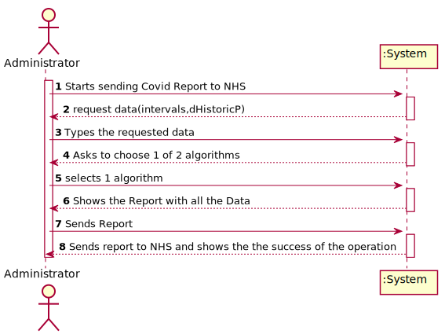
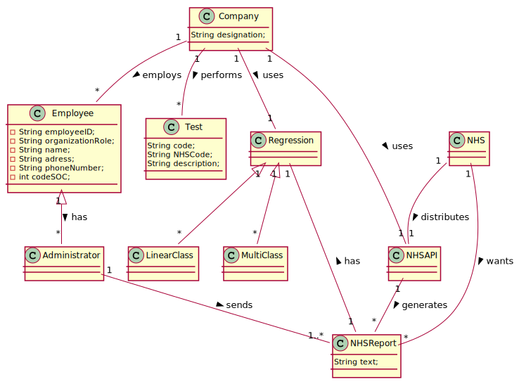
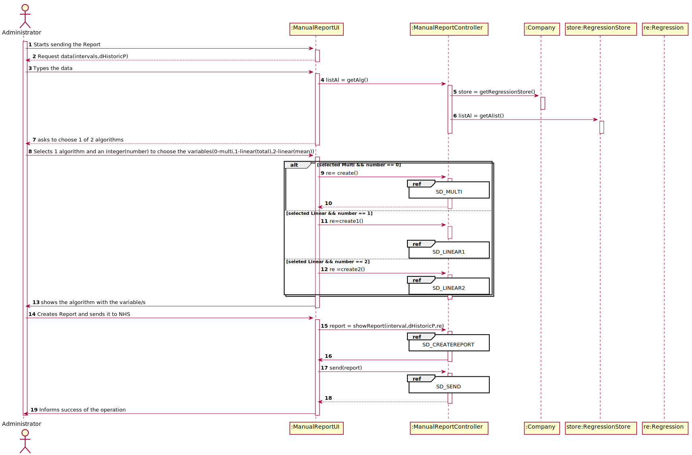
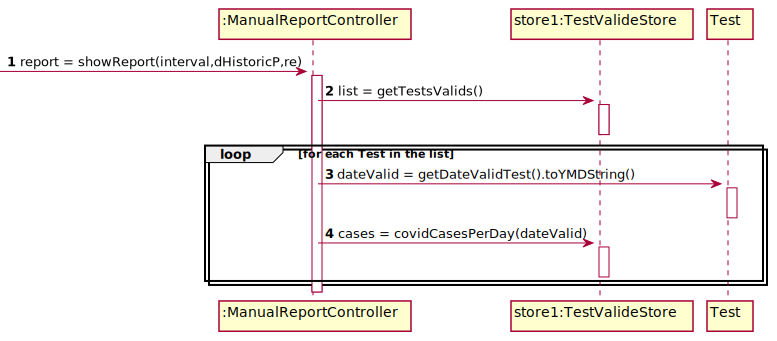
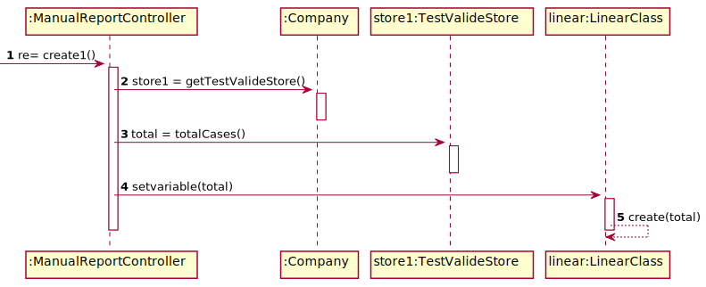
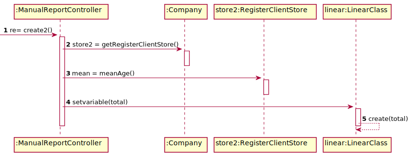
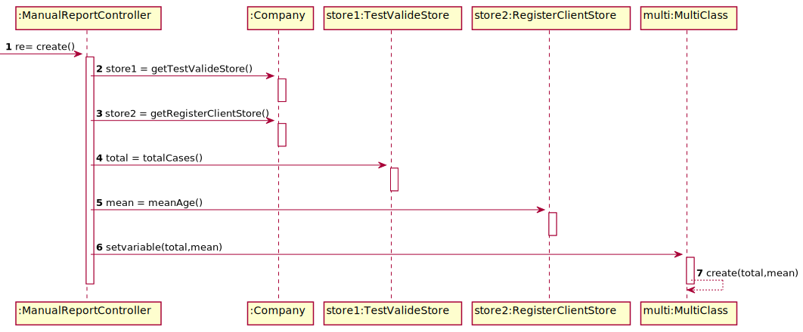
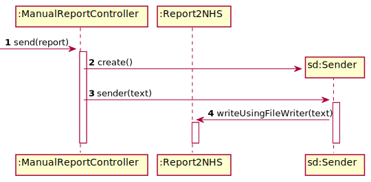
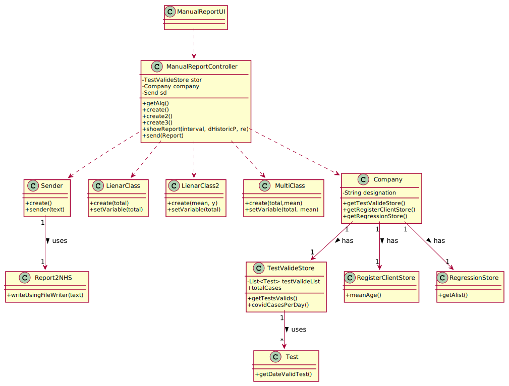

# US 18 - send the Covid-19 report to the NHS at any time.

## 1. Requirements Engineering

*In this section, it is suggested to capture the requirement description and specifications as provided by the client as well as any further clarification on it. It is also suggested to capture the requirements acceptance criteria and existing dependencies to other requirements. At last, identfy the involved input and output data and depicted an Actor-System interaction in order to fulfill the requirement.*

### 1.1. User Story Description

As a laboratory coordinator, I want to validate the work done by the clinical  chemistry technologist and specialist doctor.

### 1.2. Customer Specifications and Clarifications 

*Insert here any related specification and/or clarification provided by the client together with **your interpretation**. When possible, provide a link to such specifications/clarifications.*

**_From the Specifications Document_**

“Considering that ManyLabs has  the  exclusivity  to  perform Covid-19  tests,  and  that  the  contract with the NHS in England requires Many Labsto summarize and report Covid-19 data, the company needs to: identify the number of Covid-19 tests performed, identify all positive results to Covid-19 tests,  report  the  total  number  of  Covid-19  cases per day, per week  and per month  of  the  year,  and send  the  forecasts  for  these  same time horizons(the number  of  Covid-19  cases  for  the  following day, next week and next month)”

**_From the client clarifications_**
    
Q: which significance level should we use for the hypothesis tests?
A: The application should allow the user to choose the significance level
    
Q: Should the report contain the data of all the tests with results (with or without report, with or without validation) or contain only the validated tests? (Or other option?)
A: The NHS Covid report should include statistics computed only from validated tests.

Q: General doubt: Are we going to be able to use more math libraries in order to facilitate the calculus (for example, for confidence intervals) or is the rest of the calculus to be developed by each team?
A: Each team should implement the classes and methods needed.
    
Q: Regarding US18 and US19, it is only one report containing all the tests performed by Many Labs to be sent each time, correct? Or is it one report per laboratory, for example? Or other option?
A: The report should contain all the tests made by Many Labs.
    
Q: From the project description it is known "send the forecasts for these same time horizons (the number of Covid-19 cases for the following day, next week and next month)." In the example report we have in moodle, there is a line that says "// Prediction values". Does this mean that after this line we should put our predictions or it refers to the following table?
A: Yes, the prediction values are the ones available in the table that we include in the example.
    
Q: From Sprint D requirements we get "I want to define... the number of historical points (number of days or number of weeks) that must be sent to the NHS".
Is the Administrator who must choose between days or weeks? If so, how should he make this choice?
A: Yes. The Administrator should select between days and weeks using the user interface.

Q: Should the number of historical points have the same range as the date interval defined by the administrator?
A: No. The points within the interval are used to fit the linear regression model. The number of historical points are the points for which we want to send the estimates/expect values to NHS. The points within the interval and historical points can overlap. Please carefully review the report example file available in moodle.

Q: From the report example we got that the administrator defines the dates interval to fit the model. Which date should the application use to provide the report? Is it the registration date or results registration date?
A: The registration date should be considered. But only tests that have already been validated should be considered.

Q: From the covid report example you gave us we can see that is missing two dates(16/05/2021 and 23/05/2021) in the predictions table. Is there any specific reason?
A: These days of the week are two Sundays and the laboratory does not work on Sundays.

Q: I know that the administrator chose 15 historical points and it is shown in the table down below in the file, but my question is, what's the criteria for showing 3 days before 17/05 and 6 days after 22/05?
A: The interval data is used to fit the regression model. The historical points are defined to get the number of ESTIMATED positive cases. Please study MATCP and linear regression.

Q: Should I find the line/equation (and everything else derived from it) using the data concerning the interval of days chosen, or from the historical days chosen?
A: The interval data is used to fit the regression model.

Q: I read from a previous post that " to apply mlr you need two independent variables- daily number tests and mean age person tested daily. Also you need the same records per week. " so when de administrator selects a MLR the system should adopt by default that the independent variables are daily number tests and mean age person , or he should write or select the independent variables that he wants ?
A: When the Administrator selects MLR, the number tests and mean age independent variables should be used without being selected.

Q: Could you clarify how the historical points work? Acording to the NhsReportExample, it was chosen 15 points and the dates to fit the regression model but it seems that it was not chosen the day to start the prediction table.
A: In the header of the exampleNHSReport.txt file it says "If the administrator selects: The current day to be 31/05/2021...". Please relate this information with the table available in the exampleNHSReport.txt file.
In US19, the current day is the day when the report is sent automatically to the NHS. The teams should not include sundays in their analysis or estimates.
When the time resolution is a week, please consider only complete weeks.

Q: If on a certain day or week there aren't any Covid 19 tests realized and therefore no clients, should we consider the mean age to be 0?
A: Yes, you should consider the mean age to be zero. Sundays should not be considered in your analysis.

Q: In US 18, should we ask the user to select which parameter he/she wants be analyzed for the hypothesis tests (a or b)?
A: Yes.

Q:Also, should we ask for the prevision interval level or should we just use 95% like it's shown in the example report?
A: The user should introduce the confidence level value.

Q: Should the reports sent to the NHS be saved in the app, or are they just sent?
A: There is no need to save the report in the app.


### 1.3. Acceptance Criteria

AC1: The system should allow the Administrator to select between a simple linear  and multilinear regression  model to fit the data. 

AC2: Moreover, the Administrator should be able to choose the independent variable to use with the simple  linear regression  model (either  the number of tests realized or the mean age).

AC3: The system should send the report using the NHS API

### 1.4. Found out Dependencies

There needs to have an list of Tests Results that are Validated to do the Covid-19 report-US15

### 1.5 Input and Output Data

- Input Data
	- Typed data: intervals , dHistoricP , number(represents independent variables)
	- Selected data: algorithm
- Output Data
 	- Shows the Report and sends it to the NHS 
	- (In)Success of the operation


### 1.6. System Sequence Diagram (SSD)



### 1.7 Other Relevant Remarks

 

## 2. OO Analysis

### 2.1. Relevant Domain Model Excerpt



### 2.2. Other Remarks

## 3. Design - User Story Realization 

### 3.1. Rationale

**The rationale grounds on the SSD interactions and the identified input/output data.**

| Interaction ID | Question: Which class is responsible for... | Answer  | Justification (with patterns)  |
|:-------------  |:--------------------- |:------------|:---------------------------- |
| Step 1: Stars sending the report | ... interacting with the actor? | ManualReportUI   |  Pure Fabrication: there is no reason to assign this responsibility to any existing class in the Domain Model.           |
| 			  		 |	... coordinating the US? | ManualReportController | Controller                             |			  		
| 			  		 | ... knowing the user using the system?  | UserSession  | IE: Knows the registered user and their roles.  |
| 			  		 |							 | Company  | IE: knows/has its own Employees| 
| 			  		 |							 | Employee  | IE: knows its own data (e.g. email) |
| Step 2: requests data(intervals,dHistoricP) | 					 |        |                      |
| Step 3: Types the data |	...knowing the list of algorithms to show | RegressionStore | IE: has access to all Regression Class and its sub-Class objects                             |
| | 					 | ...instanciating a new RegressionStore       |    Company                  |IE: adopts/records all the algorithms + HCLC 
| Step 4: asks to choose 1 of 2 algorithms |	n/a | n/a | n/a |
| Step 5: Selects 1 algorithm and an integer(number) to choose the variables(0-multi,1-linear(total),2-linear(mean))| ...   |  | |
| | ...instanciating the new TestValideStore  | Company | IE: adopts/records all the Valide test+ HCLC | 
| | ...instanciating the new RegisterClientStore | Company | IE: adopts/records all the Client+ HCLC  | 
| | ...getting the total cases  | TestStore | IE: has access to all Test Class objects|        
| | ...getting the average age of client  | RegisterClientStore |IE: has access to Client Class objects |                       
| | ...setting the variables(total ,mean)  | MultiClass |IE: has access to its own data |           
| | ...instanciating the new TestValideStore  | Company |IE: adopts/records all the Valide test+ HCLC  |        
| | ...getting the total cases  | TestStore | IE: has access to all Test Class objects|                             
| | ...setting the variables(total)  | LinearClass |IE: has access to its own data |        
   | | ...instanciating the new RegisterClientStore | Company | Creator (Rule 1): in the DM Company has a Store | 
| | ...getting the average age of client  | RegisterClientStore |IE: has access to Client Class objects | 
| | ...setting the variables(mean)  | LinearClass |IE: has access to its own data |                                      |    
| Step 6: Shows the algorithm with the variable/s| 					 |        |                      |
| Step 7: Creates Report and sends it to NHS | 	 ... knowing the list of Valid Test 				 |   TestValideStore     | IE: has access to all Test Class objects                       |
| 			  		 |	...getting the valide date						 | Test  | IE: knows its own data|
| 			  		 |	...getting the cases of covid						 | TestValideStore  | IE: has access to all Test Class objects |
| 			  		 |	...instanciating a new Sender						 | Sender | IE: knows its own data|
| 			  		 |	...sending the report					 | Report2NHS  | Pure Fabrication |
| Step 8: Informs operation success | ... informing operation success? | ManualReportUI | IE: responsible for user interaction |                              |                

### Systematization ##

According to the taken rationale, the conceptual classes promoted to software classes are: 

 * Company
 * Regression
 * Test
 

Other software classes (i.e. Pure Fabrication) identified: 

 * ManualReporttUI
 * ManualReportController
 * TestValideStore
 * Report2NHS
 * RegressionStore
  

## 3.2. Sequence Diagram (SD)








## 3.3. Class Diagram (CD)

*In this section, it is suggested to present an UML static view representing the main domain related software classes that are involved in fulfilling the requirement as well as and their relations, attributes and methods.*



# 4. Tests 
*In this section, it is suggested to systematize how the tests were designed to allow a correct measurement of requirements fulfilling.* 

**_DO NOT COPY ALL DEVELOPED TESTS HERE_**

**Test 1:**  Test of senderTest metod
 
     @Test
    public void senderTest(){
        Sender sender = new Sender();
        sender.sender("ola");
    }

**Test 2:**   Test of validate test, of class TestValideStore.
       @Test
    public void testValidateTest(){
        List<app.domain.model.Test> list = new ArrayList<>();
        TestValideStore store = new TestValideStore(list);
        app.domain.model.Test t1 = null;
        boolean expected = store.addValide(t1);
        assertFalse(expected);
    }

**Test 3:**   Test of validate test, of class TestValideStore.
    @Test
    public void testValidateTest1(){
        List<app.domain.model.Test> list = new ArrayList<>();
        TestValideStore store = new TestValideStore(list);
        String nhs = "000000000005";
        app.domain.model.Test t1 = new app.domain.model.Test(nhs);
        t1.setTimeDiagnosis();
        t1.setTimeChemAnalysis();
        t1.setTimeSample();
        t1.setDateChemAnalysis();
        t1.setDateSample();
        t1.setDateDiagnosis();
        t1.setTimeValidTest();
        t1.setDateValidTest();
        list.add(t1);

        boolean expected = store.addValide(t1);
        assertFalse(expected);
    }


*It is also recommended to organize this content by subsections.* 

# 5. Construction (Implementation)

*In this section, it is suggested to provide, if necessary, some evidence that the construction/implementation is in accordance with the previously carried out design. Furthermore, it is recommeded to mention/describe the existence of other relevant (e.g. configuration) files and highlight relevant commits.*

**Sender**
```java
public class Sender {
    /**
     * Constructor
     */
    public Sender(){
        //this is a constructor empty for this class
    }
    /**
     * Sends report to the nhs through nhs api
     * @param text
     */
    public void sender(String text){
        Report2NHS.writeUsingFileWriter(text);
    }
}
```

**TestValideStore**
```java

public class TestValideStore {
    /**
     * List of Test
     */
    private final List<Test> testValideList;
    /**
     * Creates a validate test store that contains all validated tests
     *
     * @param testVlist The list containing test
     */
    public TestValideStore(List<Test> testVlist) {
        this.testValideList = testVlist;
    }
    /**
     * Validates the Validated test
     *
     * @param t The validated test to be validated
     * @return Validation if the validated test does not already exists
     */

    public boolean validateValide(Test t) {
        if (t == null)
            return false;
        return  ! this.testValideList.contains(t);
    }
    /**
     * Saves the validated test  if it is valid
     *
     * @param t The validated test to be added to the list of validated validated test
     * @return true if the new validated test was added successfully
     */
    public boolean addValide(Test t) {
        if (!validateValide(t)) {
            return false;
        }else {
            Client c = t.getClient();
            c.addTest(t);
            return this.testValideList.add(t);
        }
    }

    /**
     * Gets the number of covid positive tests in a specific date
     *
     * @param date The date
     * @return Number of positive cases
     */
    public int covidCasesPerDay(String date){
        int cases=0;
        for(Test t: this.testValideList){
            if(t.getDateRegistration().toYMDString().compareTo(date)==0 && t.getTestType().getCode().compareTo("tt001")==0){
                for(TestParameter tp : t.getResults()){
                    if(tp.getParameter().getCodeP().compareTo("IgGAN")==0 && stringToDouble(tp.getTestResult().getResult())>1.4){
                        cases++;
                    }
                }

            }
        }
        return cases;
    }
    /**
     * Gets the list of tests
     *
     * @return the list of test
     */
    public List<Test> getTestsValids(){
        List<Test> tests = null;
        tests = this.testValideList;
        return tests;
    }

    public double stringToDouble(String result){
        StringBuilder s= new StringBuilder();
        for(int i=0; i<result.length(); i++){
            if(result.charAt(i) == ',')
                s.append(".");
            else
                s.append(result.charAt(i));
        }
        return Double.parseDouble(s.toString());
    }
}
```

**ManualReportController**
```java
public class ManualReportController {
    private Sender sd;
    /**
     * the TestValideStore is used to validate and save the test
     */
    private TestValideStore store;
    /**
     * the company that validates the work
     */
    private Company company;

    /**
     * Creates a controller getting the Company information from App
     */
    public ManualReportController() throws IOException, ClassNotFoundException {
        this(App.getInstance().getCompany());
        this.store = this.company.getValidationStore();
        this.sd=new Sender();
    }

    /**
     * Creates a controller from the Company, having it as a parameter
     * @param company
     */
    public ManualReportController(Company company) {
        this.company = company;
    }
    /**
     * Builds a String with the daily covid cases and its average
     * @return String with the data
     */
    public String showReport(String alg,String it) throws IOException {
        Scanner sc = new Scanner(System.in);
        List<Test> list = this.store.getTestsValids();
        int day = 0;
        StringBuilder sb = new StringBuilder();
      /*  System.out.println("Choose 1 of 2 algorithms(Linear and Multi) ");
        String alg = sc.next();
        sc.nextLine();
        System.out.println("Write the Interval");
        String intv = sc.next();*/
        sb.append(alg+"\n"+"\n"+it+"\n"+"\n");
        sb.append("Date          Cases         \n");
        Collections.sort(list,App.sortD());
        for (Test t : list){
            int cases = store.covidCasesPerDay(t.getDateValidTest().toYMDString());

            if (day != t.getDateValidTest().getDay()){
                String case1 = String.format("%02d", cases);
                sb.append(t.getDateValidTest().toYMDString()+"          "+case1+ "\n");
                day = t.getDateValidTest().getDay();
            }
        }
        return sb.toString();
    }
    public void send(String text){
        this.sd.sender(text);
    }
}

```

*It is also recommended to organize this content by subsections.* 

# 6. Integration and Demo 

*In this section, it is suggested to describe the efforts made to integrate this functionality with the other features of the system.*

* Update TestValidStore class
* Update RegisterClientStore class
* Added RegressionStore class
* Added ManualReportController class
* Added Sender class
* Added ManualReportUI class
* Added LinearClass class
* Added LinearClass2 class
* Added MultiClass class
* A new option on the Administrator menu options was added: Manual Report
* Added coverage and mutation tests for TestValideStore class
* Added coverage and mutation tests for Sender class

# 7. Observations

*In this section, it is suggested to present a critical perspective on the developed work, pointing, for example, to other alternatives and or future related work.*

