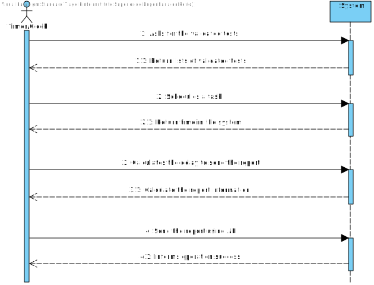
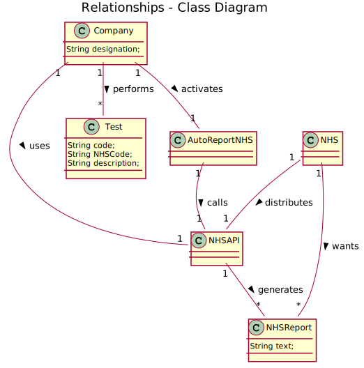
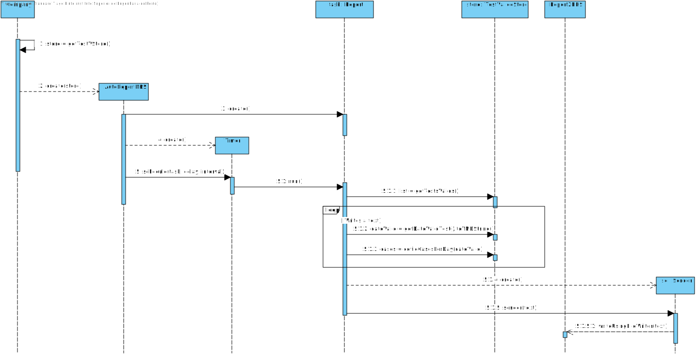

# US 19 - Send to the NHS daily reports of Covid-19 data, including the number of observed values and estimated values. Reports should be generated automatically with historical data and must be sent every day at 6:00 am

## 1. Requirements Engineering

### 1.1. User Story Description

The Many Labs company wants to send to the NHS daily reports of Covid-19
data, including the number of observed values and estimated values. Reports should be generated automatically with historical data and must be sent every day at 6:00 am.

### 1.2. Customer Specifications and Clarifications 

**_From the Specifications Document_**

"Considering that Many Labs has the exclusivity to perform Covid-19 tests, and that the contract with the NHS in England requires Many Labs to summarize and report Covid-19 data, the company needs to: identify the number of Covid-19 tests performed, identify all positive results to Covid-19 tests, report the total number of Covid-19 cases per day, per week and per month of the year, and send the forecasts for these same time horizons (the number of Covid-19 cases for the following day, next week and next month). The company is also required to generate daily (automatic) reports with all the information demanded by the NHS and should send them to the NHS using their API."

**_From the client clarifications_**

-	**Question:** Which significance level should we use for the hypothesis tests?

	- 	**Answer:** The application should allow the user to choose the significance level.

-	**Question:** It is only one report containing all the tests performed by Many Labs to be sent each time, correct? Or is it one report per laboratory, for example? Or other option?

	- 	**Answer:** The report should contain all the tests made by Many Labs. 

-	**Question:** In US19, in Sprint D Requirements, it says "The report should include day and week (observed and estimated) values..." and also "Reports...must be sent every day at 6:00 am". 
As the Report is to be automatically sent very early in the morning, do you wish the report to have the data concerning the day before and the last week starting at the day before?

	- 	**Answer:** The format of the report should follow the report example that is available in moodle.

-	**Question:** Should the report contain the data of all the tests with results (with or without report, with or without validation) or contain only the validated tests? (Or other option?)

	- 	**Answer:** The NHS Covid report should include statistics computed only from validated tests.

-	**Question:** As the report is generated automatically, should the system generate a notication that the report was sent?

	- 	**Answer:** The application should write the event into a log file.

-	**Question:** Which class is responsible for creating the scheduler(s)? Should we assume the report scope is Many Labs or is it each laboratory?

	- 	**Answer:** Many Labs Many has exclusivity for doing Covid-19 tests and should send nationwide reports to NHS. The scope is Many Labs.

-	**Question:** In the context of sprint D US19 and US18. We are a group without MATCP and MATDISC. What parameters should we use in the config files if we dont have to implement things related to Math curricular units?

	- 	**Answer:** US19 and US18 are US associated only with MATCP. Please check the requirements introduced in Sprint D and the NHS report example available in moodle. You can easily find the parameters required for these user stories. 

-	**Question:** What about US19? Is the significance level, for example, defined in the configuration file?

	- 	**Answer:** Yes the user could be choose the significance level for hip t and confidence level for IC

-	**Question:** Should the reports sent to the NHS be saved in the app, or are they just sent?

	- 	**Answer:** There is no need to save the report in the app.

-	**Question:** If on a certain day or week there aren't any Covid 19 tests realized and therefore no clients, should we consider the mean age to be 0?

	- 	**Answer:** Yes, you should consider the mean age to be zero. Sundays should not be considered in your analysis.

### 1.3. Acceptance Criteria

- **AC1:** The report should include day and week (observed and estimated) values, the regression model used to estimate each value, R(SLR), R2 and R2 adjusted for SLR and MLR, hypothesis tests for regression coefficients significance model with Anova. 
- **AC2:** Simple linear and multilinear regression models can be used to compute the estimates and corresponding confidence intervals.
- **AC3:** When the system is configured to use the simple linear regression model, the performance of each model should be used to select the best model (the one that uses the number of tests realized or the one that uses the mean age as independent variable).
- **AC4:** The best model will be used to make the estimated/expected values that will be send to NHS. 
- **AC5:** The interval of dates to fit the regression model and the number of historical points (number of days and number of weeks) must be defined through a configuration file. 
- **AC6:** The system should send the report using the NHS API (available in moodle).

### 1.4. Found out Dependencies

There is one dependency:
	- "US18 - Send the Covid-19 report to the NHS at any time" since we need the method that sends the text to the NHS API.

### 1.5 Input and Output Data

*Identity here the data to be inputted by the system actor as well as the output data that the system have/needs to present in order to properly support the actor actions. Regarding the inputted data, it is suggested to distinguish between typed data and selected data (e.g. from a list)*

- Input Data
	- Typed data:
		- None
	- Selected data: 
		- None
- Output Data
	- Report

### 1.6. System Sequence Diagram (SSD)

*Insert here a SSD depicting the envisioned Actor-System interactions and throughout which data is inputted and outputted to fulfill the requirement. All interactions must be numbered.*

### 1.7 Other Relevant Remarks

## 2. OO Analysis

### 2.1. Relevant Domain Model Excerpt

### 2.2. Other Remarks

The report is generated automatically every day at 6am.

## 3. Design - User Story Realization 

### 3.1. Rationale

**The rationale grounds on the SSD interactions and the identified input/output data.**

| Interaction ID | Question: Which class is responsible for... | Answer  | Justification (with patterns)  |
|:-------------  |:--------------------- |:------------|:---------------------------- |
| Step 1:  	 | ... starting AutoReportNHS? | Company | IE: The company starts its timer automatically whenever it is created and have information concerning the tests that are in the report. |
|                | ... knowing the tests that are supposed to be analysed in the report? | TestValideStore | IE: adopts/records all the validated Test objects. |
|                | ... instantiating a new TestValideStore? | Company | IE: adopts/records all the valid tests. | 
| Step 2	 |					    |         | 				  	|
| Step 3  	 | ... scheduling the reporter task? | 	AutoReportNHS | Pure Fabrication: there is no reason to assign this responsibility to any existing class in the Domain Model. |
| Step 4	 |					    |         | 				  	|
| Step 5	 | ... calculating the time to send the report(delay)? | Time | IE: Has a method to get the current time. |
| Step 6	 | ... checking the tests in each of the days? | Reporter | Pure Fabrication: there is no reason to assign this responsibility to any existing class in the Domain Model. |
|		 | ... checking if a test is covid-positive? | TestValideStore | IE: Has a method to calculate daily cases bases in the test results. |
| Step 7	 | ... sending the report? | Sender | Protected Variation: accesses the external API to send the report. |
| Step 8	 | 					    |         | 				  	|

### Systematization ##

According to the taken rationale, the conceptual classes promoted to software classes are: 

 * NHSReport
 * AutoReportNHS

Other software classes (i.e. Pure Fabrication) identified:

 * Sender

## 3.2. Sequence Diagram (SD)

*In this section, it is suggested to present an UML dynamic view stating the sequence of domain related software objects' interactions that allows to fulfill the requirement.* 

## 3.3. Class Diagram (CD)

*In this section, it is suggested to present an UML static view representing the main domain related software classes that are involved in fulfilling the requirement as well as and their relations, attributes and methods.*

# 4. Tests 

# 5. Construction (Implementation)

* AutoReportNHS *

	public class AutoReportNHS {
    		private TestValideStore store;

    		public AutoReportNHS(TestValideStore validTestsStore){
        		this.store = validTestsStore;
    		}

    		public static final Timer timer = new Timer();

    		public void sendReport(){

        		Time now = new Time();
        		int seconds = now.getSeconds() + now.getMinutes()*60 + now.getHours()*360;
        		int sendTime = 30 + 10*60 + 22*360;

        		if(seconds<sendTime)
            			timer.schedule(new Reporter(), (sendTime-seconds)* 1000L, 86400*1000L);
        		else
            			timer.schedule(new Reporter(), (86400 - (seconds-sendTime))* 1000L, 86400*1000L);
    		}

    		class Reporter extends TimerTask{
        		public void run(){
            			List<Test> testList = store.getTestsValids();
            			int day = 0;
            			StringBuilder sb = new StringBuilder();
            			sb.append("Date          Cases      \n");
            			for (Test t : testList){
                			int cases = store.covidCasesPerDay(t.getDateRegistration().toYMDString());
                			if (day != t.getDateValidTest().getDay()){
                    				String case1 = String.format("%02d", cases);
                    				sb.append(t.getDateRegistration().toYMDString()+"          "+case1+          "\n");
                    				day = t.getDateValidTest().getDay();
                			}
            			}
            			Sender s = new Sender();
            			s.sender(sb.toString());
       	 		}
    		}

	}

# 6. Integration and Demo 

-Added the class AutoReportNHS

# 7. Observations

