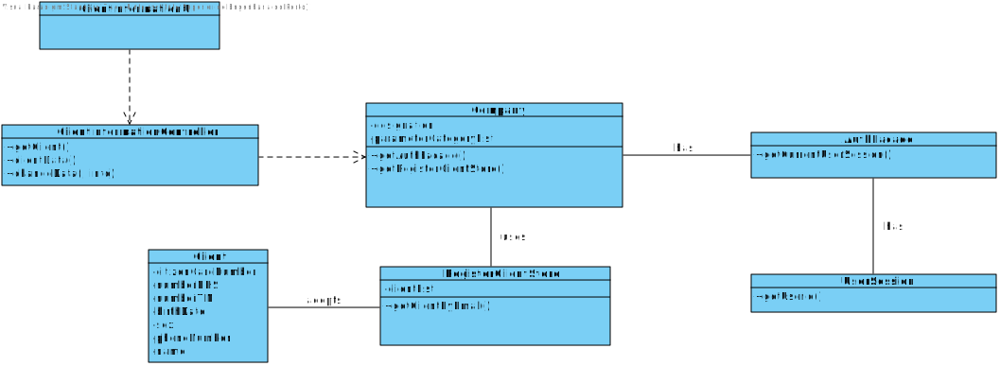

# US 2 - Update my personal data

## 1. Requirements Engineering

### 1.1. User Story Description

As a client, I want to update my personal data.

### 1.2. Customer Specifications and Clarifications 

**_From the Specifications Document_**

"To register a client, the receptionist needs the client’s citizen card number, National Healthcare Service (NHS) number, birth date, sex, Tax Identification number (TIF), phone number, e-mail and name."

**_From the client clarifications_**

-	**Question:** Should the Client type in the attribute he/she wants to update or should he choose from a list?

	- 	**Answer:**  In this sprint each team should develop a graphical user interface for US2. The application should show the current user data and the client can update any attribute.

- **Question:** In us02 when the client changes the password what should the rules be for this new password? (for example, a digit limit).
	- **Answear:** From a previous post we get: "... the password should be randomly generated. It should have ten alphanumeric characters."
There are some constraints with the auth component and I will not ask the teams to include a feature to update the login and password of the client. 
The client can only update his: name, address, phone number and sex attributes. The other attributes can not be updated. There are some restrictions that forced me to make this decision.

-	**Question:** Should/Can we show the current data held in the client's account? If so, we think that showing certain information(Password, for exemple) could violate some security purposes. How should we approach that situation?

	- 	**Answer:** Today I made the following clarification: "The client can only update his: name, address, phone number and sex attributes. The other attributes can not be updated. There are some restrictions that forced me to make this decision."

-	**Question:** When we update the client's information, should we send an email informing that the client's data has been changed? If so, what should this email contain?

	- 	**Answer:** Yes. The e-mail message should only inform the client that his personal data has been updated.

### 1.3. Acceptance Criteria

- **AC1:** Any update to client's data cannot be empty.

### 1.4. Found out Dependencies

There is one dependency:

- "US3 - Register a Client" since the client needs to be registered to can change the own data;

### 1.5 Input and Output Data

- Input Data
	- Typed data:
		- Client's data
	- Selected data:
		- Attribute to change
- Output Data
	- All client's data
	- (In)Success of the operation

### 1.6. System Sequence Diagram (SSD)

### 1.7 Other Relevant Remarks

The client must update his data whenever he deems it necessary.

## 2. OO Analysis

### 2.1. Relevant Domain Model Excerpt 

### 2.2. Other Remarks

None.

## 3. Design - User Story Realization 

### 3.1. Rationale

**The rationale grounds on the SSD interactions and the identified input/output data.**

| Interaction ID | Question: Which class is responsible for... | Answer  | Justification (with patterns)  |
|:-------------  |:--------------------- |:------------|:---------------------------- |
| Step 1: Starts to update own data | ... interacting with the actor? | ClientInformationUI | Pure Fabrication: there is no reason to assign this responsibility to any existing class in the Domain Model. |
|| ... coordinating the US? | ClientInformationController | Controller |
|| ... instantiating a new RegisterClientStore? | Company | Creator (Rule 1): in the DM Company has a Store. |
|| ... instantiating a AuthFacade? | Company | Company knows the user who is using now the system |
| Step 2: Shows all data and requests to choose which one wants to change | ... knowing the data? | Client | Client knows it's own data |
| Step 3: Types requested data | ... records the choice? | ClientInformationUI | n/a |
|  | ... changing the data? | Client | Client knows it's own data |
| Step 4: Informs operation success | ... informing operation success? | ClientInformationUI | IE: responsible for user interaction |             

### Systematization ##

According to the taken rationale, the conceptual classes promoted to software classes are: 

 * Company
 * Client
 * Email

Other software classes (i.e. Pure Fabrication) identified: 
 
 * ClientInformationUI
 * ClientInformationController
 * RegisterClientStore

## 3.2. Sequence Diagram (SD)

*In this section, it is suggested to present an UML dynamic view stating the sequence of domain related software objects' interactions that allows to fulfill the requirement.* 

## 3.3. Class Diagram (CD)

*In this section, it is suggested to present an UML static view representing the main domain related software classes that are involved in fulfilling the requirement as well as and their relations, attributes and methods.*

# 4. Tests 

**Test 1:**  

	@Test
    public void testClientData() {
        System.out.println("clientData");
        Client client = new Client("Joana","1234567890123456","18/05/2001","1234567890","1234567890","contribute@geeksforgeeks.org","12345678901","Female");
        String exp = "1) Name: Joana\n" +
                "2) Citizenship card: 1234567890123456\n" +
                "3) Birth date: 18/05/2001\n" +
                "4) NHS id: 1234567890\n" +
                "5) TIN number: 1234567890\n" +
                "6) Phone number: 12345678901\n" +
                "7) E-mail: contribute@geeksforgeeks.org\n" +
                "8) Gender: Female";
        String actual = client.clientData().toString();
        assertEquals(exp, actual);
    }

# 5. Construction (Implementation)

**ClientInformationUI**

	public class ClientInformationUI implements Runnable {
	    Scanner sc = new Scanner(in);
	
	    private ClientInformationController vcrc;
	
	    public ClientInformationUI(){
	        this.vcrc= new ClientInformationController();
	    }
	
	    public void run() {
	
	        vcrc.getClient();
	
	        System.out.println("Your current personal data\n");
	        System.out.println(vcrc.clientData());
	
	        boolean valid=false;
	        do{
	            System.out.println("\n\nChoose the attribute to change(-1 to cancel)");
	            int i = sc.nextInt();
	            if(i>0 && i<9){
	                System.out.println("Introduce new data:");
	                String info = sc.next();
	                try{
	                    vcrc.changeData(i, info);
	                    if(i==7)
	                        System.out.println("For security reasons restart the login session");
	                    System.out.println("Your personal data was updated");
	                    valid = true;
	                }catch(IllegalArgumentException e){
	                    System.out.println("This attribute is invalid!");
	                    valid = false;
	                }
	            }
	            if(i==-1){
	                System.out.println("Operation canceled");
	                valid = true;
	            }
	
	        }while(!valid);
	    }
	}

**ClientInformationController**

	public class ClientInformationController {
	    /**
	     * The company that knows the tests
	     */
	    private final Company company;
	
	    /**
	     * Client who do the test
	     */
	    private Client client;
	
	    /**
	     * the user that is created using the client
	     */
	    private User user;
	
	    private UserStore store2;
	
	    /**
	     * The client store to get the client
	     */
	    private RegisterClientStore store;
	
	    /**
	     * Creates a controller getting the Company information from App
	     */
	    public ClientInformationController(){this(App.getInstance().getCompany());}
	
	    /**
	     * Creates a controller
	     */
	    public ClientInformationController(Company company){
	        this.company=company;
	    }
	
	
	    /**
	     * this method return client by email, from the login
	     * @return client by email
	     */
	    public void getClient(){
	        this.store=this.company.getClientStore();
	        this.client = this.store.getClientByEmail(this.company.getAuthFacade().getCurrentUserSession().getUserId().toString());
	    }
	
	    /**
	     * Gets the current user data
	     *
	     * @return String with all the attributes from teh client
	     */
	    public String clientData(){
	        return this.client.clientData();
	    }
	
	    /**
	     * Changes an attribute
	     *
	     * @param i The attribute to be changed
	     * @param info The new attribute
	     */
	    public void changeData(int i, String info){
	        switch(i){
	            case 1: this.client.setName(info);
	                    break;
	
	            case 2: this.client.setCc(info);
	                    break;
	
	            case 3: this.client.setBirth(info);
	                    break;
	
	            case 4: this.client.setNhsid(info);
	                    break;
	
	            case 5: this.client.setTin(info);
	
	                    break;
	
	            case 6: this.client.setPhonenumber(info);
	                    break;
	
	            case 7: Email e = new Email(info);
	                    this.client.setEmail(e);
	                    this.company.getAuthFacade().getCurrentUserSession().changeEmail(e);
	                    break;
	
	            case 8: this.client.setSex(info);
	                    break;
	        }
	    }
	
	}

# 6. Integration and Demo 

* Added ClientInformationUI
* Added ClientInformationController
* Added coverage and mutation tests
* A new option on the Client menu options was added: Change my personal information

# 7. Observations

