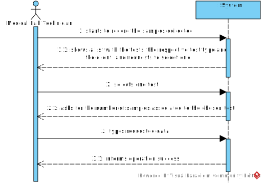
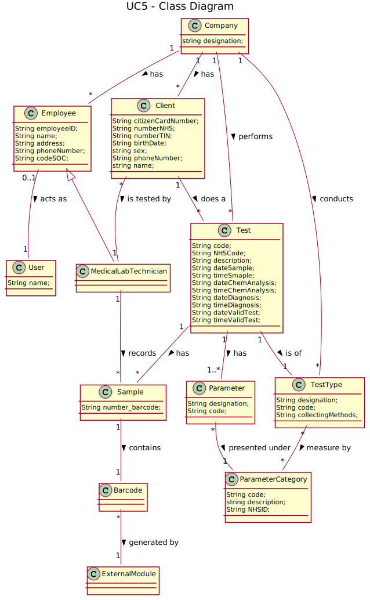
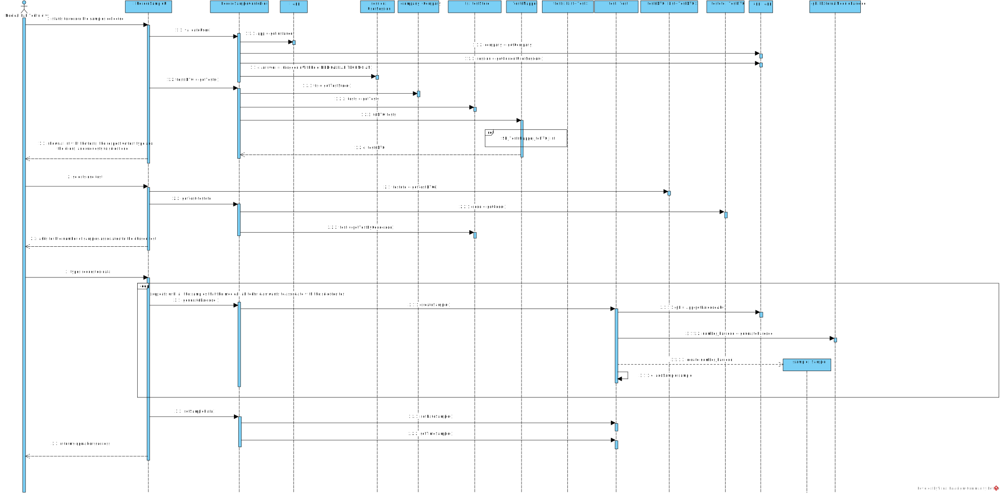
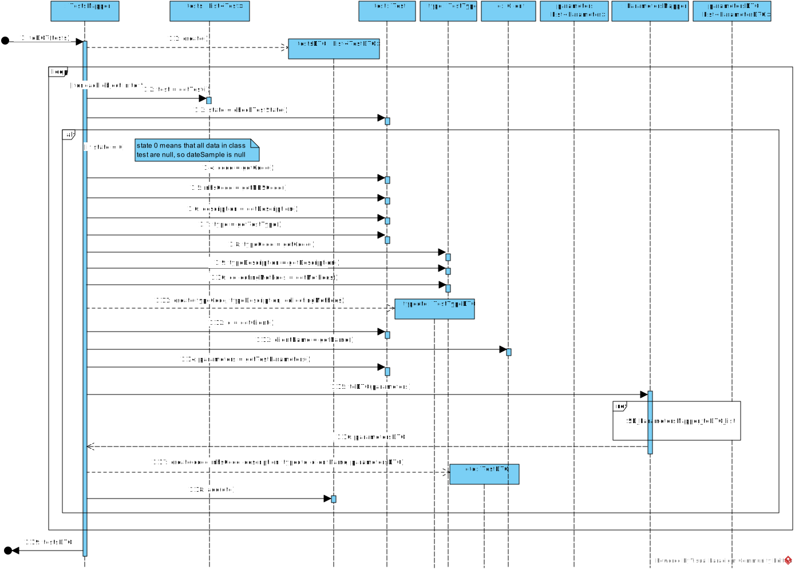
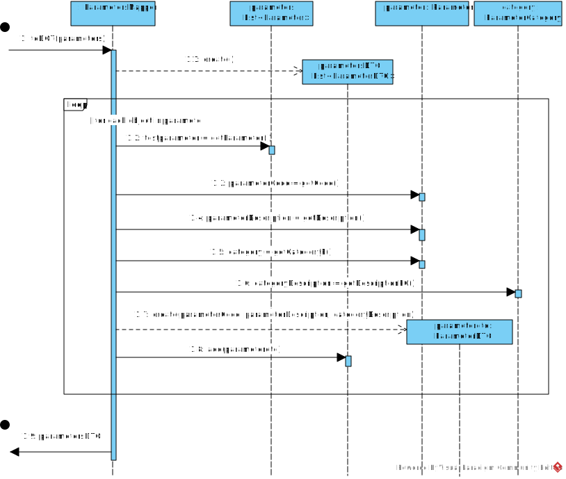
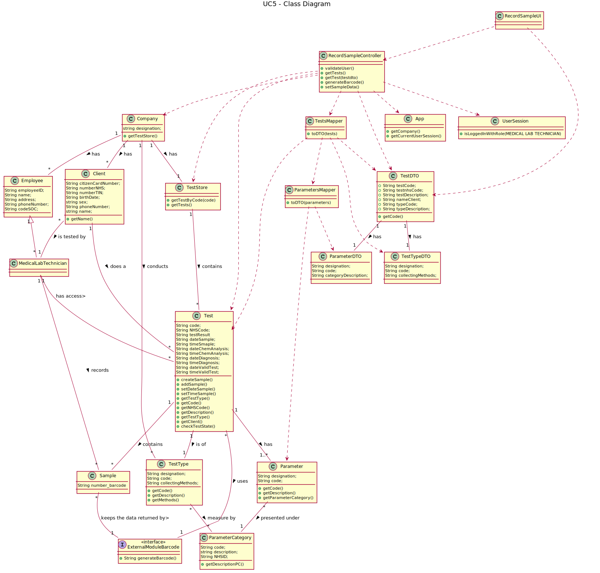
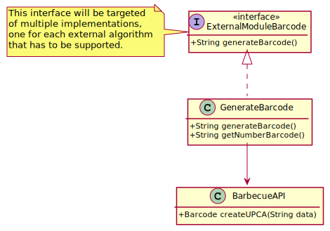

# US5 - Record the sample

## 1. Requirements Engineering

### 1.1. User Story Description

As a medical lab technician, I want to record the samples collected in the scope of a given test.

### 1.2. Customer Specifications and Clarifications

*Insert here any related specification and/or clarification provided by the client together with **your interpretation**. When possible, provide a link to such specifications/clarifications.*

**_From the Specifications Document_**

- All the tests (clinical blood tests and Covid-19 tests) performed by the network of laboratories are
registered locally by the medical lab technicians who collect the samples.

- The samples are sent daily to the chemical laboratory where the chemical analyses are performed, and results obtained.

- When sampling (blood or swab) the medical lab technician records the samples in the system,
associating the samples with the client/test, and identifying each sample with a barcode that is
automatically generated using an external API.

**_From the client clarifications_**

-	**Question:** What is the data that characterize a sample?
	- 	**Answer:** Each sample is associated with a test. A sample has only one attribute, a barcode number (UPC) that is a sequential number and is automatically generated by the system. Each sample has a unique barcode number.

-	**Question:** Can a test have more than one sample?
	- 	**Answer:** Yes.

-	**Question:** During the current sprint, how should we allow the barcodes to be printed. After generating them via the API, should we save the barcode images to the disk?
	- 	**Answer:** Each generated barcode should be saved in a folder as a jpeg file.

- **Question:** The date of collection of the samples is an attribute of the test and not of the sample itself?
  -   **Answer:** Yes. The system should record the date (DD/MM/YYYY) and time (HH:MM) when the sample is collect made. The date and time are automatically generated by the system when the barcode is issued.

-	**Question:** If there were multiple samples for a single test, would there be only one collection date for all of them?
	- 	**Answer:** Only one collection date and time for a test.

-	**Question:** What is supposed to show to the Medical Lab Technician when he selects the pretended test?
	- 	**Answer:** Firstly, the Medical Lab Technician checks the system to see the tests/clients that need to be done. Before selecting a test, the Medical Lab Technician checks/see the name of the client and all the test data (test attributes, test type, collection method, parameters, etc.). Then, the Medical Lab Technician selects one test/client and the system asks for the number of samples to collect. Next, the system generates the barcodes to put in the samples.

### 1.3. Acceptance Criteria

- AC1: There must be at least one test in the system.
- AC2: The API to generate the barcode is defined by configuration.

### 1.4. Found out Dependencies

* There is a dependency to "US4 Register a test" since at least a test must exist to record a sample.

### 1.5 Input and Output Data

**Input Data:**

* Typed data:
	* Number of samples to associate to a specific test

* Selected data:
	* Test

**Output Data:**
* (In)Success of the operation

### 1.6. System Sequence Diagram (SSD)

### 1.7 Other Relevant Remarks

- The system should support several APIs.

## 2. OO Analysis

### 2.1. Relevant Domain Model Excerpt

### 2.2. Other Remarks

## 3. Design - User Story Realization

### 3.1. Rationale

**The rationale grounds on the SSD interactions and the identified input/output data.**

| Interaction ID | Question: Which class is responsible for... | Answer  | Justification (with patterns)  |
|:-------------  |:------------------ |:------------|:---------------------------- |
| Step 1: Starts to record the samples collected  | ...interacting with the actor? | RecordSampleUI | Pure Fabrication: there is no reason to assign this responsibility to any existing class in the Domain Model.|
| | ...coordinating the US? | RecordSampleController | Controller|
| | ...instantiating a new Sample? | Test | By the application of the Creator (R1) it would be the "Company". But, by applying HC + LC to the "Company", this delegates that responsibility to the "Test", Test has samples. |
| | ...knowing the user using the system? | UserSession	| IE: cf. A&A component documentation. |
| Step 2: Shows a list with the tests and requests to select one  | 	...knowing the tests? | TestStore | By the application of the Creator (R1) it would be the "Company". But, by applying HC + LC to the "Company", this delegates that responsibility to the "TestStore". |
| | ...knows TestStore? | Company | IE: in the DM Company has Tests.|
| | ...knowing the type of the test? | Test | IE : Test has a TestType. |
| | | TestType | IE : TestType has its own data. |
| | ...knowing the client associated to the selected test? | Test | IE : Test has client. |
| | | Client | IE : Client has its own data. |
| | ...knowing the parameters associated to the selected test? | Test | IE : Test has parameters. |
| | | Parameter | IE : Parameter has its own data. |
| | ...knowing the client associated to the selected test? | Test | IE : Test has its own data. |
| Step 3: Selects one test | ...knows the selected test | TestStore | IE : TestStore has tests. |
| Step 4: Asks for the number of samples associated to the chosen test | n/a | n/a | n/a |
| Step 5: Types requested data. | ...generating the barcode? | ExternalModuleBarcode | Protected Variation + Adapter |
| | ...keeping the barcodes created? | Sample | Sample has its own data. |
| | ...keeping the samples? | Test | IE : Test has samples |
| | ...storing the date and time that the sample was created? | Test | IE : Test has its own data. |
| Step 6: Informs operation success | ...informing operation success? | RecordSampleUI | IE: responsible for user interaction |

### Systematization ##

According to the taken rationale, the conceptual classes promoted to software classes are:

 * Company
 * Sample
 * Test
 * GenerateBarcode
 * TestType
 * Client
 * Parameter

Other software classes (i.e. Pure Fabrication) identified:

* RecordSampleUI
* RecordSampleController
* UserSession
* TestStore

## 3.2. Sequence Diagram (SD)

## 3.3. Class Diagram (CD)

*In this section, it is suggested to present an UML static view representing the main domain related software classes that are involved in fulfilling the requirement as well as and their relations, attributes and methods.*

# 4. Tests
*In this section, it is suggested to systematize how the tests were designed to allow a correct measurement of requirements fulfilling.*

**_GenerateBarcodeTest_**

public class GenerateBarcodeTest {

    /**
     * Test of generateBarcode method, of class GenerateBarcode.
     * When the number doesn't have 11 digits, gives an exception
     */
    @Test(expected = BarcodeException.class)
    public void generateBarcode() throws BarcodeException, IOException, OutputException {
        String str_barcode = "Number";
        Barcode barcode = BarcodeFactory.createUPCA(str_barcode);
        barcode.setPreferredBarHeight(100);

        String file_name = "Sample" + str_barcode + ".jpg";

        File imgFile = new File(file_name);
        BarcodeImageHandler.saveJPEG(barcode, imgFile);

    }

    /**
     * Test of getNumberBarcodetest method, of class GenerateBarcode.
     */
    @Test
    public void getNumberBarcodetest() {
        System.out.println("getNumberBarcode");
        int length = String.valueOf(12).length();
        String s = String.valueOf(12);
        for (int i = 0; i < 11-length; i++) {
            s = s + "0";
        }
        String expected = "12000000000";
        String result = s;
        assertEquals(expected,result);
    }

    /**
     * Test of generateBarcode method, of class GenerateBarcode.
     */
    @Test
    public void generateBarcode2() throws BarcodeException, IOException, OutputException {
        String str_barcode = "11111111111";
        Barcode barcode = BarcodeFactory.createUPCA(str_barcode);
        barcode.setPreferredBarHeight(100);

        String file_name = "Sample" + str_barcode + ".jpg";

        File imgFile = new File(file_name);
        BarcodeImageHandler.saveJPEG(barcode, imgFile);
    }

}

**_TestsMapperTest_**

public class TestsMapperTest {

    /**
     * Test of toDTO(Test test) method, of class TestsMapper.
     */
    @Test
    public void toDTO() {
        System.out.println("Create testDTO");
        String nh = "123456789012";
        String description = "test";
        app.domain.model.Test t = new app.domain.model.Test(nh);
        t.setDescription(description);
        TestType tt = new TestType("tt009", "Urine", "123456");
        t.setTestType(tt);
        ParameterCategory pc = new ParameterCategory("toSOS", "Patê", "id21");
        Parameter p = new Parameter("2121", "toSOS", pc);
        t.addTestParameter(p);
        Client c = new Client("João de Alburquerque","1234567890123256","02/11/2001", "1221567890", "1221267890","cliente2@geeksforgeeks.org","21212121333","Non Binary");
        t.setClient(c);
        TestTypeDTO typedto = new TestTypeDTO(t.getTestType().getCode(), t.getTestType().getDescription(), t.getTestType().getMethods());
        ParameterMapper pm = new ParameterMapper();
        List<ParameterDTO> parametersDTO = pm.parameterToDTO(t.getTestParameters());
        TestDTO expected = new TestDTO(t.getCode(), t.getNHScode(), t.getDescription(), typedto, t.getClient().getName(), parametersDTO);
        TestsMapper tm = new TestsMapper();

        TestDTO result = tm.toDTO(t);
        assertEquals(expected.toString(),result.toString());
    }

    /**
     * Test of toDTO(List<Test> tests) method, of class TestsMapper.
     */
    @Test
    public void testToDTO() {
        System.out.println("Create list testsDTO");

        String nh = "123456789012";
        String description = "test";
        app.domain.model.Test t = new app.domain.model.Test(nh);
        t.setDescription(description);
        TestType tt = new TestType("tt009", "Urine", "123456");
        t.setTestType(tt);
        ParameterCategory pc = new ParameterCategory("toSOS", "Patê", "id21");
        Parameter p = new Parameter("2121", "toSOS", pc);
        t.addTestParameter(p);
        Client c = new Client("João de Alburquerque","1234567890123256","02/11/2001", "1221567890", "1221267890","cliente2@geeksforgeeks.org","21212121333","Non Binary");
        t.setClient(c);

        TestsMapper tm = new TestsMapper();
        List<app.domain.model.Test> tests = new ArrayList<>();
        tests.add(t);

        List<TestDTO> testsDTOexpect = new ArrayList<>();
        List<TestDTO> testsDTOresult = tm.toDTO(tests);

        TestTypeDTO typedto = new TestTypeDTO(t.getTestType().getCode(), t.getTestType().getDescription(), t.getTestType().getMethods());
        ParameterMapper pm = new ParameterMapper();
        List<ParameterDTO> parametersDTO = pm.parameterToDTO(t.getTestParameters());

        TestDTO testDTO = new TestDTO(t.getCode(), t.getNHScode(), t.getDescription(), typedto, t.getClient().getName(), parametersDTO);
        testsDTOexpect.add(testDTO);
        String expected = testsDTOexpect.toString();
        String result = testsDTOresult.toString();
        assertEquals(expected,result);
    }
}

# 5. Construction (Implementation)

*In this section, it is suggested to provide, if necessary, some evidence that the construction/implementation is in accordance with the previously carried out design. Furthermore, it is recommeded to mention/describe the existence of other relevant (e.g. configuration) files and highlight relevant commits.*

*It is also recommended to organize this content by subsections.*

**_ConfigurationFile_**
	bloodAPI=1
	barcodeAPI=1

**_RecordSampleController_**

public class RecordSampleController {

    private Company company;
    private TestStore ts;
    private Test test;

    public RecordSampleController() {
        this.company = App.getInstance().getCompany();
        this.ts = this.company.getTestStore();
    }

    /**
     * @param company
     */
    public RecordSampleController(Company company) {
        this.company = company;
        this.ts = this.company.getTestStore();
    }

    /**
     * @return List of testsDTO
     */
    public List<TestDTO> getTests() {
        List<Test> tests = this.ts.getTests();
        TestsMapper tm = new TestsMapper();
        return tm.toDTO(tests);
    }

    /**
     * @param testdto
     */
    public void getTest(TestDTO testdto) {
        this.test = ts.getTestByCode(testdto.getCode());
    }

    /**
     * Associates the barcodes generated to the test
     * @return if the sample where added correctly to the test
     */
    public Boolean generateBarcode() {
        return this.test.createSample();
    }

    public List<Sample> getSamples(){
        return this.test.getSamples();
    }

    public void setSampleData() {
        this.test.setDateSample();
        this.test.setTimeSample();
    }
}

**_Test_**

	public class Test {
			public Boolean createSample() {
        String number_barcode;
        try {
            ExternalModuleBarcode gb = App.getBarcodeAPI();
            number_barcode = gb.generateBarcode();
            Sample sample = new Sample(number_barcode);

            return addSample(sample);

        } catch (OutputException e) {
            System.out.println(e.getMessage());
            return false;
        } catch (BarcodeException e) {
            System.out.println(e.getMessage());
            return false;
        } catch (IOException e) {
            System.out.println(e.getMessage());
            return false;
        }
    }

    /**
     * Adds a sample to the Test' list
     *
     * @param sample The sample added
     */
    public Boolean addSample(Sample sample) {
        return this.testSamples.add(sample);
    }

    /**
     * Checks the Test state based on its dates
     *
     * @return State of the Test
     */
    public int checkTestState(){
        int state=0;
        if(this.dateSample!=null)
            state++;
        if(this.dateChemAnalysis!=null)
            state++;
        if(this.dateDiagnosis!=null)
            state++;
        if(this.dateValidTest!=null)
            state++;
        return state;
    }
	}

**_TestDTO_**

	public class TestDTO {

	    //code of the test
	    private String testCode;
	    //NHScode of the test
	    private String testNHSCode;
	    //Description of the test
	    private String testDescription;
	    //The typeDTO of this test
	    private TestTypeDTO testTypeDTO;
	    //The client associated to this test
	    private String testClientName;
	    //The list of ParameterDTO associated to this test
	    private List<ParameterDTO> parametersDTO;

	    /**
	     * Creates a TestDTO using the test code, test NHS code and test description from a Test instance
	     *
	     * @param code Test code
	     * @param nhscode Test NHS code
	     * @param description Test description
	     */
	    public TestDTO(String code, String nhscode ,String description, TestTypeDTO testType, String clientName, List<ParameterDTO> parametersDTO) {
	        this.testCode = code;
	        this.testNHSCode = nhscode;
	        this.testDescription = description;
	        this.testTypeDTO = testType;
	        this.testClientName = clientName;
	        this.parametersDTO = parametersDTO;
	    }

	    /**
	     * Gets the test code of a test DTO
	     *
	     * @return TestDTO's code
	     */
	    public String getCode() {
	        return testCode;
	    }

	    /**
	     * Gets the list with all parametersDTO of a test DTO
	     *
	     * @return list with all parametersDTO associated to the testDTO
	     */
	    public List<ParameterDTO> getParameters() {
	        return parametersDTO;
	    }

	    /**
	     * Writes the test code, the test NHSCode and the test description
	     *
	     * @return a String with information related to this TestDTO
	     */
	    @Override
	    public String toString() {
	        return "Test:   " +
	                "Code = " + testCode + "   " +
	                "NHS Code = " + testNHSCode + "   " +
	                "Description = " + testDescription + "\n" +
	                "    Test Type:   " +
	                "Code = " + testTypeDTO.getCode() + "   " +
	                "Description = " + testTypeDTO.getDescription() + "   " +
	                "Collect method = " + testTypeDTO.getCollectingMethods() + "\n" +
	                "    Client:   " +
	                "Name = " + testClientName;
	    }

	    /**
	     * Writes the information about all parametersDTO in in test
	     *
	     * @return a String with information related to this ParametersDTO
	     */
	    public String toStringParameterDTO(ParameterDTO parameterDTO) {
	        return "    Parameters =   " +
	                "Code = " + parameterDTO.getCode() + "   " +
	                "Description = " + parameterDTO.getDescription() + "   " +
	                "Category description = " + parameterDTO.getCategoryDescription() + "\n";
	    }

	}

# 6. Integration and Demo

*In this section, it is suggested to describe the efforts made to integrate this functionality with the other features of the system.*

Efforts to reuse classes from other uc's like ParameterDTO, TestTypeDTO and ParameterMapper.

# 7. Observations

*In this section, it is suggested to present a critical perspective on the developed work, pointing, for example, to other alternatives and or future related work.*
